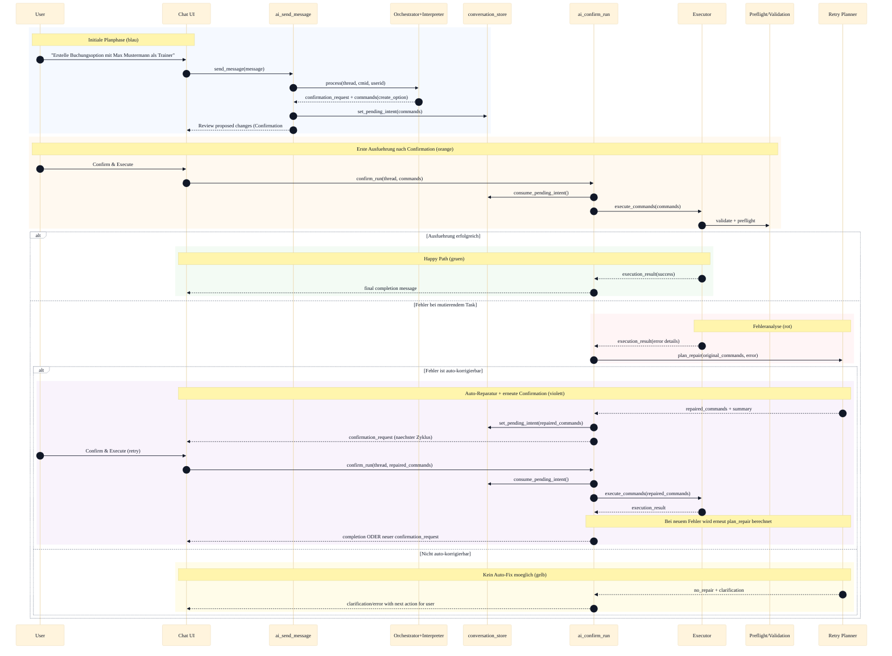
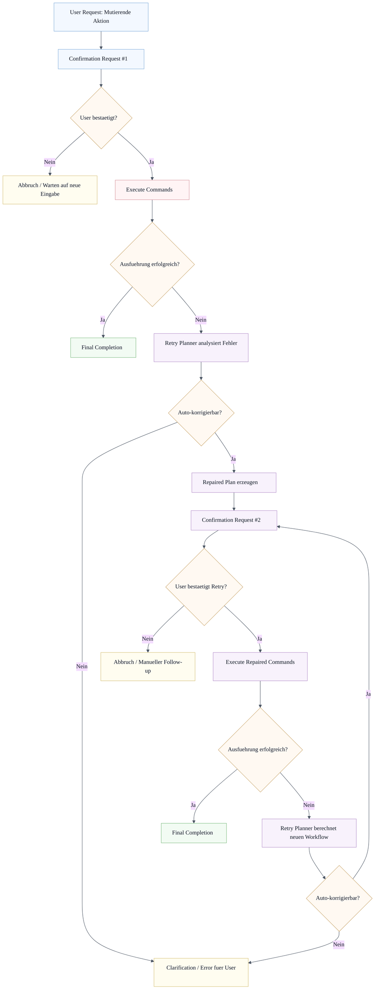

# Agent Workflow

Dieses Diagramm beschreibt den geplanten Ablauf fuer mutierende Agent-Tasks mit selbststaendiger Fehlerkorrektur und iterativer Neuplanung (mehrere Replan-Zyklen mit erneuter Bestaetigung je Zyklus).

## Alternative Pfade (Flow-Ansicht)

Legende:

- Blau: initiale Planung und erste Confirmation
- Orange: Entscheidungsstellen
- Gruen: erfolgreicher Abschluss
- Violett: Auto-Reparatur und Retry-Pfad
- Rot: Fehler-/Ausfuehrungsknoten
- Gelb: Abbruch/kein Auto-Fix

## Workflow-Regeln

- Mutierende Aktionen laufen immer erst ueber `confirmation_request`.
- Bei Fehlern wird nur fuer whitelisted, deterministische Fehlerarten eine Auto-Reparatur versucht.
- Jeder geaenderte Plan benoetigt zwingend eine neue Bestaetigung durch den User.
- In der Reparaturphase werden keine schreibenden Tasks ohne erneute Confirmation ausgefuehrt.
- Der Workflow kann mehrfach neu berechnet werden, solange die Fehler als auto-korrigierbar klassifiziert sind und jeder neue Plan erneut bestaetigt wird.
- Terminierung erfolgt, wenn: Erfolg erreicht, Fehler nicht auto-korrigierbar, User nicht bestaetigt, oder Sicherheitsgrenzen verletzt werden (z.B. kein Fortschritt zwischen Zyklen, identischer Plan ohne Aenderung).

## Test-Strategie (verpflichtend)

Alle neuen Funktionen in diesem Ablauf muessen durch Tests abgedeckt werden:

- Unit-Tests fuer Retry-Entscheidungslogik (repairable vs non-repairable).
- Unit-Tests fuer Command-Patching (z.B. teacherquery -> teacheremail).
- Integrationstests fuer Confirmation #1 -> Fehler -> Confirmation #2 -> Retry mit mehreren aufeinanderfolgenden Replan-Zyklen.
- Negativtests fuer Tamper/Mismatch und fehlende pending intents.
- Regressionstests, dass nicht-korrigierbare Fehler weiterhin in clarification/error enden.
- Guardrail-Tests fuer Abbruch bei fehlendem Fortschritt (z.B. gleicher Fehler + unveraenderter Plan).
