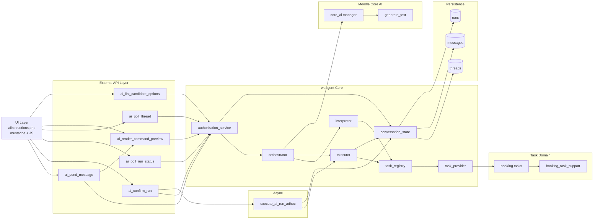

```mermaid
    flowchart LR

        %% ================= UI =================
        UI["UI Layer<br/>aiinstructions.php<br/>mustache + JS"]

        %% ================= API =================
        subgraph API["External API Layer"]
            direction TB
            SEND["ai_send_message"]
            CONFIRM["ai_confirm_run"]
            POLL["ai_poll_run_status"]
            THREAD["ai_poll_thread"]
            PREVIEW["ai_render_command_preview"]
            CAND["ai_list_candidate_options"]
        end

        %% ================= CORE =================
        subgraph CORE["wbagent Core"]
            direction TB
            AUTH["authorization_service"]
            ORCH["orchestrator"]
            INTERP["interpreter"]
            EXEC["executor"]
            REG["task_registry"]
            PROVIDER["task_provider"]
            STORE["conversation_store"]
        end

        %% ================= TASKS =================
        subgraph TASKS["Task Domain"]
            direction TB
            BT["booking tasks"]
            SUPPORT["booking_task_support"]
        end

        %% ================= AI =================
        subgraph AI["Moodle Core AI"]
            direction TB
            AIMGR["core_ai manager"]
            GEN["generate_text"]
        end

        %% ================= DB =================
        subgraph DB["Persistence"]
            direction TB
            T1[("threads")]
            T2[("messages")]
            T3[("runs")]
        end

        %% ================= ASYNC =================
        subgraph ASYNC["Async"]
            direction TB
            ADHOC["execute_ai_run_adhoc"]
        end

        %% ================= FLOW =================

        %% UI → API (clean entry)
        UI --> SEND
        UI --> CONFIRM
        UI --> POLL
        UI --> THREAD
        UI --> PREVIEW
        UI --> CAND

        %% API → Core (single gate)
        SEND --> AUTH
        CONFIRM --> AUTH
        POLL --> AUTH
        THREAD --> AUTH
        PREVIEW --> AUTH
        CAND --> AUTH

        %% Core pipeline
        AUTH --> ORCH
        ORCH --> INTERP
        INTERP --> REG
        ORCH --> EXEC
        EXEC --> REG
        REG --> PROVIDER
        PROVIDER --> BT
        BT --> SUPPORT

        %% AI branch
        ORCH --> AIMGR
        AIMGR --> GEN

        %% Storage
        AUTH --> STORE
        EXEC --> STORE
        STORE --> T1
        STORE --> T2
        STORE --> T3

        %% Async
        CONFIRM --> ADHOC
        ADHOC --> EXEC
        ADHOC --> STORE

        %% Preview shortcut
        SEND --> PREVIEW
```