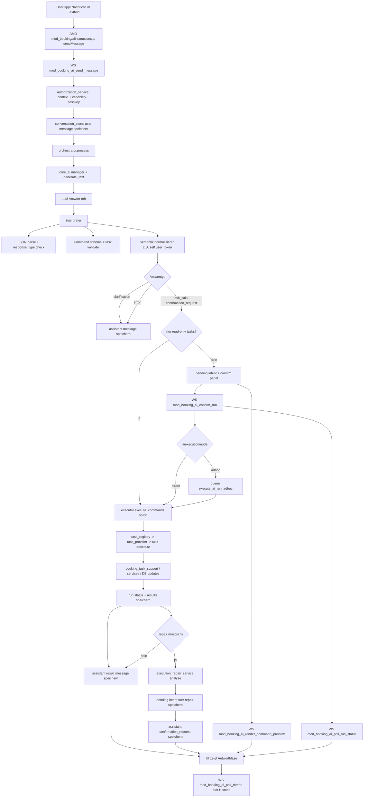

# WBAgent Workflow Uebersicht (mod_booking)

Diese Uebersicht zeigt den Weg von der Eingabe im Textfeld bis zur Ausgabe im Chat.

## Weiterfuehrende Doku

- Task-Erweiterungsleitfaden fuer Agenten/Entwickler:
    [booking/tasks/README_AGENT_TASKS.md](booking/tasks/README_AGENT_TASKS.md)

## End-to-End Flow

## Wie fuehrt der Agent Aufgaben aus?

1. Das Frontend ruft mod_booking_ai_send_message auf.
2. Der Orchestrator baut den Prompt aus Systemprompt + letzter Thread-Historie.
3. Das Modell wird ueber core_ai generate_text angesprochen.
4. Der Interpreter ist die Trust-Boundary:
   - validiert JSON + response_type
   - validiert task/input gegen Registry
   - stoppt bei Ambiguitaet (clarification)
   - normalisiert Eingaben (z.B. self-reference)
5. Bei reinen Read-only-Commands wird sofort ausgefuehrt.
6. Bei mutierenden Commands kommt confirmation_request; Ausfuehrung erst nach Confirm.
7. Die Ausfuehrung passiert im Executor ueber task_registry auf konkrete Tasks.
8. Nach Execute kann optional ein Repair-Plan erzeugt werden (execution_repair_service).
9. Wenn Repair moeglich ist, wird ein neues pending intent + confirmation_request gespeichert (zweite Confirmation).
10. Tasks delegieren Fachlogik (z.B. booking_task_support / mutation services), schreiben Resultate, und das UI pollt den Status.

## Zweite Confirmation nach Ausfuehrungsfehler

- Die zweite Confirmation entsteht nicht im Erst-Interpreterlauf, sondern nach einem Execute-Fehler in mod_booking_ai_confirm_run.
- Voraussetzung: execution_repair_service liefert can_repair=true und repaired_commands.
- ai_poll_run_status liefert dann followupconfirmation/followupcommandsjson.
- aiinstructions.js zeigt daraus ein zweites showConfirmPanel.
- Wenn dieser Repair-Zweig entfernt wird, gibt es trotz Fehlerausgabe keine zweite Confirmation mehr.

## Erste Confirmation: Soft-Override-Bedingungen

Manche Tasks (z.B. `booking.book_users`) koennen bereits in `validate()` eine strukturierte Confirmation ausloesen,
bevor execute() laeuft. Das ist der Soft-Override-Confirmation-Pfad:

1. `validate()` gibt ein Issue mit `code=SOFT_BOOKING_OVERRIDE_CONFIRM_REQUIRED`, `severity=needs_confirmation` zurueck.
2. `interpreter.php::validate_commands()` erkennt den Code in `CONFIRMABLE_ISSUE_CODES` und:
   - Baut ein `$confirmcommand` mit `input['confirmed'] = true`.
   - Fuegt es zu `$confirmablecommands` hinzu.
3. Der Interpreter liefert `confirmation_request` mit pending intent (inkl. confirmed=true im Command).
4. Der Nutzer bestaetigt → `ai_send_message` fuehrt das gespeicherte Command mit confirmed=true aus.
5. `validate()` sieht `confirmed=true` und ueberspringt den Soft-Blocker-Check → execute() laeuft durch.

Wichtig: Ohne Schritt 2 (CONFIRMABLE_ISSUE_CODES-Eintrag) wuerde der Flow mit "nothing pending to confirm" enden.
Ohne `confirmed=true`-Injektion wuerde der zweite Durchlauf dieselbe Rueckfrage stellen.

Details und Erweiterungsanleitung: `booking/tasks/README_AGENT_TASKS.md` (Abschnitt Zweistufige Bedingungspruefung).

## Welche Webservices werden verwendet?

### Vom Chat-UI genutzte mod_booking Webservice-Funktionen

- mod_booking_ai_send_message
- mod_booking_ai_confirm_run
- mod_booking_ai_poll_thread
- mod_booking_ai_poll_run_status
- mod_booking_ai_render_command_preview
- mod_booking_ai_list_candidate_options

### Innerhalb der Agent-Logik genutzte Services/Endpoints

- core_ai generate_text (ueber core_ai manager) fuer die Modellanfrage
- mod_booking\\external\\search_users::execute (in-process aufgerufen)
- mod_booking\\external\\search_courses::execute (in-process aufgerufen)

Wichtig: search_users/search_courses werden hier nicht als separater HTTP Call vom Browser aus benutzt, sondern serverseitig als wiederverwendete externe Klassenlogik aufgerufen.
