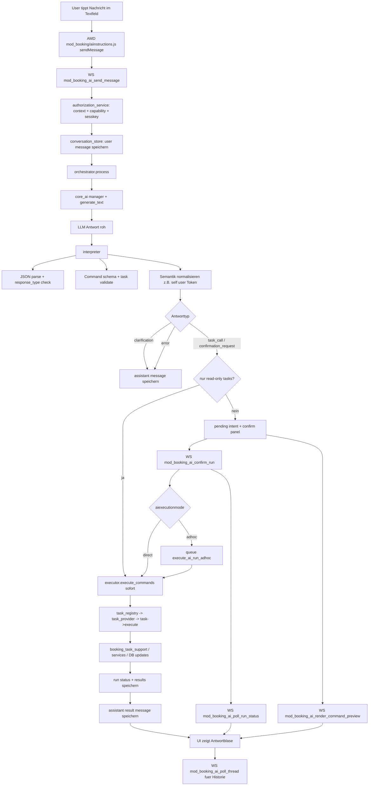

# WBAgent Workflow Uebersicht (mod_booking)

Diese Uebersicht zeigt den Weg von der Eingabe im Textfeld bis zur Ausgabe im Chat.

## End-to-End Flow

## Wie fuehrt der Agent Aufgaben aus?

1. Das Frontend ruft mod_booking_ai_send_message auf.
2. Der Orchestrator baut den Prompt aus Systemprompt + letzter Thread-Historie.
3. Das Modell wird ueber core_ai generate_text angesprochen.
4. Der Interpreter ist die Trust-Boundary:
   - validiert JSON + response_type
   - validiert task/input gegen Registry
   - stoppt bei Ambiguitaet (clarification)
   - normalisiert Eingaben (z.B. self-reference)
5. Bei reinen Read-only-Commands wird sofort ausgefuehrt.
6. Bei mutierenden Commands kommt confirmation_request; Ausfuehrung erst nach Confirm.
7. Die Ausfuehrung passiert im Executor ueber task_registry auf konkrete Tasks.
8. Tasks delegieren Fachlogik (z.B. booking_task_support / mutation services), schreiben Resultate, und das UI pollt den Status.

## Welche Webservices werden verwendet?

### Vom Chat-UI genutzte mod_booking Webservice-Funktionen

- mod_booking_ai_send_message
- mod_booking_ai_confirm_run
- mod_booking_ai_poll_thread
- mod_booking_ai_poll_run_status
- mod_booking_ai_render_command_preview
- mod_booking_ai_list_candidate_options

### Innerhalb der Agent-Logik genutzte Services/Endpoints

- core_ai generate_text (ueber core_ai manager) fuer die Modellanfrage
- mod_booking\\external\\search_users::execute (in-process aufgerufen)
- mod_booking\\external\\search_courses::execute (in-process aufgerufen)

Wichtig: search_users/search_courses werden hier nicht als separater HTTP Call vom Browser aus benutzt, sondern serverseitig als wiederverwendete externe Klassenlogik aufgerufen.
