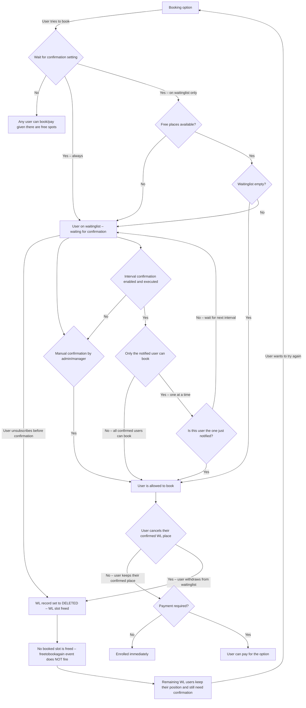

# Waitinglist confirmation – simplified flow

## Key points

- **A WL user can unsubscribe at any point – before or after confirmation.**
  Whether still unconfirmed (`F`) or already confirmed/allowed to book (`J`), withdrawing sets the
  WL record to `DELETED` and frees the WL slot. In both cases the path leads to `Q`.

- **Cancelling from the waitinglist frees only a WL slot, not a booked slot.**
  The `bookingoption_freetobookagain` event is **not** triggered when a WL user withdraws.
  Other WL users are therefore not auto-promoted and still need to wait for their own confirmation.

- **`waitforconfirmation = 2` (only on waitinglist):**
  A user books directly when both a free slot *and* an empty waitinglist exist.
  Once the WL is occupied, any new booker is queued on the WL and requires confirmation —
  even if a booked slot later becomes available.

- **The interval confirmation sends one or all users a notification, depending on the setting.**
  With *only notified user can book*, only the most recently notified user holds an active
  confirmation at a time. Others must wait for their own interval turn.
