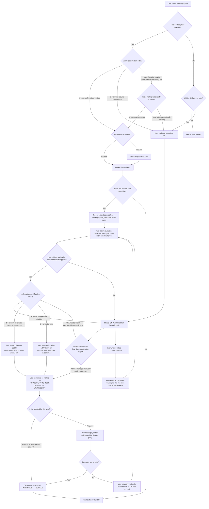

# Waiting list + confirmation user flow

This diagram extends the flow from issue #1050 and includes the waiting-list unsubscribe path.

## Key points about the flow

- **The task does NOT place users on the waiting list.**
  Users land on the waiting list first (status `WAITINGLIST`, unconfirmed). Only *after* that does a rule task run *from* that waiting-list status to give the user the *possibility to book*.

- **"Possibility to book" is an intermediate state (still on waiting list).**
  The task sets a confirmation JSON flag on the booking_answers record. The user's waiting-list status only changes to `BOOKED` when they are actually auto-booked (no price) or complete payment (price > 0).

- **Waiting-list unsubscribe does not free a booked place.**
  When a waiting-list user unsubscribes, their answer is set to `DELETED`. No `bookingoption_freetobookagain` event fires. The rule task re-evaluates the remaining waiting-list users on its next run.

- **One-at-a-time notification (`confirmationonnotification = 2`):**
  Only one user at a time is left with a confirmation JSON. All other waiting-list users have their confirmation JSON removed, so only the next in line can pay.

- **Price-aware behavior:**
  If the option has a price but the effective user price is `0`, the task auto-books the user directly (no payment step needed).
