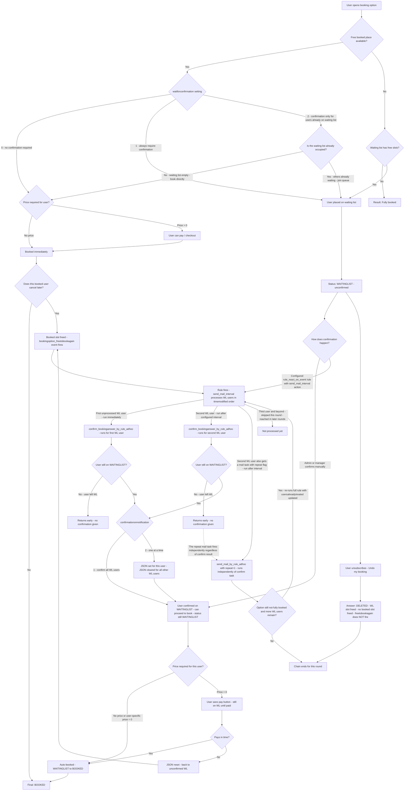

# Waiting list + confirmation user flow

This diagram extends the flow from issue #1050 and includes the waiting-list unsubscribe path and the
task-chaining logic used by the automated confirmation rule.

## Key points about the flow

- **`waitforconfirmation = 2` means "confirmation only for waiting-list users".**
  When slots are free and the waiting list is empty, users book directly (no confirmation needed).
  Once the option fills up and users land on the waiting list, or once the waiting list is occupied,
  all further bookings go through the waiting list and require confirmation — even if a slot later
  becomes free. This ensures the queue is respected.

- **The task does NOT place users on the waiting list.**
  Users land on the waiting list first (status `WAITINGLIST`, unconfirmed). Only *after* that does a
  rule task run *from* that waiting-list status to give the user the *possibility to book*.

- **"Possibility to book" is an intermediate state (still on waiting list).**
  The task sets a confirmation JSON flag on the `booking_answers` record. The user's status only
  changes to `BOOKED` when they are actually auto-booked (no price) or complete payment (price > 0).

- **Automated confirmation requires a configured rule.**
  An admin must create a `rule_react_on_event` rule for the `bookingoption_freetobookagain` event
  using the `send_mail_interval` action. This rule fires when a booked user cancels and frees a slot.

- **The chain mechanism (how the rule advances through the queue).**
  `send_mail_interval` creates tasks for the first two WL users per round.  The first user gets
  immediate tasks. The second user gets delayed tasks, and their mail task carries a `repeat=1` flag.
  When that delayed mail task fires, it re-executes the entire rule from scratch, skipping already-
  treated users. The next unprocessed WL user then becomes the new "first user". This is the chaining
  mechanism — NOT the confirm task itself.

- **When a user is no longer on the waiting list when the confirm task fires.**
  `confirm_bookinganswer_by_rule_adhoc` returns early and gives no confirmation.
  The parallel `send_mail_by_rule_adhoc` task with `repeat=1` runs **independently** regardless.
  It re-executes the rule and finds the next user in the queue. The chain continues correctly;
  it does not break because one user left the waiting list.

- **Waiting-list unsubscribe does not free a booked place and does not restart the chain.**
  When a WL user unsubscribes, their answer is set to `DELETED`. This does not fire a
  `bookingoption_freetobookagain` event (no booked slot was freed). The chain continues only through
  the repeat mail task from a previous round, if one is still scheduled.

- **One-at-a-time notification (`confirmationonnotification = 2`).**
  When the confirm task runs for a user and `confirmationonnotification = 2`, it sets the
  confirmation JSON for that user and clears it for all others currently on the waiting list.
  Only the most recently processed user has an active confirmation at any given moment.

- **Price-aware behavior.**
  If the option has a price but the effective user price is `0`, the task auto-books the user
  directly (no payment step needed).

