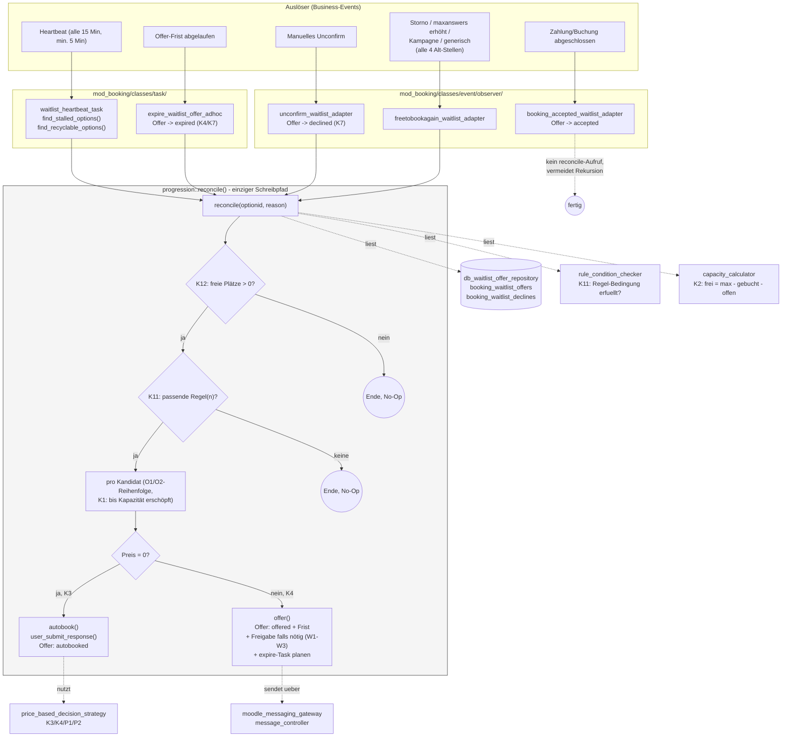
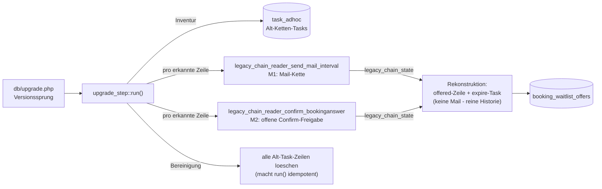

# Waitlist-Progression — Architektur (Laufzeit-Ansicht, Stand 2026-08-21)

Dieses Dokument zeigt, **wie das System heute tatsächlich arbeitet**, nach Abschluss von Phase 2
und dem größten Teil von Phase 3 (Clean-Cut-Switchover). Im Unterschied zum
Implementierungs-Fortschrittsgraphen (`WAITLIST_REFACTOR_IMPLEMENTATION_PROGRESS_2026-08-12.md`,
der den Bauzustand trackt) ist dies eine reine Laufzeit-/Verhaltensbeschreibung.

## Gesamtüberblick

## Migration (einmalig beim Produktiv-Update)

## Was bewusst NICHT mehr existiert (Phase 3, Legacy-Entfernung)

| Alt-Mechanismus | Status | Ersetzt durch |
|---|---|---|
| `send_mail_interval::execute()` (Ketten-Logik) | No-op, Klasse bleibt als Konfigurationsquelle | `progression::offer()` |
| `confirm_bookinganswer` / `confirm_bookinganswer_by_rule_adhoc` | No-op, Klassen bleiben für Alt-Regeln/verwaiste Tasks ladbar | `progression::grant_confirmation_if_required()` |
| `repeat`-Zweig in `send_mail_by_rule_adhoc` | entfernt | (nicht mehr nötig, kein Ketten-Neustart mehr) |
| Companion-Rules-Mechanik (`rules_info.php`) | entfernt | `waitlist_heartbeat_task` (T7, bis zu 15 Min statt sofort - siehe unten) |

**Offener Punkt:** die Companion-Rules-Mechanik war zugleich der einzige T5-Trigger-Pfad (später
Wartelisten-Beitritt bei zufällig schon freier Kapazität). Ohne dedizierten
`latejoiner_waitlist_adapter` fängt diesen Randfall aktuell nur noch der Heartbeat ab (Verzögerung
statt sofortiger Reaktion) - siehe `WAITLIST_REFACTOR_IMPLEMENTATION_PROGRESS_2026-08-12.md` für
den Stand dieser Entscheidung.

**Bleibt dauerhaft bestehen:** der `timemodified`-Einfrier-Sonderfall in
`booking_option::write_user_answer_to_db()`. Final entschieden (2026-08-21) - kein O3-Test
existiert, und der Sonderfall wird nicht nur von Alt-Code gebraucht, sondern auch vom eigenen
neuen `db_waitlist_offer_repository::get_unbehandelte_waitinglist()` (Runden-Reihenfolge via
`MIN(timemodified)`) sowie von der weiterhin aktiven, unabhängigen `sync_waiting_list()`-Logik,
`manageusers_table.php`s Rang-Anzeige/manuellem Umsortieren und `select_student_in_bo.php`s
"wer ist als Nächstes"-Regel-Bedingung. Details:
`WAITLIST_REFACTOR_IMPLEMENTATION_PROGRESS_2026-08-12.md`.

## Kernprinzipien (unverändert seit Phase 2)

- **Ein einziger Schreibpfad**: `progression::reconcile()` ist die einzige Stelle, die
  Wartelisten-Entscheidungen trifft und in `booking_waitlist_offers` schreibt.
- **Kapazitätsgesteuert, nicht zeitgesteuert** (K1/T8): so viele Kandidaten wie Plätze frei sind,
  nicht eine Person pro Intervall-Tick.
- **Permanente Sperre** (K7): einmal abgelehnt oder verstrichen, nie wieder angeboten - außer die
  neue, pro Option einstellbare Recycling-Option ist aktiv (`waitlistrecycling`).
- **`\core\clock`-DI überall**: keine bare `time()`-Aufrufe für terminierungsrelevante
  Entscheidungen, macht alles mit `mock_clock_with_frozen()` testbar.
- **Composition Root**: `progression_factory::get()` ist die einzige Stelle, die konkrete
  Implementierungen verdrahtet.
