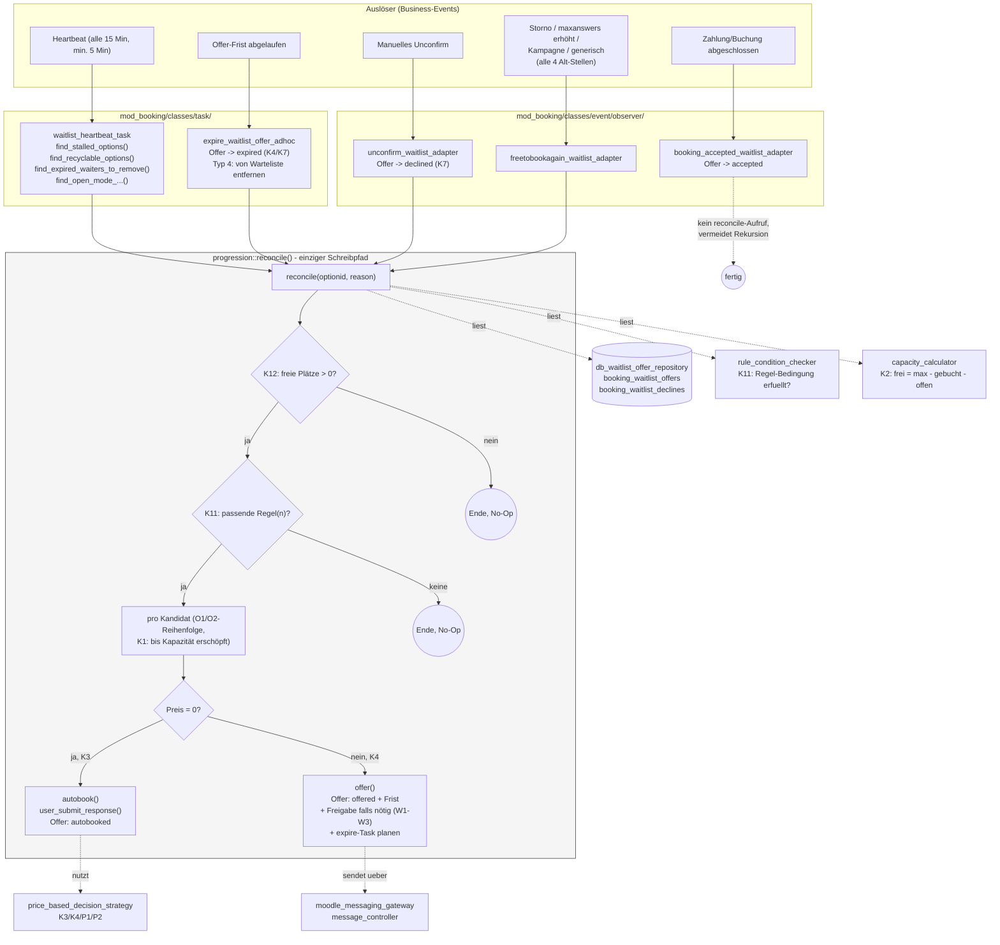
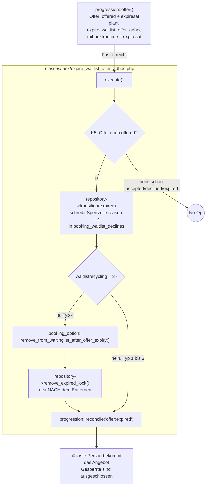
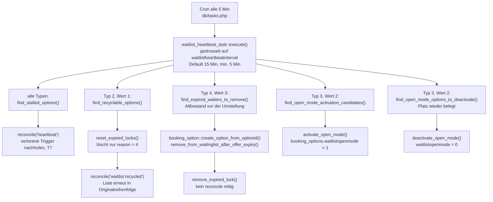
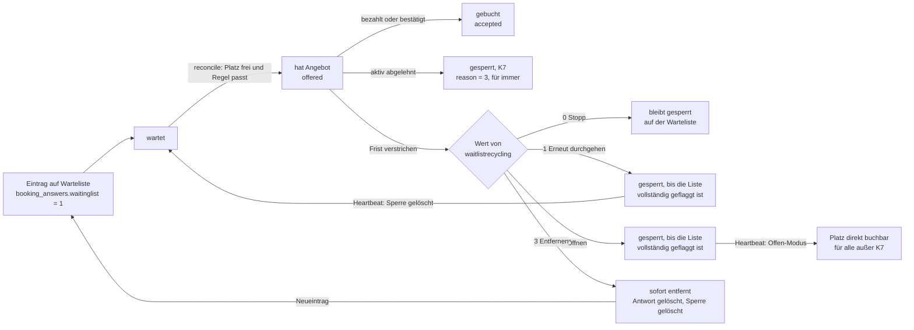
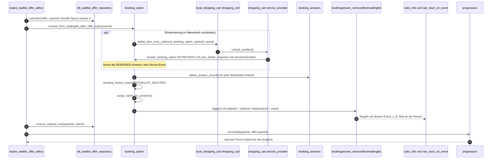
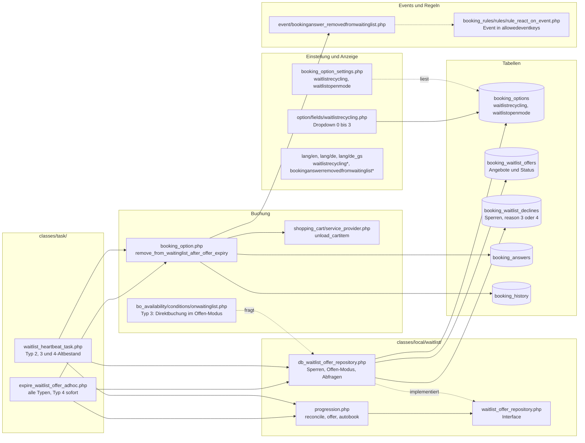
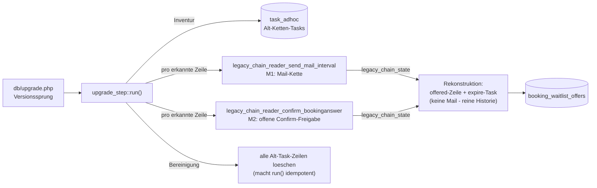

# Waitlist-Progression — Architektur (Laufzeit-Ansicht, Stand 2026-08-21)

> Ergänzt 2026-09-11: Abschnitt [Die vier Wartelisten-Typen](#die-vier-wartelisten-typen-waitlistrecycling) inklusive des neuen Typs 4 „Bei Ablauf des Angebots von der Warteliste entfernen“.

Dieses Dokument zeigt, **wie das System heute tatsächlich arbeitet**, nach Abschluss von Phase 2
und dem größten Teil von Phase 3 (Clean-Cut-Switchover). Im Unterschied zum
Implementierungs-Fortschrittsgraphen (`WAITLIST_REFACTOR_IMPLEMENTATION_PROGRESS_2026-08-12.md`,
der den Bauzustand trackt) ist dies eine reine Laufzeit-/Verhaltensbeschreibung.

## Gesamtüberblick

## Die vier Wartelisten-Typen (`waitlistrecycling`)

Pro Buchungsoption einstellbar im Optionsformular unter **„Erweiterte Einstellungen“**, Feld
**„Warteliste nach vollständigem Durchlauf“** (`classes/option/fields/waitlistrecycling.php`,
gespeichert in `booking_options.waitlistrecycling`). Die Einstellung legt fest, was mit Personen
passiert, deren Angebot **verstrichen** ist (K4). Wer ein Angebot **aktiv ablehnt** (K7), bleibt bei
allen vier Typen dauerhaft gesperrt.

| Typ | Wert | Bezeichnung (de / en) | Greift wann | Wirkung |
|---|---|---|---|---|
| 1 | `0` (Default) | Stopp / Stop | nie | Verstrichene bleiben dauerhaft gesperrt auf der Warteliste. |
| 2 | `1` | Erneut durchgehen / Go through again | Heartbeat, sobald die Liste vollständig geflaggt ist | Ablauf-Sperren werden gelöscht, die Liste wird in der ursprünglichen Reihenfolge erneut angefragt. |
| 3 | `2` | Nach vollständigem Durchlauf öffnen / Open up after full pass-through | Heartbeat, sobald die Liste vollständig geflaggt ist | Der freie Platz ist direkt buchbar, für alle außer aktiv Ablehnende, bis jemand bucht. Danach arbeitet die Warteliste wieder normal. |
| 4 | `3` | Bei Ablauf des Angebots von der Warteliste entfernen / Remove from waiting list when offer expires | **sofort** beim einzelnen Ablauf (expire-Task); Altbestand beim nächsten Heartbeat | Die Person wird von der Warteliste entfernt, inklusive einer Warenkorb-Reservierung, ohne Storno-Event oder Storno-Mails. Die Sperre wird gelöscht, ein Neueintrag ist ein Neustart am Ende der Liste. |

**Vollständig geflaggt** heißt: Mindestens eine Person steht auf der Warteliste, niemand hat ein
offenes Angebot (`pending`/`offered`), und alle Wartenden haben eine Sperrzeile in
`booking_waitlist_declines`.

> **Benennung im Code:** Code-Kommentare zählen nicht einheitlich. „Typ 2 / Type 2 (open after full
> pass)“ meint den **Wert** `2` (in dieser Tabelle Typ 3), „Type 4“ meint den Wert `3`. Maßgeblich ist
> immer der Wert von `waitlistrecycling`.

### Ablauf, wenn ein Angebot verstreicht

Gilt für alle Typen. Nur Typ 4 greift hier sofort ein, die Typen 2 und 3 wirken erst über den
Heartbeat (nächster Abschnitt).

Die Reihenfolge bei Typ 4 ist wichtig: Beim Entfernen einer Warenkorb-Reservierung läuft intern
`sync_waiting_list()` und damit womöglich schon ein `reconcile()`. In diesem Moment muss die
entfernte Person noch gesperrt sein, sonst würde sie sofort wieder angefragt.

### Heartbeat: was pro Typ periodisch passiert

Solange der Offen-Modus aktiv ist, bricht `progression::reconcile()` sofort ab
(`is_open_mode_active()`), und `bo_availability/conditions/onwaitinglist.php` lässt die direkte
Buchung zu, außer für aktiv Ablehnende (`is_actively_declined()`).

### Weg einer wartenden Person, je Typ

### Typ 4 im Detail: Aufrufe über die Klassen

Bewusst **nicht** über `booking_option::user_delete_response()`: Das würde die Entfernung als Storno
behandeln. Es feuert `bookinganswer_cancelled`, verschickt die alten Storno-Mails
(`MSGPARAM_CANCELLED_BY_TEACHER_OR_SYSTEM`), führt die „cancel“-After-Actions aus und fasst
Einschreibung und Abschluss an. Nichts davon passt zu jemandem, der nie einen Platz hatte.

### Beteiligte Dateien und Klassen

### Tests

| Typ | Tests |
|---|---|
| 1 Stopp | `tests/task/expire_waitlist_offer_adhoc_test.php` (`test_stop_mode_keeps_the_expired_candidate_locked_on_the_list`, `test_execute_does_not_reoffer_the_sole_candidate_whose_own_offer_expired`), `tests/task/waitlist_heartbeat_task_test.php` (`test_execute_does_not_recycle_when_recycling_disabled`) |
| 2 Erneut durchgehen | `tests/task/waitlist_heartbeat_task_test.php` (`test_execute_recycles_a_fully_flagged_option_when_recycling_enabled`, `test_execute_never_recycles_an_actively_declined_candidate`), `tests/local/waitlist/e1_heartbeat_recycling_e2e_test.php`, `e2_recycling_reset_order_multi_candidate_test.php`, `c2_mixed_k7_k4_recycling_test.php` |
| 3 Öffnen | `tests/local/waitlist/waitlist_openmode_fresh_candidate_after_reset_test.php`, `tests/local/waitlist/waitlist_openmode_heartbeat_activation_test.php`, `tests/local/waitlist/waitlist_openmode_heartbeat_deactivation_test.php`, `tests/local/waitlist/waitlist_openmode_reconcile_noop_test.php` |
| 4 Entfernen | `tests/task/expire_waitlist_offer_adhoc_test.php` (5 × `test_type4_*`), `tests/task/waitlist_heartbeat_task_test.php` (`test_execute_removes_the_type4_backlog`, `test_execute_leaves_an_expired_waiter_alone_when_not_type4`), `tests/local/waitlist/db_waitlist_offer_repository_test.php` (`test_remove_expired_lock_*`, `test_find_expired_waiters_to_remove_scoping`) |

## Migration (einmalig beim Produktiv-Update)

## Was bewusst NICHT mehr existiert (Phase 3, Legacy-Entfernung)

| Alt-Mechanismus | Status | Ersetzt durch |
|---|---|---|
| `send_mail_interval::execute()` (Ketten-Logik) | No-op, Klasse bleibt als Konfigurationsquelle | `progression::offer()` |
| `confirm_bookinganswer` / `confirm_bookinganswer_by_rule_adhoc` | No-op, Klassen bleiben für Alt-Regeln/verwaiste Tasks ladbar | `progression::grant_confirmation_if_required()` |
| `repeat`-Zweig in `send_mail_by_rule_adhoc` | entfernt | (nicht mehr nötig, kein Ketten-Neustart mehr) |
| Companion-Rules-Mechanik (`rules_info.php`) | entfernt | `waitlist_heartbeat_task` (T7, bis zu 15 Min statt sofort - siehe unten) |

**Offener Punkt:** die Companion-Rules-Mechanik war zugleich der einzige T5-Trigger-Pfad (später
Wartelisten-Beitritt bei zufällig schon freier Kapazität). Ohne dedizierten
`latejoiner_waitlist_adapter` fängt diesen Randfall aktuell nur noch der Heartbeat ab (Verzögerung
statt sofortiger Reaktion) - siehe `WAITLIST_REFACTOR_IMPLEMENTATION_PROGRESS_2026-08-12.md` für
den Stand dieser Entscheidung.

**Bleibt dauerhaft bestehen:** der `timemodified`-Einfrier-Sonderfall in
`booking_option::write_user_answer_to_db()`. Final entschieden (2026-08-21) - kein O3-Test
existiert, und der Sonderfall wird nicht nur von Alt-Code gebraucht, sondern auch vom eigenen
neuen `db_waitlist_offer_repository::get_unbehandelte_waitinglist()` (Runden-Reihenfolge via
`MIN(timemodified)`) sowie von der weiterhin aktiven, unabhängigen `sync_waiting_list()`-Logik,
`manageusers_table.php`s Rang-Anzeige/manuellem Umsortieren und `select_student_in_bo.php`s
"wer ist als Nächstes"-Regel-Bedingung. Details:
`WAITLIST_REFACTOR_IMPLEMENTATION_PROGRESS_2026-08-12.md`.

## Kernprinzipien (unverändert seit Phase 2)

- **Ein einziger Schreibpfad**: `progression::reconcile()` ist die einzige Stelle, die
  Wartelisten-Entscheidungen trifft und in `booking_waitlist_offers` schreibt.
- **Kapazitätsgesteuert, nicht zeitgesteuert** (K1/T8): so viele Kandidaten wie Plätze frei sind,
  nicht eine Person pro Intervall-Tick.
- **Permanente Sperre** (K7): einmal abgelehnt oder verstrichen, nie wieder angeboten - außer die
  pro Option einstellbare Einstellung `waitlistrecycling` sagt für *verstrichene* Angebote etwas
  anderes (Typ 2 erneut durchgehen, Typ 3 öffnen, Typ 4 entfernen - siehe
  [Die vier Wartelisten-Typen](#die-vier-wartelisten-typen-waitlistrecycling)).
- **`\core\clock`-DI überall**: keine bare `time()`-Aufrufe für terminierungsrelevante
  Entscheidungen, macht alles mit `mock_clock_with_frozen()` testbar.
- **Composition Root**: `progression_factory::get()` ist die einzige Stelle, die konkrete
  Implementierungen verdrahtet.
