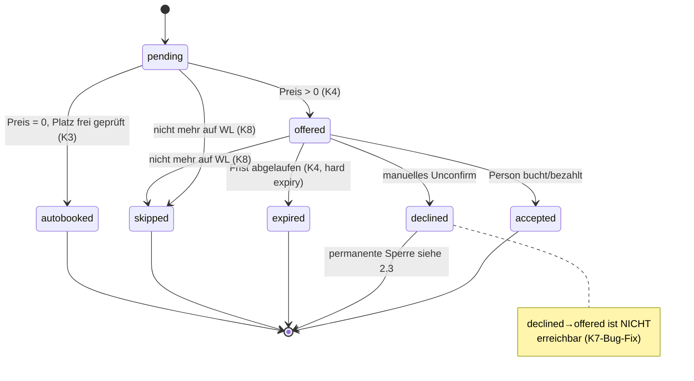
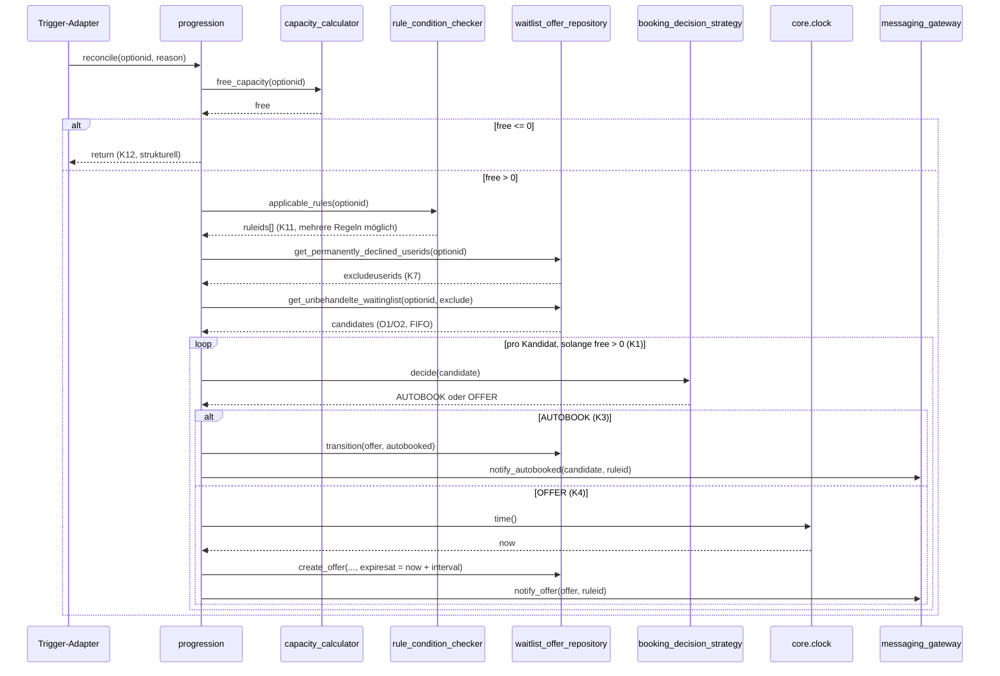
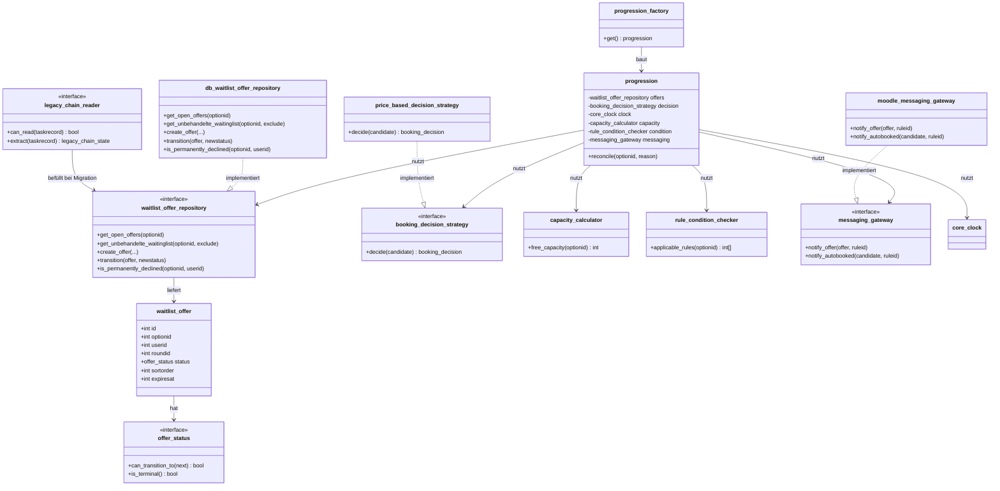
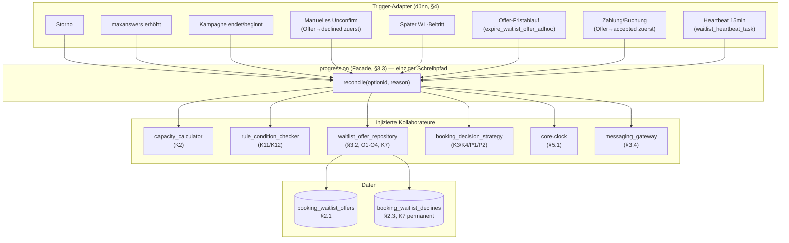

# Waitlist-Progression — Architektur (Schritt 3, Entwurf)

> **Status:** Entwurf, noch nicht final mit Georg abgenommen. Baut auf den externen Docs in
> `Wunderbyte-GmbH/secret_docs` (`mod_booking/blueprints/WAITLIST_REFACTOR_*_2026-08-04.md`) auf
> und macht deren Architektur-Skizze konkret: Klassenschnitt, Design Patterns mit Begründung,
> Modulgrenzen, und explizite Antworten auf die Testbarkeits-Lücken, die beim Testlauf (Schritt 2)
> gefunden wurden. Policy-Entscheidungen (K4 hard expiry, K7 permanent, K12 strukturell, T7
> 15min, kein Deprecation-Fenster) sind eingearbeitet.

---

## 1. Design-Ziele (Leitplanken für jede Entscheidung unten)

1. **Ein Schreibpfad** — nur `progression::reconcile()` darf den Wartelisten-Zustand verändern.
2. **Idempotenz per Konstruktion**, nicht per Disziplin — DB-Constraints statt "wir prüfen das schon".
3. **Testbar ohne Task-Log-Archäologie** — Uhrzeit und Zufall sind injizierbar, nicht global.
4. **Jede Policy-Entscheidung hat eine 1:1 Code-Stelle**, keine verstreute Logik.
5. **Robust gegen Fehlkonfiguration** — sicherheitskritische Garantien (K12) hängen nicht an
   Admin-Einstellungen.

## 2. Domänenmodell

### 2.1 Tabelle `booking_waitlist_offers` (wie Blueprint §2.1)

Ergänzung ggü. Blueprint: eigene Sperrliste für K7 (siehe 2.3) und ein `version`-Feld für
optimistisches Locking bei gleichzeitigen Schreibzugriffen (siehe 5.3).

```
booking_waitlist_offers
  id, optionid, userid, baid, roundid
  status        SMALLINT  (siehe 2.2, State Pattern)
  sortorder     BIGINT    -- eingefroren bei Rundenstart, nie verändert (O1-O3, O5)
  offeredat, expiresat, ruleid
  version       INT DEFAULT 1   -- optimistic locking, siehe 5.3
  timecreated, timemodified
  UNIQUE(optionid, roundid, userid)     -- Idempotenz (K5)
  INDEX(userid, optionid, status)       -- K7: schneller "ist diese Person permanent declined"-Check
```

### 2.2 State Pattern für den Offer-Status

Statt eines rohen SMALLINT-Vergleichs verstreut über Reconciler/Tasks/Reports: eine
`offer_status`-Klassenhierarchie, die **erlaubte Übergänge** kennt und validiert.

```
interface offer_status {
    public function can_transition_to(offer_status $next): bool;
    public function is_terminal(): bool;   // accepted/declined/expired/skipped/autobooked
}

pending → offered → { accepted | declined | expired }
offered → skipped   (K8: Person nicht mehr auf WL beim Ausführungszeitpunkt)
pending → autobooked (K3: Preis 0, kein Offer-Umweg)
```

**Warum dieses Pattern:** Der aktuelle Code hat Status-Strings/Konstanten
(`MOD_BOOKING_BO_SUBMIT_STATUS_*`) an >6 Stellen verglichen, ohne zentrale Übergangs-Validierung —
genau das hat den K7-Bug ermöglicht (ein "declined" konnte stillschweigend erneut in Richtung
"offered" laufen). Mit einer expliziten Zustandsmaschine wird `declined → offered` **strukturell
unmöglich** (die Repository-Schicht ruft `can_transition_to()` vor jedem Schreiben), nicht nur
"durch sorgfältige Tests abgedeckt".



### 2.3 K7 — permanenter Declined-Status (jetzt entschieden: dauerhaft, nicht rundenbezogen)

Da K7 jetzt **dauerhaft bis zur Wiederanmeldung** gilt (nicht nur rundenbezogen), reicht der
Status `declined` auf einer Offer-Zeile nicht aus — eine Offer-Zeile ist an eine `roundid`
gebunden, aber die Sperre muss rundenübergreifend wirken. Deshalb:

- Zusätzliches, schlankes Tabellenpaar `booking_waitlist_declines` (optionid, userid,
  timecreated) — eine reine Sperrliste, kein Zustandsautomat nötig.
- Der Reconciler filtert **vor** dem FIFO-Durchlauf: `WHERE NOT EXISTS (SELECT 1 FROM
  booking_waitlist_declines WHERE optionid=? AND userid=?)`.
- Eintrag wird **gelöscht**, sobald die Person die Warteliste aktiv neu verlässt und wieder
  beitritt (Re-Registrierung) — das ist der einzige Weg, den Eintrag loszuwerden, exakt wie
  entschieden.
- Damit bleibt `booking_waitlist_offers` rein rundenscoped (einfach, klar), und die
  rundenübergreifende Sperre ist eine eigene, klar benannte Verantwortlichkeit
  (Single Responsibility) statt eines Sonderfalls im State-Automaten.

## 3. Der Reconciler-Service

### 3.1 Strategy Pattern für die Preis-Entscheidung (K3/K4/P1/P2)

```
interface booking_decision_strategy {
    public function decide(booking_waitlist_candidate $candidate): booking_decision;
    // returns: AUTOBOOK | OFFER
}

class price_based_decision_strategy implements booking_decision_strategy {
    public function decide($candidate): booking_decision {
        $price = price::get_price('option', $candidate->optionid, $candidate->user); // P1: live lookup, nicht gecacht
        if (($price['price'] ?? 0) == 0) { return booking_decision::AUTOBOOK; }      // K3, P2
        return booking_decision::OFFER;
    }
}
```

**Warum:** Isoliert die Preis-Frage vollständig von der Reihenfolge-/Kapazitäts-Logik. Macht
P1 ("Bewertung zum Behandlungszeitpunkt") durch Bauart korrekt — die Strategy wird pro
Kandidat frisch aufgerufen, nie gecacht. Erlaubt außerdem, die Strategie in Unit-Tests
(Kategorie A8/A9) ohne DB/Reconciler zu testen — direkt gegen die Requirements-Tabelle.

### 3.2 Repository Pattern für den Datenzugriff

```
interface waitlist_offer_repository {
    public function get_open_offers(int $optionid): array;
    public function get_unbehandelte_waitinglist(int $optionid, array $excludeuserids): array;  // O1/O2: sortorder ASC, id ASC
    public function create_offer(int $optionid, int $userid, int $roundid, int $sortorder, offer_status $status): waitlist_offer;
    public function transition(waitlist_offer $offer, offer_status $newstatus): void;  // wirft bei ungültigem Übergang (2.2)
    public function is_permanently_declined(int $optionid, int $userid): bool;          // K7
}
```

**Warum:** Der Reconciler-Service selbst enthält **kein SQL**. Das macht ihn mockbar für
Unit-Tests (Reconciler-Logik ohne echte DB testen) und hält "wie wird sortiert/gefiltert" an
einer Stelle — genau der Punkt, an dem heute O1-O4 über drei verschiedene Code-Stellen verteilt
sind (`select_student_in_bo.php`, `booking_option.php:635/675`, PHP-`usort` ohne Tie-Break).

### 3.3 Der Reconciler selbst (Facade/Application Service)

```
final class progression {
    public function __construct(
        private waitlist_offer_repository $offers,
        private booking_decision_strategy $decision,
        private \core\clock $clock,              // 5.1: DI statt time_mock-Falle
        private capacity_calculator $capacity,    // K2
        private rule_condition_checker $condition, // K11/K12
        private messaging_gateway $messaging,      // 3.4
    ) {}

    public function reconcile(int $optionid, string $reason = ''): void {
        // Locking: siehe 5.2
        $free = $this->capacity->free_capacity($optionid);       // K2: Kapazität − Gebucht − offene Offers
        if ($free <= 0) { return; }                               // K12: strukturell, keine Sonderregel nötig

        $ruleids = $this->condition->applicable_rules($optionid);  // K11, mehrere Regeln möglich
        if (empty($ruleids)) { return; }

        $excludeuserids = $this->offers->get_permanently_declined_userids($optionid); // K7
        $candidates = $this->offers->get_unbehandelte_waitinglist($optionid, $excludeuserids); // O1/O2

        // Pro qualifizierender Regel (id ASC), gemeinsamer $free-Topf wird weitergereicht -
        // Regel 1 nimmt was sie kann, Regel 2 den Rest usw. (entspricht dem heutigen Verhalten
        // unabhängiger Ketten, jetzt aber mit echtem gemeinsamem Kapazitäts-Gate). Ein einmal in
        // dieser Runde behandelter Kandidat darf keiner weiteren Regel erneut zugeteilt werden -
        // Detail wird bei der Implementierung von progression selbst festgelegt.
        foreach ($ruleids as $ruleid) {
            foreach ($candidates as $candidate) {
                if ($free <= 0) { break 2; }                            // K1: min(N, M)
                if (!$candidate->still_on_waitinglist()) { continue; }  // K8, kein $free--

                $decision = $this->decision->decide($candidate);
                if ($decision === booking_decision::AUTOBOOK) {
                    $this->autobook($candidate, $optionid);             // K3, mit Re-Check auf freien Platz
                } else {
                    $this->offer($candidate, $optionid, $ruleid, $this->clock->time()); // K4
                }
                $free--;
            }
        }
    }
}
```

Das ist bewusst nah am Blueprint-Pseudocode aus §2.2, aber jetzt mit injizierten
Kollaborateuren statt statischen Aufrufen — das ist der Kern von "modular und robust":
jede Verantwortlichkeit hat eine eigene, austauschbare/mockbare Klasse.



### 3.4 Messaging als eigene Gateway-Schnittstelle

```
interface messaging_gateway {
    public function notify_offer(waitlist_offer $offer, int $ruleid): void;
    public function notify_autobooked(booking_waitlist_candidate $candidate, int $ruleid): void;
}
```

Wrapt den bestehenden `message_controller` + Platzhalter-Mechanismus (Blueprint §2.4:
"Rules-Layer wird reiner Messaging-Layer"). Der Reconciler kennt nur dieses Interface, nicht
Moodle-Messaging-Details — Dependency Inversion, macht Reconciler-Tests messaging-frei.

`$ruleid` statt eines eigenen `rule_configuration`-Typs (ursprünglicher Entwurf, existierte nie im
Code): `message_controller` liest Regel-Daten heute schon selbst per `ruleid` aus der DB, ein
serialisiertes `rulejson` gilt im Bestandscode explizit als unzuverlässig ("Send the ruleid as
rulejson often seems to not work", `send_mail_by_rule_adhoc.php`). `moodle_messaging_gateway`
folgt demselben Muster.

## 4. Trigger-Schicht: Adapter Pattern

Alle Trigger (Cancel, maxanswers, Kampagne, Unconfirm, Late-Joiner, Offer-Expiry, Zahlung,
Heartbeat) sind **dünne Adapter**, die Moodle-Events/Cron-Aufrufe auf `reconcile()` abbilden:

```
class freetobookagain_observer {
    public static function trigger(\core\event\base $event): void {
        progression_factory::get()->reconcile((int) $event->objectid, 'event:freetobookagain');
    }
}
```

**Warum Adapter statt der heutigen Direkt-Kopplung:** Heute ruft `booking_option.php` an
4 Stellen direkt in die Rule-Engine hinein. Mit der Adapter-Schicht bleibt `booking_option.php`
unverändert bis auf "Event feuern" — die Domänenlogik weiß nichts von `booking_option`, und neue
Trigger-Quellen (z. B. eine zukünftige API) brauchen nur einen neuen, kleinen Adapter, keine
Änderung am Reconciler.

### 4.1 Offer-Fristablauf als eigener Adhoc-Task (K4)

```
class expire_waitlist_offer_adhoc extends \core\task\adhoc_task {
    public function execute(): void {
        $offer = /* laden per customdata->offerid */;
        if ($offer->status !== offer_status::OFFERED) { return; }  // K5: idempotent, evtl. schon accepted
        $this->repository->transition($offer, offer_status::EXPIRED);  // K4: hard expiry, entzieht Freigabe
        progression_factory::get()->reconcile($offer->optionid, 'offer:expired');
    }
}
```

Ein Task **pro Offer**, geplant mit `nextruntime = expiresat`, nicht ein Ketten-Repeat-Task wie
heute — jede Offer-Frist ist unabhängig, kein zentraler "Zähler"-Zustand mehr nötig (löst
Diagnose #1 aus dem Blueprint: "Zustand ohne Zuhause" — der Zustand lebt jetzt in der Offer-Zeile,
nicht im Task-`rulejson`).

### 4.2 Heartbeat (T7, jetzt konkretisiert: 15 Min Default / 5 Min Floor)

```
class waitlist_heartbeat_task extends \core\task\scheduled_task {
    public function execute(): void {
        // Scope eng halten (USI-Lasttest-Erfahrung):
        // nur Optionen mit aktiven WL-Antworten UND ohne offene Offers UND free > 0.
        foreach ($this->repository->find_stalled_options() as $optionid) {
            progression_factory::get()->reconcile($optionid, 'heartbeat');
        }
    }
}
```

`get_timestr()`/Intervall über `admin_setting_configduration('booking/waitlistheartbeatinterval',
default: 900, floor: 300)` — Admin-konfigurierbar mit hartem Minimum, wie entschieden.

## 5. Robustheit — drei konkrete Mechanismen

### 5.1 Clock als expliziter Konstruktor-Parameter (direkt aus dem Testlauf-Befund)

Beim Testlauf in Schritt 2 wurde ein Bug gefunden: zwei unsynchronisierte Uhren koexistieren im
Code — `tool_mocktesttime\time_mock` (Namespace-Hack, patcht nur bare `time()`-Aufrufe) vs.
Core's `\core\clock`-DI (von `\core\task\manager` für Scheduling-Entscheidungen genutzt). Diese
Architektur verhindert das strukturell: `progression`, `waitlist_offer_repository`-Implementierung
und die Adhoc-Tasks nehmen `\core\clock` explizit im Konstruktor entgegen (Moodles eigener,
offizieller DI-Mechanismus). Neue Tests (Kategorie A/B/C) mocken ausschließlich über
`$this->mock_clock_with_frozen()` — der `time_mock`-Namespace-Hack wird für den neuen Code
**gar nicht mehr gebraucht**. Kein Feature-Code darf mehr bare `time()`-Aufrufe für
terminierungsrelevante Entscheidungen nutzen.

### 5.2 Locking pro Option (Blueprint erwähnt es, hier konkretisiert)

```
$lock = \core\lock\lock_config::get_lock_factory('mod_booking_waitlist')->get_lock(
    "option:{$optionid}", timeout: 10
);
```

Kritischer Abschnitt = gesamter `reconcile()`-Aufruf. Verhindert, dass zwei gleichzeitig
laufende Trigger (z. B. Heartbeat und ein echtes Storno-Event fast zeitgleich) denselben freien
Platz doppelt vergeben — das UNIQUE-Constraint (2.1) ist das zweite, redundante Sicherheitsnetz
(Defense-in-Depth ist hier gerechtfertigt, weil Lock-Timeouts/Deadlocks in Produktion vorkommen
können; das Constraint fängt den Fall ab, in dem der Lock aus irgendeinem Grund umgangen wurde).

### 5.3 Optimistisches Locking auf Offer-Zeilen (`version`-Feld)

Zwei Prozesse, die dieselbe Offer-Zeile gleichzeitig transitionieren wollen (z. B.
Fristablauf-Task und manuelles Confirm treffen sich), sollen nicht die "letzte Schreiboperation
gewinnt"-Race haben. `transition()` schreibt mit `WHERE id=? AND version=?`, bei 0 betroffenen
Zeilen wird neu geladen und der Aufrufer informiert ("Offer war bereits in anderem Zustand") —
robuster als der heutige Code, der stillschweigend überschreibt.

## 6. Modulgrenzen (Namespace-Vorschlag)

```
mod_booking\local\waitlist\
  offer_status.php              (State Pattern, 2.2)
  waitlist_offer.php             (Entity)
  waitlist_offer_repository.php  (Interface)
  db_waitlist_offer_repository.php (Implementierung, 3.2)
  booking_decision_strategy.php  (Interface + price_based_decision_strategy, 3.1)
  capacity_calculator.php        (K2)
  rule_condition_checker.php     (K11, liest bestehende rule_react_on_event/send_mail_interval-
                                   Konfiguration; unterstützt mehrere aktive Regeln pro Instanz)
  messaging_gateway.php          (Interface + moodle_messaging_gateway, 3.4)
  progression.php                (Facade/Service, 3.3)
  progression_factory.php        (Composition Root — verdrahtet die DI-Kette einmal zentral)

mod_booking\task\
  expire_waitlist_offer_adhoc.php   (4.1)
  waitlist_heartbeat_task.php        (4.2)

mod_booking\event\observer\
  freetobookagain_waitlist_adapter.php   (4, ersetzt Direkt-Kopplung in booking_option.php)

mod_booking\local\waitlist\migration\
  upgrade_step.php                (Blueprint §3, siehe unten)
```

Bewusst **kein** einziger God-Service — jede Klasse hat eine Verantwortlichkeit, jede ist über
ihr Interface mockbar. `progression_factory` ist der einzige Ort, der konkrete Implementierungen
kennt (Composition Root, verhindert `new X()` verstreut über den Code — genau das Muster, das
heute fehlt und wodurch die 2 parallelen Ketten überhaupt erst auseinanderdriften konnten).



## 7. Migration (M1-M5) — Strategy pro Alt-Format

Blueprint §6 nennt explizit mehrere Alt-Ketten-Generationen (631ca237e-, 1ea74eed0-,
020289328-Format). Statt einer monolithischen `if/elseif`-Kaskade:

```
interface legacy_chain_reader {
    public function can_read(stdClass $taskrecord): bool;
    public function extract(stdClass $taskrecord): legacy_chain_state;  // usersalreadytreated, etc.
}
```

Eine Implementierung pro Generation, der `upgrade_step` iteriert über registrierte Reader und
nimmt den ersten passenden — neue Alt-Formate (falls beim Rollout noch mehr auftauchen, siehe
Blueprint-Risiko "Vielfalt realer Alt-Ketten-Zustände") lassen sich als zusätzlicher Reader
ergänzen, ohne den Kern anzufassen (Open/Closed Principle). Nicht erkennbare Formate fallen an
die T7-Heartbeat-Selbstheilung durch (M3: Bereinigung + Reconcile holt nach) — genau das
Sicherheitsnetz, das T7 laut Anforderungsliste ohnehin haben soll.

## 7a. Gesamtüberblick als Diagramm



## 8. Wie jede Policy-Entscheidung konkret verortet ist

| Entscheidung | Wo in dieser Architektur |
|---|---|
| K4 Hard Expiry | `expire_waitlist_offer_adhoc` (4.1) — expliziter Task pro Offer, kein Zähler |
| K7 permanent | `booking_waitlist_declines`-Tabelle (2.3), Filter vor FIFO-Durchlauf |
| K12 strukturell | `free <= 0`-Guard in `reconcile()` VOR der K11-Bedingungsprüfung (3.3) |
| T7 15min/5min | `waitlist_heartbeat_task` + `admin_setting_configduration` (4.2) |
| Kein Deprecation-Fenster | `confirm_bookinganswer_by_rule_adhoc` wird in Phase 3 vollständig entfernt, keine Hülle — Migration (§7) MUSS daher lückenlos sein, da kein Fallback existiert |

## 9. Was das für Schritt 4 bedeutet

- Kategorie-A-Charakterisierungstests (gegen heutigen Code) bleiben wie geplant unverändert nötig.
- Kategorie-B-Zielverhaltenstests können ab Phase 2 direkt gegen `progression` + Mock-Repository
  geschrieben werden (kein DB-Setup nötig für die Kernlogik-Tests) — schneller als heutige
  DB-lastige Tests, und sauber isoliert von der Clock-Falle aus Schritt 2.
- `progression_factory` ist die erste Klasse, die in Phase 2 entsteht — alles andere hängt davon ab.

## 10. Referenzen

- Ist-Zustand: `INTERVALLBENACHRICHTIGUNG_FREIE_PLAETZE_FUNKTIONSWEISE_2026-08-04.md` (secret_docs)
- Requirements (R-Nummern): `WAITLIST_REFACTOR_REQUIREMENTS_2026-08-04.md` (secret_docs)
- Testabdeckung/Lückenliste: `WAITLIST_REFACTOR_TEST_COVERAGE_2026-08-04.md` (secret_docs)
- Blueprint (Zielarchitektur-Skizze, Migration, Phasenplan): `WAITLIST_REFACTOR_BLUEPRINT_2026-08-04.md` (secret_docs)
- Testlauf-Befund (Clock-Mocking-Lücke, `runAdhocTasks()` ignoriert nextruntime): siehe Session-Notizen 2026-08-12
