# Waitlist-Progression — Implementierungs-Fortschritt

Lebendiges Tracking-Dokument zur Architektur in
[`WAITLIST_REFACTOR_ARCHITECTURE_2026-08-12.md`](WAITLIST_REFACTOR_ARCHITECTURE_2026-08-12.md).
Jede Klasse/Tabelle aus der Architektur ist hier ein Knoten. **Alle Knoten starten mit ⬜**
(noch nicht begonnen). Sobald eine Klasse implementiert ist, wird das Symbol im Knotentext auf
✅ umgestellt (siehe Anleitung unten).

## So aktualisierst du dieses Dokument

Jeder Knotentext beginnt mit einem Status-Symbol, z. B.:

```
db_waitlist_offer_repository["⬜ db_waitlist_offer_repository<br/>DB-Implementierung"]
```

Zum Markieren als fertig: `⬜` → `✅` ändern (optional `🟨` für "gerade in Arbeit"). Sonst nichts
an dem Diagramm anfassen — Knoten-IDs und Kanten bleiben stabil, damit der Graph über die ganze
Umsetzung hinweg vergleichbar bleibt.

*(Hinweis: eine frühere Fassung dieser Datei nutzte Mermaid-`classDef`/`class`-Einfärbung sowie
Stadium-/Subroutine-Knotenformen — das hat sich in der Vorschau als nicht renderbar erwiesen.
Diese Fassung nutzt nur das Syntax-Subset, das in
[`WAITLIST_REFACTOR_ARCHITECTURE_2026-08-12.md`](WAITLIST_REFACTOR_ARCHITECTURE_2026-08-12.md)
nachweislich rendert: einfache Rechtecke, Zylinder für Tabellen, einfache Pfeile.)*

---

## Gesamtgraph (alle Klassen/Tabellen, Status siehe Symbol im Knotentext)

```mermaid
flowchart TB
    subgraph Domain["mod_booking/local/waitlist - Domaenenkern"]
        offer_status["⬜ offer_status<br/>State Pattern, Paragraph 2.2"]
        waitlist_offer["⬜ waitlist_offer<br/>Entity"]
        waitlist_offer_repository["⬜ waitlist_offer_repository<br/>Interface, Paragraph 3.2"]
        db_waitlist_offer_repository["⬜ db_waitlist_offer_repository<br/>DB-Implementierung"]
        booking_decision_strategy["⬜ booking_decision_strategy<br/>Interface, Paragraph 3.1"]
        price_based_decision_strategy["⬜ price_based_decision_strategy<br/>K3 K4 P1 P2"]
        capacity_calculator["⬜ capacity_calculator<br/>K2"]
        rule_condition_checker["⬜ rule_condition_checker<br/>K11 K12"]
        messaging_gateway["⬜ messaging_gateway<br/>Interface, Paragraph 3.4"]
        moodle_messaging_gateway["⬜ moodle_messaging_gateway<br/>Moodle-Messaging-Impl."]
        progression["⬜ progression<br/>Facade reconcile, Paragraph 3.3<br/>einziger Schreibpfad"]
        progression_factory["⬜ progression_factory<br/>Composition Root"]
    end

    subgraph Tasks["mod_booking/task"]
        expire_waitlist_offer_adhoc["⬜ expire_waitlist_offer_adhoc<br/>Adhoc-Task, K4, Paragraph 4.1"]
        waitlist_heartbeat_task["⬜ waitlist_heartbeat_task<br/>Scheduled Task, T7, Paragraph 4.2"]
    end

    subgraph Adapters["Trigger-Adapter Paragraph 4"]
        freetobookagain_waitlist_adapter["⬜ freetobookagain_waitlist_adapter<br/>Storno maxanswers Kampagne T1-T3"]
        latejoiner_waitlist_adapter["⬜ latejoiner_waitlist_adapter<br/>spaeter WL-Beitritt T5"]
        unconfirm_waitlist_adapter["⬜ unconfirm_waitlist_adapter<br/>Unconfirm zu declined T4"]
        booking_accepted_waitlist_adapter["⬜ booking_accepted_waitlist_adapter<br/>Zahlung Buchung zu accepted"]
    end

    subgraph Migration["mod_booking/local/waitlist/migration Paragraph 7"]
        upgrade_step["⬜ upgrade_step<br/>Migrations-Einstiegspunkt M1-M5"]
        legacy_chain_reader["⬜ legacy_chain_reader<br/>Interface"]
        legacy_chain_reader_631ca237e["⬜ reader 631ca237e-Format<br/>aelteste Generation"]
        legacy_chain_reader_1ea74eed0["⬜ reader 1ea74eed0-Format<br/>mittlere Generation"]
        legacy_chain_reader_020289328["⬜ reader 020289328-Format<br/>neueste Generation"]
    end

    subgraph Data["Daten"]
        booking_waitlist_offers[("⬜ booking_waitlist_offers<br/>Paragraph 2.1")]
        booking_waitlist_declines[("⬜ booking_waitlist_declines<br/>Paragraph 2.3, K7 permanent")]
    end

    progression --> waitlist_offer_repository
    progression --> booking_decision_strategy
    progression --> capacity_calculator
    progression --> rule_condition_checker
    progression --> messaging_gateway
    db_waitlist_offer_repository --> waitlist_offer_repository
    price_based_decision_strategy --> booking_decision_strategy
    moodle_messaging_gateway --> messaging_gateway
    waitlist_offer_repository --> waitlist_offer
    waitlist_offer --> offer_status
    progression_factory --> progression
    db_waitlist_offer_repository --> booking_waitlist_offers
    db_waitlist_offer_repository --> booking_waitlist_declines

    freetobookagain_waitlist_adapter --> progression_factory
    latejoiner_waitlist_adapter --> progression_factory
    unconfirm_waitlist_adapter --> progression_factory
    booking_accepted_waitlist_adapter --> progression_factory
    expire_waitlist_offer_adhoc --> progression_factory
    waitlist_heartbeat_task --> progression_factory

    upgrade_step --> legacy_chain_reader
    legacy_chain_reader_631ca237e --> legacy_chain_reader
    legacy_chain_reader_1ea74eed0 --> legacy_chain_reader
    legacy_chain_reader_020289328 --> legacy_chain_reader
    upgrade_step --> db_waitlist_offer_repository
```



---

## Klassen-Checkliste (Details zu jedem Knoten)

| Klasse/Tabelle | Datei | Zweck | Architektur-§ |
|---|---|---|---|
| `offer_status` | `local/waitlist/offer_status.php` | State Pattern: erlaubte Status-Übergänge validieren | §2.2 |
| `waitlist_offer` | `local/waitlist/waitlist_offer.php` | Entity: eine Wartelisten-Offer-Zeile | §2.1 |
| `waitlist_offer_repository` | `local/waitlist/waitlist_offer_repository.php` | Interface: Datenzugriff, kein SQL im Reconciler | §3.2 |
| `db_waitlist_offer_repository` | `local/waitlist/db_waitlist_offer_repository.php` | DB-Implementierung des Repositories | §3.2 |
| `booking_decision_strategy` | `local/waitlist/booking_decision_strategy.php` | Interface: Autobook vs. Offer | §3.1 |
| `price_based_decision_strategy` | `local/waitlist/price_based_decision_strategy.php` | Preis-Entscheidung zum Behandlungszeitpunkt (K3/K4/P1/P2) | §3.1 |
| `capacity_calculator` | `local/waitlist/capacity_calculator.php` | Freie Plätze = Kapazität − Gebucht − offene Offers | §5. K2 |
| `rule_condition_checker` | `local/waitlist/rule_condition_checker.php` | "Führe aus wenn…"-Prüfung + struktureller K12-Guard | K11/K12 |
| `messaging_gateway` | `local/waitlist/messaging_gateway.php` | Interface: Benachrichtigungen, Reconciler messaging-frei | §3.4 |
| `moodle_messaging_gateway` | `local/waitlist/moodle_messaging_gateway.php` | Wrapt bestehenden `message_controller` | §3.4 |
| `progression` | `local/waitlist/progression.php` | Facade — `reconcile()`, einziger Schreibpfad | §3.3 |
| `progression_factory` | `local/waitlist/progression_factory.php` | Composition Root, verdrahtet alle Kollaborateure | §6 |
| `expire_waitlist_offer_adhoc` | `task/expire_waitlist_offer_adhoc.php` | Ein Task pro Offer-Frist, hard expiry | §4.1, K4 |
| `waitlist_heartbeat_task` | `task/waitlist_heartbeat_task.php` | Selbstheilung bei verpassten Triggern, 15min/5min | §4.2, T7 |
| `freetobookagain_waitlist_adapter` | `event/observer/freetobookagain_waitlist_adapter.php` | Storno, maxanswers-Erhöhung, Kampagnen-Ende/-Start → reconcile() | §4, T1-T3 |
| `latejoiner_waitlist_adapter` | `event/observer/latejoiner_waitlist_adapter.php` | Später WL-Beitritt reaktiviert reconcile() | §4, T5 |
| `unconfirm_waitlist_adapter` | `event/observer/unconfirm_waitlist_adapter.php` | Setzt Offer→declined, dann sofortiges reconcile() | §4, T4/K7 |
| `booking_accepted_waitlist_adapter` | `event/observer/booking_accepted_waitlist_adapter.php` | Setzt Offer→accepted nach abgeschlossener Zahlung/Buchung | §4 |
| `upgrade_step` | `local/waitlist/migration/upgrade_step.php` | Migrations-Einstiegspunkt, idempotent | §7, M1-M5 |
| `legacy_chain_reader` | `local/waitlist/migration/legacy_chain_reader.php` | Interface: liest ein Alt-Ketten-Format | §7 |
| `legacy_chain_reader_631ca237e` | `local/waitlist/migration/legacy_chain_reader_631ca237e.php` | Reader für älteste Ketten-Generation | §7 |
| `legacy_chain_reader_1ea74eed0` | `local/waitlist/migration/legacy_chain_reader_1ea74eed0.php` | Reader für mittlere Ketten-Generation | §7 |
| `legacy_chain_reader_020289328` | `local/waitlist/migration/legacy_chain_reader_020289328.php` | Reader für neueste Ketten-Generation | §7 |
| `booking_waitlist_offers` | `db/install.xml` | Tabelle: Single Source of Truth der Progression | §2.1 |
| `booking_waitlist_declines` | `db/install.xml` | Tabelle: permanente K7-Sperrliste | §2.3 |

**Hinweis zu den Trigger-Adaptern:** `freetobookagain_waitlist_adapter`, `latejoiner_waitlist_adapter`,
`unconfirm_waitlist_adapter` und `booking_accepted_waitlist_adapter` waren im Architektur-Dokument
nur exemplarisch als ein Adapter-Pattern skizziert (§4) — hier für die Umsetzungsplanung auf alle
8 Trigger-Fälle aus der Anforderungsliste aufgeschlüsselt. Bei Bedarf in Schritt 4 anpassen, falls
sich beim Implementieren eine andere Aufteilung als sinnvoller erweist.
