# Waitlist-Progression — Implementierungs-Fortschritt

Lebendiges Tracking-Dokument zur Architektur in
[`WAITLIST_REFACTOR_ARCHITECTURE_2026-08-12.md`](WAITLIST_REFACTOR_ARCHITECTURE_2026-08-12.md).
Jede Klasse/Tabelle aus der Architektur ist hier ein Knoten. **Alle Knoten starten mit ⬜**
(noch nicht begonnen). Sobald eine Klasse implementiert ist, wird das Symbol im Knotentext auf
✅ umgestellt (siehe Anleitung unten).

## So aktualisierst du dieses Dokument

Jeder Knotentext beginnt mit einem Status-Symbol, z. B.:

```
db_waitlist_offer_repository["⬜ db_waitlist_offer_repository<br/>DB-Implementierung"]
```

Zum Markieren als fertig: `⬜` → `✅` ändern (optional `🟨` für "gerade in Arbeit"). Sonst nichts
an dem Diagramm anfassen — Knoten-IDs und Kanten bleiben stabil, damit der Graph über die ganze
Umsetzung hinweg vergleichbar bleibt.

*(Hinweis: eine frühere Fassung dieser Datei nutzte Mermaid-`classDef`/`class`-Einfärbung sowie
Stadium-/Subroutine-Knotenformen — das hat sich in der Vorschau als nicht renderbar erwiesen.
Diese Fassung nutzt nur das Syntax-Subset, das in
[`WAITLIST_REFACTOR_ARCHITECTURE_2026-08-12.md`](WAITLIST_REFACTOR_ARCHITECTURE_2026-08-12.md)
nachweislich rendert: einfache Rechtecke, Zylinder für Tabellen, einfache Pfeile.)*

---

## Gesamtgraph (alle Klassen/Tabellen, Status siehe Symbol im Knotentext)

```mermaid
flowchart TB
    subgraph Domain["mod_booking/local/waitlist - Domaenenkern"]
        offer_status["✅ offer_status<br/>State Pattern, Paragraph 2.2"]
        waitlist_offer["✅ waitlist_offer<br/>Entity"]
        waitlist_offer_repository["✅ waitlist_offer_repository<br/>Interface, Paragraph 3.2"]
        db_waitlist_offer_repository["✅ db_waitlist_offer_repository<br/>DB-Implementierung"]
        booking_decision_strategy["✅ booking_decision_strategy<br/>Interface, Paragraph 3.1"]
        price_based_decision_strategy["✅ price_based_decision_strategy<br/>K3 K4 P1 P2"]
        capacity_calculator["✅ capacity_calculator<br/>K2"]
        rule_condition_checker["✅ rule_condition_checker<br/>K11 (mehrere Regeln pro Instanz)"]
        messaging_gateway["✅ messaging_gateway<br/>Interface, Paragraph 3.4"]
        moodle_messaging_gateway["✅ moodle_messaging_gateway<br/>Moodle-Messaging-Impl."]
        progression["✅ progression<br/>Facade reconcile, Paragraph 3.3<br/>einziger Schreibpfad"]
        progression_factory["⬜ progression_factory<br/>Composition Root"]
    end

    subgraph Tasks["mod_booking/task"]
        expire_waitlist_offer_adhoc["⬜ expire_waitlist_offer_adhoc<br/>Adhoc-Task, K4, Paragraph 4.1"]
        waitlist_heartbeat_task["⬜ waitlist_heartbeat_task<br/>Scheduled Task, T7, Paragraph 4.2"]
    end

    subgraph Adapters["Trigger-Adapter Paragraph 4"]
        freetobookagain_waitlist_adapter["⬜ freetobookagain_waitlist_adapter<br/>Storno maxanswers Kampagne T1-T3"]
        latejoiner_waitlist_adapter["⬜ latejoiner_waitlist_adapter<br/>spaeter WL-Beitritt T5"]
        unconfirm_waitlist_adapter["⬜ unconfirm_waitlist_adapter<br/>Unconfirm zu declined T4"]
        booking_accepted_waitlist_adapter["⬜ booking_accepted_waitlist_adapter<br/>Zahlung Buchung zu accepted"]
    end

    subgraph Migration["mod_booking/local/waitlist/migration Paragraph 7"]
        upgrade_step["⬜ upgrade_step<br/>Migrations-Einstiegspunkt M1-M5"]
        legacy_chain_reader["⬜ legacy_chain_reader<br/>Interface"]
        legacy_chain_reader_631ca237e["⬜ reader 631ca237e-Format<br/>aelteste Generation"]
        legacy_chain_reader_1ea74eed0["⬜ reader 1ea74eed0-Format<br/>mittlere Generation"]
        legacy_chain_reader_020289328["⬜ reader 020289328-Format<br/>neueste Generation"]
    end

    subgraph Data["Daten"]
        booking_waitlist_offers[("✅ booking_waitlist_offers<br/>Paragraph 2.1")]
        booking_waitlist_declines[("✅ booking_waitlist_declines<br/>Paragraph 2.3, K7 permanent")]
    end

    progression --> waitlist_offer_repository
    progression --> booking_decision_strategy
    progression --> capacity_calculator
    progression --> rule_condition_checker
    progression --> messaging_gateway
    db_waitlist_offer_repository --> waitlist_offer_repository
    price_based_decision_strategy --> booking_decision_strategy
    moodle_messaging_gateway --> messaging_gateway
    waitlist_offer_repository --> waitlist_offer
    waitlist_offer --> offer_status
    progression_factory --> progression
    db_waitlist_offer_repository --> booking_waitlist_offers
    db_waitlist_offer_repository --> booking_waitlist_declines

    freetobookagain_waitlist_adapter --> progression_factory
    latejoiner_waitlist_adapter --> progression_factory
    unconfirm_waitlist_adapter --> progression_factory
    booking_accepted_waitlist_adapter --> progression_factory
    expire_waitlist_offer_adhoc --> progression_factory
    waitlist_heartbeat_task --> progression_factory

    upgrade_step --> legacy_chain_reader
    legacy_chain_reader_631ca237e --> legacy_chain_reader
    legacy_chain_reader_1ea74eed0 --> legacy_chain_reader
    legacy_chain_reader_020289328 --> legacy_chain_reader
    upgrade_step --> db_waitlist_offer_repository
```



---

## Klassen-Checkliste (Details zu jedem Knoten)

| Klasse/Tabelle | Datei | Zweck | Architektur-§ |
|---|---|---|---|
| `offer_status` | `local/waitlist/offer_status.php` | State Pattern: erlaubte Status-Übergänge validieren | §2.2 |
| `waitlist_offer` | `local/waitlist/waitlist_offer.php` | Entity: eine Wartelisten-Offer-Zeile | §2.1 |
| `waitlist_offer_repository` | `local/waitlist/waitlist_offer_repository.php` | Interface: Datenzugriff, kein SQL im Reconciler | §3.2 |
| `db_waitlist_offer_repository` | `local/waitlist/db_waitlist_offer_repository.php` | DB-Implementierung des Repositories | §3.2 |
| `booking_decision_strategy` | `local/waitlist/booking_decision_strategy.php` | Interface: Autobook vs. Offer | §3.1 |
| `price_based_decision_strategy` | `local/waitlist/price_based_decision_strategy.php` | Preis-Entscheidung zum Behandlungszeitpunkt (K3/K4/P1/P2) | §3.1 |
| `capacity_calculator` | `local/waitlist/capacity_calculator.php` | Freie Plätze = Kapazität − Gebucht − offene Offers | §5. K2 |
| `rule_condition_checker` | `local/waitlist/rule_condition_checker.php` | "Führe aus wenn…"-Prüfung, `applicable_rules(optionid): int[]`, mehrere Regeln pro Instanz | K11 |
| `messaging_gateway` | `local/waitlist/messaging_gateway.php` | Interface: Benachrichtigungen, Reconciler messaging-frei | §3.4 |
| `moodle_messaging_gateway` | `local/waitlist/moodle_messaging_gateway.php` | Wrapt bestehenden `message_controller` | §3.4 |
| `progression` | `local/waitlist/progression.php` | Facade — `reconcile()`, einziger Schreibpfad | §3.3 |
| `progression_factory` | `local/waitlist/progression_factory.php` | Composition Root, verdrahtet alle Kollaborateure | §6 |
| `expire_waitlist_offer_adhoc` | `task/expire_waitlist_offer_adhoc.php` | Ein Task pro Offer-Frist, hard expiry | §4.1, K4 |
| `waitlist_heartbeat_task` | `task/waitlist_heartbeat_task.php` | Selbstheilung bei verpassten Triggern, 15min/5min | §4.2, T7 |
| `freetobookagain_waitlist_adapter` | `event/observer/freetobookagain_waitlist_adapter.php` | Storno, maxanswers-Erhöhung, Kampagnen-Ende/-Start → reconcile() | §4, T1-T3 |
| `latejoiner_waitlist_adapter` | `event/observer/latejoiner_waitlist_adapter.php` | Später WL-Beitritt reaktiviert reconcile() | §4, T5 |
| `unconfirm_waitlist_adapter` | `event/observer/unconfirm_waitlist_adapter.php` | Setzt Offer→declined, dann sofortiges reconcile() | §4, T4/K7 |
| `booking_accepted_waitlist_adapter` | `event/observer/booking_accepted_waitlist_adapter.php` | Setzt Offer→accepted nach abgeschlossener Zahlung/Buchung | §4 |
| `upgrade_step` | `local/waitlist/migration/upgrade_step.php` | Migrations-Einstiegspunkt, idempotent | §7, M1-M5 |
| `legacy_chain_reader` | `local/waitlist/migration/legacy_chain_reader.php` | Interface: liest ein Alt-Ketten-Format | §7 |
| `legacy_chain_reader_631ca237e` | `local/waitlist/migration/legacy_chain_reader_631ca237e.php` | Reader für älteste Ketten-Generation | §7 |
| `legacy_chain_reader_1ea74eed0` | `local/waitlist/migration/legacy_chain_reader_1ea74eed0.php` | Reader für mittlere Ketten-Generation | §7 |
| `legacy_chain_reader_020289328` | `local/waitlist/migration/legacy_chain_reader_020289328.php` | Reader für neueste Ketten-Generation | §7 |
| `booking_waitlist_offers` | `db/install.xml` | Tabelle: Single Source of Truth der Progression | §2.1 |
| `booking_waitlist_declines` | `db/install.xml` | Tabelle: permanente K7-Sperrliste | §2.3 |

**Hinweis zu den Trigger-Adaptern:** `freetobookagain_waitlist_adapter`, `latejoiner_waitlist_adapter`,
`unconfirm_waitlist_adapter` und `booking_accepted_waitlist_adapter` waren im Architektur-Dokument
nur exemplarisch als ein Adapter-Pattern skizziert (§4) — hier für die Umsetzungsplanung auf alle
8 Trigger-Fälle aus der Anforderungsliste aufgeschlüsselt. Bei Bedarf in Schritt 4 anpassen, falls
sich beim Implementieren eine andere Aufteilung als sinnvoller erweist.

---

## Woran wir gerade arbeiten

**DB-Schema (`booking_waitlist_offers` + `booking_waitlist_declines`) ist fertig (✅).** Erste
Änderung an echtem Produktionscode in diesem Refactoring — und die erste unter dem ab jetzt
geltenden Arbeitsmodus: Claude beschreibt was/wo/warum, Georg fügt den Code selbst ein (siehe
Memory `waitlist_refactor_code_authorship`).

Drei Dateien geändert:
- `db/install.xml`: beide Tabellen nach Architektur §2.1/§2.3, plus `VERSION`-Attribut-Bump im
  XMLDB-Header (Moodle-Konvention).
- `version.php`: `$plugin->version` auf `2026081700` gebumpt.
- `db/upgrade.php`: entsprechender `xmldb_table`-Upgrade-Block mit Savepoint.

**Eigene Entscheidung in diesem Schritt** (Architektur-Doku legt nur ZustandsNAMEN fest, keine
DB-Werte): `status`-Spalte in `booking_waitlist_offers` als `int(2)` mit numerischer Zuordnung
`0=pending, 1=offered, 2=accepted, 3=declined, 4=expired, 5=skipped, 6=autobooked` — die nächste
Klasse (`offer_status`, State Pattern) baut direkt darauf auf und muss diese Zuordnung
respektieren.

Verifiziert: `phpcs` sauber (0/0) nach einem kleinen Nachbesserungsschritt (doppelte Leerzeile in
`upgrade.php`), `php admin/tool/phpunit/cli/init.php` lief fehlerfrei durch, beide Tabellen per
`psql \d` gegen die PHPUnit-Test-DB direkt verifiziert — Primary Key, FK-Index auf `optionid`,
UNIQUE-Constraint (`optionid, roundid, userid` bzw. `optionid, userid`) und der zusammengesetzte
Such-Index (`userid, optionid, status`) sind alle exakt wie geplant vorhanden.

**`offer_status` ist fertig (✅).** Erste vollständige Domänenklasse dieses Refactorings, und die
erste unter dem neuen Arbeitsmodus (Claude beschreibt Datei für Datei, Georg fügt Code ein;
Testdateien und Docblock-Nachbesserungen sind davon ausgenommen, siehe Memory
`waitlist_refactor_code_authorship`).

**Design-Entscheidung (per `AskUserQuestion` von Georg getroffen):** klassisches State Pattern
mit Interface + 7 einzelnen Zustandsklassen (nicht ein PHP-Backed-Enum) — exakt wie im
Architektur-Klassendiagramm §6 als `<<interface>>` gezeichnet. 9 neue Dateien:
- `classes/local/waitlist/offer_status.php` — Interface (`can_transition_to()`,
  `is_terminal()`, plus `get_code(): int` als eigene Ergänzung für die DB-Persistenz).
- `classes/local/waitlist/offer_statuses/{pending,offered,accepted,declined,expired,skipped,autobooked}.php`
  — je eine finale Klasse, Namenskonvention exakt wie beim bestehenden
  `booking_rule_action`/`actions/`-Muster in diesem Codebase übernommen.
- `tests/local/waitlist/offer_status_test.php` — 24 Tests (72 Assertions): jede der 7
  dokumentierten Übergänge einzeln bestätigt, ALLE 42 übrigen der 7×7=49 möglichen Paarungen
  exhaustiv per verschachtelter Schleife als verboten bestätigt (inkl. Selbst-Übergänge), ein
  dediziert benannter K7-Test (`declined` hat null ausgehende Übergänge), terminale
  Zustände + DB-Codes je einzeln per `dataProvider`, plus ein Eindeutigkeits-Check über alle
  Codes.

Zwei kleine Nachbesserungsrunden beim Einfügen nötig: (1) zweimal falscher Dateipfad
(`waitinglist/` statt `waitlist/`, dann `waitlist/` statt `waitlist/offer_statuses/`) — jeweils
sofort korrigiert; (2) `phpcs` bemängelte fehlende Methoden-Docblocks in allen 7 Zustandsklassen
(meine Vorgabe war unvollständig) — nachgetragen.

Verifiziert: `phpcs` sauber (0/0) über alle 9 Dateien, `phpunit` 24/24 grün (72 Assertions),
keine Fehler.

**`waitlist_offer` ist fertig (✅).** Reines Datenobjekt für eine Zeile aus
`booking_waitlist_offers`, keine eigene Logik. Zwei Nachbesserungen beim Einfügen: (1) Moodle-
`phpcs` mag PHP-8-Property-Promotion nicht (verlangt einen eigenen `/** @var */`-Docblock pro
Property statt kombinierter `@param`-Tags im Konstruktor) — auf den klassischen Deklarieren-
und-Zuweisen-Stil umgestellt, passend zum Rest des Codebase (kein `readonly` mehr, wird
projektweit nirgends genutzt); (2) eine überzählige Leerzeile am Dateiende entfernt.

Unit-Test `tests/local/waitlist/waitlist_offer_test.php` von Claude selbst geschrieben (Test-
Dateien sind vom Copy-Paste-Modus ausgenommen): Konstruktor-Rundlauf über alle 13 Properties,
plus ein Nachweis, dass `status` jede beliebige `offer_status`-Implementierung akzeptiert (nicht
nur eine hartkodierte). `phpcs` sauber (0/0, ein eigener kleiner Nachbesserungsschritt bei
uneinheitlicher Kommentar-Ausrichtung). Kombinierter Testlauf mit `offer_status_test.php`:
26/26 grün, 87 Assertions, keine Fehler.

**`waitlist_offer_repository` ist fertig (✅).** Reiner Vertrag, `phpcs` sauber im ersten Anlauf
(0/0), keine Nachbesserung nötig. Kein eigener Unit-Test — bestätigt konsistent mit dem
bestehenden `booking_rule_action`-Interface-Muster in diesem Codebase (reine Interfaces werden
nicht separat getestet, das passiert über ihre Implementierungen).

**`db_waitlist_offer_repository` ist fertig (✅).** Erste Klasse mit echtem DB-Zugriff in diesem
Refactoring — und der bisher aufwendigste Schritt.

**Design-Entscheidungen, die während der Umsetzung getroffen werden mussten** (Architektur-Doku
lässt sie offen):
- `\core\clock`-DI im Konstruktor (§5.1), optional mit Fallback auf `\core\di::get(...)` — damit
  sowohl `progression_factory` später explizit injizieren kann, als auch alle bereits
  geschriebenen B-/C-Tests (die `new db_waitlist_offer_repository()` ohne Argumente aufrufen)
  automatisch den in `mock_clock_with_frozen()` registrierten Clock bekommen.
- **"unbehandelt" ist NICHT rundengebunden**, sondern heißt "kein OFFENES (nicht-terminales)
  Angebot" — eine Person mit nur einem abgelaufenen (`expired`) Angebot muss in einer späteren
  Runde wieder als Kandidat:in auftauchen (siehe eigener Kommentar in `expired.php`). Nur
  `declined` sperrt dauerhaft, über die separate `booking_waitlist_declines`-Tabelle — die
  aufrufende Seite (`progression`, später) muss die K7-Ausschlussliste selbst per
  `is_permanently_declined()` berechnen und übergeben, das Repository macht das nicht
  automatisch (exakt wie B1s eigener Testcode das bereits vorgemacht hat).
- `create_offer()` bekam nachträglich einen `$expiresat`-Parameter (Interface-Korrektur nötig —
  die formale §3.2-Signatur hatte keinen, aber das Sequenzdiagramm in §3.3 zeigt ihn explizit;
  ohne ihn gäbe es keinen Weg, K4 überhaupt zu setzen).
- `baid` wird intern über eine Query gegen `booking_answers` aufgelöst, nicht als Parameter
  übergeben (steht so auch nicht im Interface).
- **Echter Bug beim Testen selbst gefunden UND korrigiert, bevor der Test geschrieben wurde:**
  der ursprüngliche optimistische-Locking-Ansatz in `transition()` (Version NACH dem Schreiben
  neu lesen) hatte eine Race-Lücke — ein zufällig exakt auf `alte_version+1` gelandeter,
  unabhängiger Versionsstand hätte einen echten Konflikt fälschlich als "mein Update hat
  geklappt" durchgewunken. Auf Vorher-Prüfung umgestellt (robuster, und passender zur
  Architektur: das echte Nebenläufigkeits-Schutzmittel ist ohnehin das externe Lock aus §5.2,
  das Versionsfeld nur redundantes Sicherheitsnetz).
- `find_stalled_options()` (für B5/T7) bewusst NICHT in diesem Schritt enthalten — braucht
  `capacity_calculator`, der laut Abhängigkeitsgraph erst danach kommt.

**Unit-Test** `tests/local/waitlist/db_waitlist_offer_repository_test.php` von Claude selbst
geschrieben, 9 Tests gegen die echte DB (`resetAfterTest()`, keine `booking_bookit()`-
Choreografie nötig — reiner Repository-Test, keine FK-Constraints auf `optionid`/`userid`
verifiziert): Persistenz + Clock-Nutzung, `baid`-Auflösung (inkl. Fallback auf 0), O1/O2-
Reihenfolge UND Tie-Break bei identischem Timestamp, K4-Wiedereintritts-Fähigkeit nach Ablauf,
gültige/ungültige Übergänge, idempotente K7-Sperre über mehrere Ablehnungen hinweg, und der
optimistische-Lock-Konflikt-Fall (der den oben genannten Bug aufgedeckt hat).

Verifiziert: `phpcs` sauber (0/0) für Implementierung und Test (je eine kleine
Nachbesserungsrunde: fehlender Docblock-Einzeiler + Kommentar-Kleinbuchstaben in der Klasse;
vier Kommentar-Kleinbuchstaben im Test, von Claude selbst behoben). `phpunit`: **9/9 grün beim
ersten Lauf (38 Assertions)**, kombiniert mit den beiden vorherigen Testdateien: 35/35 grün
(125 Assertions), keine Fehler.

**`booking_decision_strategy` ist fertig (✅)** — zusammen mit zwei kleinen Hilfstypen, die die
Architektur-Doku nur als Parameter-/Rückgabetyp erwähnte, ohne sie zu spezifizieren:
- `booking_decision.php` (NEU) — Backed Enum mit zwei Werten (`AUTOBOOK`, `OFFER`). Kein State
  Pattern nötig (anders als `offer_status`) — zwei Werte, kein eigenes Verhalten. Erstes Mal in
  diesem Refactoring ein Enum verwendet, konsistent mit dem bereits bestehenden
  `execution_point`-Enum-Präzedenzfall in diesem Codebase (`local/performance/actions/`).
- `booking_waitlist_candidate.php` (NEU) — reines Datenobjekt (`optionid, userid, baid, user`),
  klassischer Deklarieren-und-Zuweisen-Stil wie `waitlist_offer`. `$user` als volles
  `\stdClass`-Objekt, weil `price::get_price('option', $optionid, $user)` (später in
  `price_based_decision_strategy` gebraucht) ein komplettes User-Objekt erwartet, keine bloße Id.
- `booking_decision_strategy.php` (NEU) — das eigentliche Interface: `decide(candidate):
  booking_decision`.

Alle drei Dateien `phpcs`-sauber im ersten Anlauf, einmal ein kleiner Pfad-Ausrutscher beim
Einfügen (`tests/local/waitlist/` statt `classes/local/waitlist/`), sofort korrigiert. Zwei
kleine Unit-Tests von Claude selbst dazu (`booking_decision_test.php`,
`booking_waitlist_candidate_test.php`) — kein Test für das reine Interface, konsistent mit dem
bereits etablierten Muster.

Verifiziert: `phpcs` sauber (0/0) über alle 5 Dateien. Kombinierter Testlauf aller
`local/waitlist`-Tests: **37/37 grün, 132 Assertions, keine Fehler.**

**`price_based_decision_strategy` ist fertig (✅).** Drei Zeilen Kernlogik:
`price::get_price()` frisch bei jedem Aufruf (P1), `$price['price'] ?? 0` statt nacktem
Array-Zugriff (P2), Preis=0 → `AUTOBOOK` sonst `OFFER` (K3/K4). `phpcs` sauber im ersten Anlauf.

**Zwei echte Setup-Bugs beim Testschreiben gefunden UND behoben** (guter Beleg, dass der
DB-Test-Aufwand hier gerechtfertigt war):
1. **Reihenfolge-Fehler:** Preiskategorien müssen VOR `create_option()` angelegt werden (wie in
   A8/A9), nicht danach — sonst bekommt die Option keine Preis-Zeile für die Kategorie. Beim
   ersten Testlauf alle 4 Tests mit "Error on set_data" fehlgeschlagen (fehlendes
   `setAdminUser()` vor `create_option()`), dann nach dessen Behebung 2 von 4 Tests mit falschem
   Ergebnis (`AUTOBOOK` statt `OFFER`) — Ursache zunächst fälschlich als Reihenfolge-Problem
   vermutet, per Debug-Testfall mit `var_export()` gegen `price::get_price()` direkt widerlegt
   (Preis wurde korrekt aufgelöst, wenn isoliert getestet).
2. **Der tatsächliche Bug:** `singleton_service`s Preiskategorie-Cache ist STATISCH über den
   ganzen PHPUnit-Prozess hinweg, wird von `resetAfterTest()` NICHT zurückgesetzt (das setzt nur
   die DB zurück) — und da Auto-Increment-IDs nach jedem Reset wieder bei denselben Werten
   starten, erbte ein "neuer" Test-User zufällig die ID eines User aus einem FRÜHEREN Test und
   damit dessen gecachten (falschen) Kategoriewert. Exakt der A9-Fund, nur diesmal
   testübergreifend statt innerhalb eines einzigen Tests. Behoben durch
   `singleton_service::destroy_instance()` + `\cache_helper::purge_all()` in `setUp()` — fehlte
   in meinem eigenen Test, ist aber Standard in bestehenden Testdateien wie
   `waitinglist_sync_status_test.php`, die ich beim Schreiben übersehen hatte.

4 Tests (K3, K4, P1, P2), alle grün nach der Korrektur. `phpcs` sauber (0/0). Kombinierter
Testlauf aller `local/waitlist`-Tests: **41/41 grün, 138 Assertions, keine Fehler.**

**`capacity_calculator` ist fertig (✅).** Eine Methode, `free_capacity()` = `max(0, maxanswers −
gebucht − offene Angebote)`. Bewusste Design-Entscheidung: die "gebucht"-Zählung wurde NICHT neu
geschrieben, sondern die bestehende, ausgereifte `\mod_booking\booking_answers\booking_answers`-
Klasse wiederverwendet (korrekte `places`-Gewichtung, `RESERVED` zählt als belegt, `DELETED`
nicht — Randfälle, die eine Neu-Implementierung leicht falsch machen könnte). Geprüft, ob
`maxanswers = 0` in diesem Codebase „unbegrenzt" bedeutet (wie `maxoverbooking = -1` es für die
Warteliste tut) — keine klare, durchgängige Konvention dafür gefunden, daher `maxanswers` wörtlich
behandelt, kein Sonderfall.

Ein kleiner `phpcs`-Nachbesserungsschritt (fehlender Docblock-Einzeiler am Konstruktor). Test von
Claude selbst geschrieben, 6 Fälle, alle beim ERSTEN Lauf grün (guter Beleg für die
Wiederverwendungs-Entscheidung): Grundformel, offene Angebote zählen mit, terminale Angebote
NICHT, `places`-Gewichtung, `RESERVED`/`DELETED`-Unterscheidung, nie negativ.

Verifiziert: `phpcs` sauber (0/0). Kombinierter Testlauf aller `local/waitlist`-Tests: **47/47
grün, 144 Assertions, keine Fehler.**

**`rule_condition_checker` ist fertig (✅).** Wichtige Design-Korrektur während der Umsetzung:
die Architektur sah ursprünglich `execution_condition_met(optionid): bool` vor (eine Regel pro
Instanz angenommen). Rückfrage bei Georg ergab: **mehrere unabhängige `rule_react_on_event` +
`send_mail_interval`-Regeln pro Instanz sind gewollt und bleiben unterstützt** (z. B. zwei
verschiedene Intervalle mit unterschiedlichen Bedingungen gleichzeitig aktiv) — genau wie im
heutigen Code (`rules_info::get_companion_interval_rules_for_waitinglist_join()` ist explizit
Mehrfach-Treffer-fähig). Architektur-Doc (§3.3, Sequenzdiagramm, §6) entsprechend korrigiert:
Methode heißt jetzt `applicable_rules(optionid): int[]`, liefert alle aktuell zutreffenden
Regel-IDs (aufsteigend sortiert) statt eines einzelnen bool. `progression::reconcile()`s
Pseudocode iteriert jetzt pro Regel-ID über den gemeinsamen `$free`-Kapazitätstopf.

Implementierung: liest `booking_rules` über die bestehende
`booking_rules::get_list_of_saved_rules_by_context()` (Kontext + Event-Filter), filtert per PHP
auf `rulejson->actionname === 'send_mail_interval'` und `isactive`, wertet die 5 Bedingungswerte
über `booking_answers::is_fully_booked()`/`is_fully_booked_on_waitinglist()` aus (je einmal pro
Aufruf berechnet, nicht pro Regel neu). K12 wird weiterhin NICHT hier getestet — strukturell
durch den `free <= 0`-Guard in `reconcile()` selbst erfüllt (bereits durch B6 bewiesen, sobald
`progression` existiert).

Ein echter Bug während der Testerstellung gefunden und behoben: die erste Fassung nutzte
`singleton_service::get_instance_of_booking_answers($settings)` — der Options-Generator liest
beim Anlegen der Option bereits Answers, cached also einen leeren Stand, bevor der Test seine
rohe Antwort-Zeile einfügt. Exakt das gleiche Problem, das `capacity_calculator` schon hatte;
gleiche Lösung: frische `new booking_answers($settings)`-Instanz statt Singleton-Zugriff.

9 Tests von Claude selbst geschrieben (alle 5 Bedingungswerte einzeln, mehrere aktive Regeln
aufsteigend sortiert, inaktive Regel ausgeschlossen, falscher Aktionstyp ausgeschlossen, keine
Regeln = leeres Array), 4 schlugen wegen des Singleton-Bugs zunächst fehl, nach der Korrektur
alle grün. `phpcs` sauber (0/0, ein `MOODLE_INTERNAL`-Warning zunächst, da keine Seiteneffekte im
File — entfernt, wie bei den Schwesterklassen ohne `require_once`).

Kombinierter Testlauf aller `local/waitlist`-Tests: **56/56 grün, 157 Assertions, keine Fehler.**

**`messaging_gateway`/`moodle_messaging_gateway` sind fertig (✅).** Design-Korrektur während der
Umsetzung: §3.4 sah einen eigenen `rule_configuration`-Typ vor, der im Code nirgends existiert —
ersetzt durch simples `int $ruleid` (Signatur jetzt `notify_offer(offer, ruleid)`/
`notify_autobooked(candidate, ruleid)`), analog zu `message_controller`, das Regel-Daten selbst
per `ruleid` aus der DB liest (Bestandscode-Kommentar: "Send the ruleid as rulejson often seems
to not work"). Sequenzdiagramm-Inkonsistenz (1 statt 2 Argumente) ebenfalls korrigiert.
`notify_offer()` liest Betreff/Template aus der `actiondata` der über `applicable_rules()`
gefundenen Regel (wie `send_mail_interval` heute), `notify_autobooked()` nutzt die
options-eigenen Status-Change-Templates (wie der heutige Warteliste-Sync-Autobook-Pfad).

**Bekannte offene Lücke, vermerkt für den `progression`-Schritt:** `db_waitlist_offer_repository::
create_offer()` schreibt `ruleid` aktuell hart auf `0` — muss beim Bau von `progression` auf die
Regel-ID aus der `applicable_rules()`-Schleife erweitert werden, damit persistierte Offers ihre
Regel-Zuordnung tragen.

**Echter Bug während der Testerstellung gefunden+behoben:** erste Fassung nutzte
`MOD_BOOKING_MSGCONTRPARAM_QUEUE_ADHOC` für beide Methoden — das prüft intern zusätzlich das
unabhängige, veraltete Options-Setting `sendmail`; ohne dieses Setting wird still gar nichts
verschickt (auch kein Adhoc-Task gequeued). Der nächstliegende Bestandscode-Präzedenzfall
(`send_mail_by_rule_adhoc.php`) nutzt tatsächlich `MOD_BOOKING_MSGCONTRPARAM_SEND_NOW` — passt
auch inhaltlich besser, da `progression::reconcile()` ohnehin schon innerhalb eines Adhoc-Tasks
läuft. Fix übernommen, beide Testfälle danach grün ohne `runAdhocTasks()`.

3 Tests von Claude selbst geschrieben (`redirectMessages()`-Sink gegen echten `message_controller`,
kein Mocking): Regel-Betreff/-Template kommt beim Empfänger an, nicht auflösbare `ruleid` sendet
nichts (defensiv), Autobook-Benachrichtigung kommt an. Alle 3 nach der Korrektur grün. `phpcs`
sauber (0/0).

Kombinierter Testlauf aller `local/waitlist`-Tests: **59/59 grün, 160 Assertions, keine Fehler.**

**`progression` ist fertig (✅).** Die zentrale Reconciler-Facade, einziger Schreibpfad.

Dabei zwei bereits fertige Dateien erweitert (notwendige Lücken, keine Bequemlichkeit):
- `waitlist_offer_repository`/`db_waitlist_offer_repository`: `create_offer()` bekam den
  `$ruleid`-Parameter (schließt die seit `messaging_gateway` offene Lücke), plus zwei neue
  Methoden `get_permanently_declined_userids(optionid): int[]` (K7 — es gab bisher nur die
  Einzelabfrage) und `is_still_on_waitinglist(optionid, userid): bool` (K8 — Live-Recheck, ob ein
  Kandidat zwischen Schnappschuss und Verarbeitung die Warteliste verlassen hat). 4 neue Tests
  dafür geschrieben, 13/13 grün, keine Regression an den 9 bestehenden Tests dieser Datei.

Wichtigste Design-Entscheidung: **K3-Autobook nutzt das bestehende, ausgereifte
`booking_option::user_submit_response()`** statt des schlanken `write_user_answer_to_db()` —
Letzteres hätte Enrolment/Events/Regel-Ausführung manuell nachbauen müssen (Fehlerrisiko).
`user_submit_response()` macht das automatisch, exakt wie der heutige Warteliste-Sync-Autobook-
Pfad. Kleines Restrisiko (erneute interne Verfügbarkeitsprüfung kann `false` liefern) defensiv
behandelt: Kandidat wird übersprungen, `$free` nicht verringert, weiter zum nächsten.

Weitere Design-Punkte: `roundid` = `$this->clock->time()` je `reconcile()`-Aufruf; `sortorder`
wird EINMAL zu Rundenbeginn aus der O1/O2-Reihenfolge eingefroren (nicht pro Regel neu berechnet,
passend zum Feld-Kommentar auf `waitlist_offer`); ein `$treated`-Set verhindert, dass ein
Kandidat unter einer zweiten Regel in derselben Runde nochmal verarbeitet wird; K4s
`expiresat` liest das Intervall (Minuten) direkt aus der jeweiligen Regel-`actiondata`.

6 Integrationstests von Claude selbst geschrieben, gegen ECHTE Kollaborateure (keine Mocks) —
K12 (Kapazität=0 ⇒ kompletter No-op), K11 (keine passende Regel ⇒ No-op trotz freier Kapazität),
K3 (kostenloser Kandidat wird real umgebucht + benachrichtigt), K4 (bezahlpflichtiger Kandidat
bekommt Offer mit korrektem `expiresat`/Regel-Betreff, wird NICHT gebucht), K1 (Batch = min(N,M),
späterer Kandidat bleibt unangetastet), K7 (permanent abgelehnter Nutzer bleibt ausgeschlossen,
auch wenn er real wieder auf der Warteliste steht). **Alle 6 grün im ersten Lauf.** `phpcs`: 6
kleine Stil-Warnings (Inline-Kommentare ohne Satzzeichen am Ende) — noch offen, keine Fehler.

Kombinierter Testlauf aller `local/waitlist`-Tests: **69/69 grün, 188 Assertions, keine Fehler.**

**Für morgen offen:**
1. Die 6 phpcs-Stil-Warnings in `progression.php` nachziehen (Zeilen 105, 110, 111, 119, 127, 141
   — Inline-Kommentare brauchen ein Satzzeichen am Ende).
2. **Als nächstes vorgeschlagen (🟨):** `progression_factory` (Composition Root) — §6, verdrahtet
   erstmals alle konkreten Implementierungen zu einer einzigen `progression`-Instanz. Danach
   können die B1-B7-Zieltests (bisher `markTestSkipped()`) aktiviert werden. Warte auf Freigabe.
