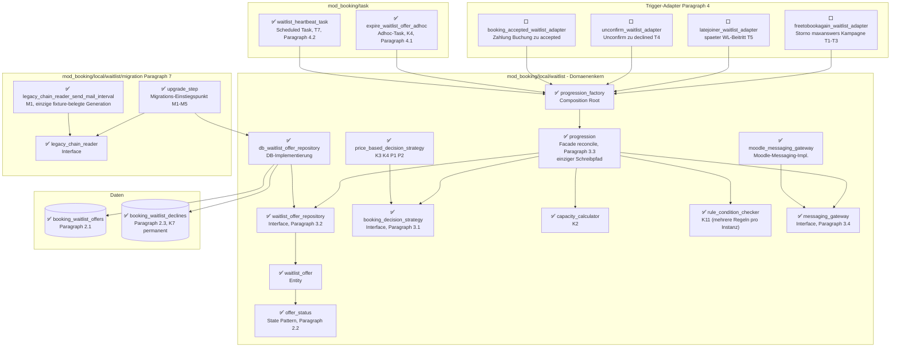

# Waitlist-Progression — Implementierungs-Fortschritt

Lebendiges Tracking-Dokument zur Architektur in
[`WAITLIST_REFACTOR_ARCHITECTURE_2026-08-12.md`](WAITLIST_REFACTOR_ARCHITECTURE_2026-08-12.md).
Jede Klasse/Tabelle aus der Architektur ist hier ein Knoten. **Alle Knoten starten mit ⬜**
(noch nicht begonnen). Sobald eine Klasse implementiert ist, wird das Symbol im Knotentext auf
✅ umgestellt (siehe Anleitung unten).

## So aktualisierst du dieses Dokument

Jeder Knotentext beginnt mit einem Status-Symbol, z. B.:

```
db_waitlist_offer_repository["⬜ db_waitlist_offer_repository<br/>DB-Implementierung"]
```

Zum Markieren als fertig: `⬜` → `✅` ändern (optional `🟨` für "gerade in Arbeit"). Sonst nichts
an dem Diagramm anfassen — Knoten-IDs und Kanten bleiben stabil, damit der Graph über die ganze
Umsetzung hinweg vergleichbar bleibt.

*(Hinweis: eine frühere Fassung dieser Datei nutzte Mermaid-`classDef`/`class`-Einfärbung sowie
Stadium-/Subroutine-Knotenformen — das hat sich in der Vorschau als nicht renderbar erwiesen.
Diese Fassung nutzt nur das Syntax-Subset, das in
[`WAITLIST_REFACTOR_ARCHITECTURE_2026-08-12.md`](WAITLIST_REFACTOR_ARCHITECTURE_2026-08-12.md)
nachweislich rendert: einfache Rechtecke, Zylinder für Tabellen, einfache Pfeile.)*

---

## Gesamtgraph (alle Klassen/Tabellen, Status siehe Symbol im Knotentext)



---

## Klassen-Checkliste (Details zu jedem Knoten)

| Klasse/Tabelle | Datei | Zweck | Architektur-§ |
|---|---|---|---|
| `offer_status` | `local/waitlist/offer_status.php` | State Pattern: erlaubte Status-Übergänge validieren | §2.2 |
| `waitlist_offer` | `local/waitlist/waitlist_offer.php` | Entity: eine Wartelisten-Offer-Zeile | §2.1 |
| `waitlist_offer_repository` | `local/waitlist/waitlist_offer_repository.php` | Interface: Datenzugriff, kein SQL im Reconciler | §3.2 |
| `db_waitlist_offer_repository` | `local/waitlist/db_waitlist_offer_repository.php` | DB-Implementierung des Repositories | §3.2 |
| `booking_decision_strategy` | `local/waitlist/booking_decision_strategy.php` | Interface: Autobook vs. Offer | §3.1 |
| `price_based_decision_strategy` | `local/waitlist/price_based_decision_strategy.php` | Preis-Entscheidung zum Behandlungszeitpunkt (K3/K4/P1/P2) | §3.1 |
| `capacity_calculator` | `local/waitlist/capacity_calculator.php` | Freie Plätze = Kapazität − Gebucht − offene Offers | §5. K2 |
| `rule_condition_checker` | `local/waitlist/rule_condition_checker.php` | "Führe aus wenn…"-Prüfung, `applicable_rules(optionid): int[]`, mehrere Regeln pro Instanz | K11 |
| `messaging_gateway` | `local/waitlist/messaging_gateway.php` | Interface: Benachrichtigungen, Reconciler messaging-frei | §3.4 |
| `moodle_messaging_gateway` | `local/waitlist/moodle_messaging_gateway.php` | Wrapt bestehenden `message_controller` | §3.4 |
| `progression` | `local/waitlist/progression.php` | Facade — `reconcile()`, einziger Schreibpfad | §3.3 |
| `progression_factory` | `local/waitlist/progression_factory.php` | Composition Root, verdrahtet alle Kollaborateure | §6 |
| `expire_waitlist_offer_adhoc` | `task/expire_waitlist_offer_adhoc.php` | Ein Task pro Offer-Frist, hard expiry | §4.1, K4 |
| `waitlist_heartbeat_task` | `task/waitlist_heartbeat_task.php` | Selbstheilung bei verpassten Triggern, 15min/5min | §4.2, T7 |
| `freetobookagain_waitlist_adapter` | `event/observer/freetobookagain_waitlist_adapter.php` | Storno, maxanswers-Erhöhung, Kampagnen-Ende/-Start → reconcile() | §4, T1-T3 |
| `latejoiner_waitlist_adapter` | `event/observer/latejoiner_waitlist_adapter.php` | Später WL-Beitritt reaktiviert reconcile() | §4, T5 |
| `unconfirm_waitlist_adapter` | `event/observer/unconfirm_waitlist_adapter.php` | Setzt Offer→declined, dann sofortiges reconcile() | §4, T4/K7 |
| `booking_accepted_waitlist_adapter` | `event/observer/booking_accepted_waitlist_adapter.php` | Setzt Offer→accepted nach abgeschlossener Zahlung/Buchung | §4 |
| `upgrade_step` | `local/waitlist/migration/upgrade_step.php` | Migrations-Einstiegspunkt, idempotent | §7, M1-M5 |
| `legacy_chain_reader` | `local/waitlist/migration/legacy_chain_reader.php` | Interface: liest ein Alt-Ketten-Format | §7 |
| `legacy_chain_state` | `local/waitlist/migration/legacy_chain_state.php` | Entity: extrahierter Alt-Ketten-Zustand | §7 |
| `legacy_chain_reader_send_mail_interval` | `local/waitlist/migration/legacy_chain_reader_send_mail_interval.php` | Reader für M1 (send_mail_interval-Kette) - einzige konkret fixture-belegte Generation, s. Hinweis unten | §7 |
| `booking_waitlist_offers` | `db/install.xml` | Tabelle: Single Source of Truth der Progression | §2.1 |
| `booking_waitlist_declines` | `db/install.xml` | Tabelle: permanente K7-Sperrliste | §2.3 |

**Hinweis zu den Trigger-Adaptern:** `freetobookagain_waitlist_adapter`, `latejoiner_waitlist_adapter`,
`unconfirm_waitlist_adapter` und `booking_accepted_waitlist_adapter` waren im Architektur-Dokument
nur exemplarisch als ein Adapter-Pattern skizziert (§4) — hier für die Umsetzungsplanung auf alle
8 Trigger-Fälle aus der Anforderungsliste aufgeschlüsselt. Bei Bedarf in Schritt 4 anpassen, falls
sich beim Implementieren eine andere Aufteilung als sinnvoller erweist.

---

## Woran wir gerade arbeiten

**DB-Schema (`booking_waitlist_offers` + `booking_waitlist_declines`) ist fertig (✅).** Erste
Änderung an echtem Produktionscode in diesem Refactoring — und die erste unter dem ab jetzt
geltenden Arbeitsmodus: Claude beschreibt was/wo/warum, Georg fügt den Code selbst ein (siehe
Memory `waitlist_refactor_code_authorship`).

Drei Dateien geändert:
- `db/install.xml`: beide Tabellen nach Architektur §2.1/§2.3, plus `VERSION`-Attribut-Bump im
  XMLDB-Header (Moodle-Konvention).
- `version.php`: `$plugin->version` auf `2026081700` gebumpt.
- `db/upgrade.php`: entsprechender `xmldb_table`-Upgrade-Block mit Savepoint.

**Eigene Entscheidung in diesem Schritt** (Architektur-Doku legt nur ZustandsNAMEN fest, keine
DB-Werte): `status`-Spalte in `booking_waitlist_offers` als `int(2)` mit numerischer Zuordnung
`0=pending, 1=offered, 2=accepted, 3=declined, 4=expired, 5=skipped, 6=autobooked` — die nächste
Klasse (`offer_status`, State Pattern) baut direkt darauf auf und muss diese Zuordnung
respektieren.

Verifiziert: `phpcs` sauber (0/0) nach einem kleinen Nachbesserungsschritt (doppelte Leerzeile in
`upgrade.php`), `php admin/tool/phpunit/cli/init.php` lief fehlerfrei durch, beide Tabellen per
`psql \d` gegen die PHPUnit-Test-DB direkt verifiziert — Primary Key, FK-Index auf `optionid`,
UNIQUE-Constraint (`optionid, roundid, userid` bzw. `optionid, userid`) und der zusammengesetzte
Such-Index (`userid, optionid, status`) sind alle exakt wie geplant vorhanden.

**`offer_status` ist fertig (✅).** Erste vollständige Domänenklasse dieses Refactorings, und die
erste unter dem neuen Arbeitsmodus (Claude beschreibt Datei für Datei, Georg fügt Code ein;
Testdateien und Docblock-Nachbesserungen sind davon ausgenommen, siehe Memory
`waitlist_refactor_code_authorship`).

**Design-Entscheidung (per `AskUserQuestion` von Georg getroffen):** klassisches State Pattern
mit Interface + 7 einzelnen Zustandsklassen (nicht ein PHP-Backed-Enum) — exakt wie im
Architektur-Klassendiagramm §6 als `<<interface>>` gezeichnet. 9 neue Dateien:
- `classes/local/waitlist/offer_status.php` — Interface (`can_transition_to()`,
  `is_terminal()`, plus `get_code(): int` als eigene Ergänzung für die DB-Persistenz).
- `classes/local/waitlist/offer_statuses/{pending,offered,accepted,declined,expired,skipped,autobooked}.php`
  — je eine finale Klasse, Namenskonvention exakt wie beim bestehenden
  `booking_rule_action`/`actions/`-Muster in diesem Codebase übernommen.
- `tests/local/waitlist/offer_status_test.php` — 24 Tests (72 Assertions): jede der 7
  dokumentierten Übergänge einzeln bestätigt, ALLE 42 übrigen der 7×7=49 möglichen Paarungen
  exhaustiv per verschachtelter Schleife als verboten bestätigt (inkl. Selbst-Übergänge), ein
  dediziert benannter K7-Test (`declined` hat null ausgehende Übergänge), terminale
  Zustände + DB-Codes je einzeln per `dataProvider`, plus ein Eindeutigkeits-Check über alle
  Codes.

Zwei kleine Nachbesserungsrunden beim Einfügen nötig: (1) zweimal falscher Dateipfad
(`waitinglist/` statt `waitlist/`, dann `waitlist/` statt `waitlist/offer_statuses/`) — jeweils
sofort korrigiert; (2) `phpcs` bemängelte fehlende Methoden-Docblocks in allen 7 Zustandsklassen
(meine Vorgabe war unvollständig) — nachgetragen.

Verifiziert: `phpcs` sauber (0/0) über alle 9 Dateien, `phpunit` 24/24 grün (72 Assertions),
keine Fehler.

**`waitlist_offer` ist fertig (✅).** Reines Datenobjekt für eine Zeile aus
`booking_waitlist_offers`, keine eigene Logik. Zwei Nachbesserungen beim Einfügen: (1) Moodle-
`phpcs` mag PHP-8-Property-Promotion nicht (verlangt einen eigenen `/** @var */`-Docblock pro
Property statt kombinierter `@param`-Tags im Konstruktor) — auf den klassischen Deklarieren-
und-Zuweisen-Stil umgestellt, passend zum Rest des Codebase (kein `readonly` mehr, wird
projektweit nirgends genutzt); (2) eine überzählige Leerzeile am Dateiende entfernt.

Unit-Test `tests/local/waitlist/waitlist_offer_test.php` von Claude selbst geschrieben (Test-
Dateien sind vom Copy-Paste-Modus ausgenommen): Konstruktor-Rundlauf über alle 13 Properties,
plus ein Nachweis, dass `status` jede beliebige `offer_status`-Implementierung akzeptiert (nicht
nur eine hartkodierte). `phpcs` sauber (0/0, ein eigener kleiner Nachbesserungsschritt bei
uneinheitlicher Kommentar-Ausrichtung). Kombinierter Testlauf mit `offer_status_test.php`:
26/26 grün, 87 Assertions, keine Fehler.

**`waitlist_offer_repository` ist fertig (✅).** Reiner Vertrag, `phpcs` sauber im ersten Anlauf
(0/0), keine Nachbesserung nötig. Kein eigener Unit-Test — bestätigt konsistent mit dem
bestehenden `booking_rule_action`-Interface-Muster in diesem Codebase (reine Interfaces werden
nicht separat getestet, das passiert über ihre Implementierungen).

**`db_waitlist_offer_repository` ist fertig (✅).** Erste Klasse mit echtem DB-Zugriff in diesem
Refactoring — und der bisher aufwendigste Schritt.

**Design-Entscheidungen, die während der Umsetzung getroffen werden mussten** (Architektur-Doku
lässt sie offen):
- `\core\clock`-DI im Konstruktor (§5.1), optional mit Fallback auf `\core\di::get(...)` — damit
  sowohl `progression_factory` später explizit injizieren kann, als auch alle bereits
  geschriebenen B-/C-Tests (die `new db_waitlist_offer_repository()` ohne Argumente aufrufen)
  automatisch den in `mock_clock_with_frozen()` registrierten Clock bekommen.
- **"unbehandelt" ist NICHT rundengebunden**, sondern heißt "kein OFFENES (nicht-terminales)
  Angebot" — eine Person mit nur einem abgelaufenen (`expired`) Angebot muss in einer späteren
  Runde wieder als Kandidat:in auftauchen (siehe eigener Kommentar in `expired.php`). Nur
  `declined` sperrt dauerhaft, über die separate `booking_waitlist_declines`-Tabelle — die
  aufrufende Seite (`progression`, später) muss die K7-Ausschlussliste selbst per
  `is_permanently_declined()` berechnen und übergeben, das Repository macht das nicht
  automatisch (exakt wie B1s eigener Testcode das bereits vorgemacht hat).
- `create_offer()` bekam nachträglich einen `$expiresat`-Parameter (Interface-Korrektur nötig —
  die formale §3.2-Signatur hatte keinen, aber das Sequenzdiagramm in §3.3 zeigt ihn explizit;
  ohne ihn gäbe es keinen Weg, K4 überhaupt zu setzen).
- `baid` wird intern über eine Query gegen `booking_answers` aufgelöst, nicht als Parameter
  übergeben (steht so auch nicht im Interface).
- **Echter Bug beim Testen selbst gefunden UND korrigiert, bevor der Test geschrieben wurde:**
  der ursprüngliche optimistische-Locking-Ansatz in `transition()` (Version NACH dem Schreiben
  neu lesen) hatte eine Race-Lücke — ein zufällig exakt auf `alte_version+1` gelandeter,
  unabhängiger Versionsstand hätte einen echten Konflikt fälschlich als "mein Update hat
  geklappt" durchgewunken. Auf Vorher-Prüfung umgestellt (robuster, und passender zur
  Architektur: das echte Nebenläufigkeits-Schutzmittel ist ohnehin das externe Lock aus §5.2,
  das Versionsfeld nur redundantes Sicherheitsnetz).
- `find_stalled_options()` (für B5/T7) bewusst NICHT in diesem Schritt enthalten — braucht
  `capacity_calculator`, der laut Abhängigkeitsgraph erst danach kommt.

**Unit-Test** `tests/local/waitlist/db_waitlist_offer_repository_test.php` von Claude selbst
geschrieben, 9 Tests gegen die echte DB (`resetAfterTest()`, keine `booking_bookit()`-
Choreografie nötig — reiner Repository-Test, keine FK-Constraints auf `optionid`/`userid`
verifiziert): Persistenz + Clock-Nutzung, `baid`-Auflösung (inkl. Fallback auf 0), O1/O2-
Reihenfolge UND Tie-Break bei identischem Timestamp, K4-Wiedereintritts-Fähigkeit nach Ablauf,
gültige/ungültige Übergänge, idempotente K7-Sperre über mehrere Ablehnungen hinweg, und der
optimistische-Lock-Konflikt-Fall (der den oben genannten Bug aufgedeckt hat).

Verifiziert: `phpcs` sauber (0/0) für Implementierung und Test (je eine kleine
Nachbesserungsrunde: fehlender Docblock-Einzeiler + Kommentar-Kleinbuchstaben in der Klasse;
vier Kommentar-Kleinbuchstaben im Test, von Claude selbst behoben). `phpunit`: **9/9 grün beim
ersten Lauf (38 Assertions)**, kombiniert mit den beiden vorherigen Testdateien: 35/35 grün
(125 Assertions), keine Fehler.

**`booking_decision_strategy` ist fertig (✅)** — zusammen mit zwei kleinen Hilfstypen, die die
Architektur-Doku nur als Parameter-/Rückgabetyp erwähnte, ohne sie zu spezifizieren:
- `booking_decision.php` (NEU) — Backed Enum mit zwei Werten (`AUTOBOOK`, `OFFER`). Kein State
  Pattern nötig (anders als `offer_status`) — zwei Werte, kein eigenes Verhalten. Erstes Mal in
  diesem Refactoring ein Enum verwendet, konsistent mit dem bereits bestehenden
  `execution_point`-Enum-Präzedenzfall in diesem Codebase (`local/performance/actions/`).
- `booking_waitlist_candidate.php` (NEU) — reines Datenobjekt (`optionid, userid, baid, user`),
  klassischer Deklarieren-und-Zuweisen-Stil wie `waitlist_offer`. `$user` als volles
  `\stdClass`-Objekt, weil `price::get_price('option', $optionid, $user)` (später in
  `price_based_decision_strategy` gebraucht) ein komplettes User-Objekt erwartet, keine bloße Id.
- `booking_decision_strategy.php` (NEU) — das eigentliche Interface: `decide(candidate):
  booking_decision`.

Alle drei Dateien `phpcs`-sauber im ersten Anlauf, einmal ein kleiner Pfad-Ausrutscher beim
Einfügen (`tests/local/waitlist/` statt `classes/local/waitlist/`), sofort korrigiert. Zwei
kleine Unit-Tests von Claude selbst dazu (`booking_decision_test.php`,
`booking_waitlist_candidate_test.php`) — kein Test für das reine Interface, konsistent mit dem
bereits etablierten Muster.

Verifiziert: `phpcs` sauber (0/0) über alle 5 Dateien. Kombinierter Testlauf aller
`local/waitlist`-Tests: **37/37 grün, 132 Assertions, keine Fehler.**

**`price_based_decision_strategy` ist fertig (✅).** Drei Zeilen Kernlogik:
`price::get_price()` frisch bei jedem Aufruf (P1), `$price['price'] ?? 0` statt nacktem
Array-Zugriff (P2), Preis=0 → `AUTOBOOK` sonst `OFFER` (K3/K4). `phpcs` sauber im ersten Anlauf.

**Zwei echte Setup-Bugs beim Testschreiben gefunden UND behoben** (guter Beleg, dass der
DB-Test-Aufwand hier gerechtfertigt war):
1. **Reihenfolge-Fehler:** Preiskategorien müssen VOR `create_option()` angelegt werden (wie in
   A8/A9), nicht danach — sonst bekommt die Option keine Preis-Zeile für die Kategorie. Beim
   ersten Testlauf alle 4 Tests mit "Error on set_data" fehlgeschlagen (fehlendes
   `setAdminUser()` vor `create_option()`), dann nach dessen Behebung 2 von 4 Tests mit falschem
   Ergebnis (`AUTOBOOK` statt `OFFER`) — Ursache zunächst fälschlich als Reihenfolge-Problem
   vermutet, per Debug-Testfall mit `var_export()` gegen `price::get_price()` direkt widerlegt
   (Preis wurde korrekt aufgelöst, wenn isoliert getestet).
2. **Der tatsächliche Bug:** `singleton_service`s Preiskategorie-Cache ist STATISCH über den
   ganzen PHPUnit-Prozess hinweg, wird von `resetAfterTest()` NICHT zurückgesetzt (das setzt nur
   die DB zurück) — und da Auto-Increment-IDs nach jedem Reset wieder bei denselben Werten
   starten, erbte ein "neuer" Test-User zufällig die ID eines User aus einem FRÜHEREN Test und
   damit dessen gecachten (falschen) Kategoriewert. Exakt der A9-Fund, nur diesmal
   testübergreifend statt innerhalb eines einzigen Tests. Behoben durch
   `singleton_service::destroy_instance()` + `\cache_helper::purge_all()` in `setUp()` — fehlte
   in meinem eigenen Test, ist aber Standard in bestehenden Testdateien wie
   `waitinglist_sync_status_test.php`, die ich beim Schreiben übersehen hatte.

4 Tests (K3, K4, P1, P2), alle grün nach der Korrektur. `phpcs` sauber (0/0). Kombinierter
Testlauf aller `local/waitlist`-Tests: **41/41 grün, 138 Assertions, keine Fehler.**

**`capacity_calculator` ist fertig (✅).** Eine Methode, `free_capacity()` = `max(0, maxanswers −
gebucht − offene Angebote)`. Bewusste Design-Entscheidung: die "gebucht"-Zählung wurde NICHT neu
geschrieben, sondern die bestehende, ausgereifte `\mod_booking\booking_answers\booking_answers`-
Klasse wiederverwendet (korrekte `places`-Gewichtung, `RESERVED` zählt als belegt, `DELETED`
nicht — Randfälle, die eine Neu-Implementierung leicht falsch machen könnte). Geprüft, ob
`maxanswers = 0` in diesem Codebase „unbegrenzt" bedeutet (wie `maxoverbooking = -1` es für die
Warteliste tut) — keine klare, durchgängige Konvention dafür gefunden, daher `maxanswers` wörtlich
behandelt, kein Sonderfall.

Ein kleiner `phpcs`-Nachbesserungsschritt (fehlender Docblock-Einzeiler am Konstruktor). Test von
Claude selbst geschrieben, 6 Fälle, alle beim ERSTEN Lauf grün (guter Beleg für die
Wiederverwendungs-Entscheidung): Grundformel, offene Angebote zählen mit, terminale Angebote
NICHT, `places`-Gewichtung, `RESERVED`/`DELETED`-Unterscheidung, nie negativ.

Verifiziert: `phpcs` sauber (0/0). Kombinierter Testlauf aller `local/waitlist`-Tests: **47/47
grün, 144 Assertions, keine Fehler.**

**`rule_condition_checker` ist fertig (✅).** Wichtige Design-Korrektur während der Umsetzung:
die Architektur sah ursprünglich `execution_condition_met(optionid): bool` vor (eine Regel pro
Instanz angenommen). Rückfrage bei Georg ergab: **mehrere unabhängige `rule_react_on_event` +
`send_mail_interval`-Regeln pro Instanz sind gewollt und bleiben unterstützt** (z. B. zwei
verschiedene Intervalle mit unterschiedlichen Bedingungen gleichzeitig aktiv) — genau wie im
heutigen Code (`rules_info::get_companion_interval_rules_for_waitinglist_join()` ist explizit
Mehrfach-Treffer-fähig). Architektur-Doc (§3.3, Sequenzdiagramm, §6) entsprechend korrigiert:
Methode heißt jetzt `applicable_rules(optionid): int[]`, liefert alle aktuell zutreffenden
Regel-IDs (aufsteigend sortiert) statt eines einzelnen bool. `progression::reconcile()`s
Pseudocode iteriert jetzt pro Regel-ID über den gemeinsamen `$free`-Kapazitätstopf.

Implementierung: liest `booking_rules` über die bestehende
`booking_rules::get_list_of_saved_rules_by_context()` (Kontext + Event-Filter), filtert per PHP
auf `rulejson->actionname === 'send_mail_interval'` und `isactive`, wertet die 5 Bedingungswerte
über `booking_answers::is_fully_booked()`/`is_fully_booked_on_waitinglist()` aus (je einmal pro
Aufruf berechnet, nicht pro Regel neu). K12 wird weiterhin NICHT hier getestet — strukturell
durch den `free <= 0`-Guard in `reconcile()` selbst erfüllt (bereits durch B6 bewiesen, sobald
`progression` existiert).

Ein echter Bug während der Testerstellung gefunden und behoben: die erste Fassung nutzte
`singleton_service::get_instance_of_booking_answers($settings)` — der Options-Generator liest
beim Anlegen der Option bereits Answers, cached also einen leeren Stand, bevor der Test seine
rohe Antwort-Zeile einfügt. Exakt das gleiche Problem, das `capacity_calculator` schon hatte;
gleiche Lösung: frische `new booking_answers($settings)`-Instanz statt Singleton-Zugriff.

9 Tests von Claude selbst geschrieben (alle 5 Bedingungswerte einzeln, mehrere aktive Regeln
aufsteigend sortiert, inaktive Regel ausgeschlossen, falscher Aktionstyp ausgeschlossen, keine
Regeln = leeres Array), 4 schlugen wegen des Singleton-Bugs zunächst fehl, nach der Korrektur
alle grün. `phpcs` sauber (0/0, ein `MOODLE_INTERNAL`-Warning zunächst, da keine Seiteneffekte im
File — entfernt, wie bei den Schwesterklassen ohne `require_once`).

Kombinierter Testlauf aller `local/waitlist`-Tests: **56/56 grün, 157 Assertions, keine Fehler.**

**`messaging_gateway`/`moodle_messaging_gateway` sind fertig (✅).** Design-Korrektur während der
Umsetzung: §3.4 sah einen eigenen `rule_configuration`-Typ vor, der im Code nirgends existiert —
ersetzt durch simples `int $ruleid` (Signatur jetzt `notify_offer(offer, ruleid)`/
`notify_autobooked(candidate, ruleid)`), analog zu `message_controller`, das Regel-Daten selbst
per `ruleid` aus der DB liest (Bestandscode-Kommentar: "Send the ruleid as rulejson often seems
to not work"). Sequenzdiagramm-Inkonsistenz (1 statt 2 Argumente) ebenfalls korrigiert.
`notify_offer()` liest Betreff/Template aus der `actiondata` der über `applicable_rules()`
gefundenen Regel (wie `send_mail_interval` heute), `notify_autobooked()` nutzt die
options-eigenen Status-Change-Templates (wie der heutige Warteliste-Sync-Autobook-Pfad).

**Bekannte offene Lücke, vermerkt für den `progression`-Schritt:** `db_waitlist_offer_repository::
create_offer()` schreibt `ruleid` aktuell hart auf `0` — muss beim Bau von `progression` auf die
Regel-ID aus der `applicable_rules()`-Schleife erweitert werden, damit persistierte Offers ihre
Regel-Zuordnung tragen.

**Echter Bug während der Testerstellung gefunden+behoben:** erste Fassung nutzte
`MOD_BOOKING_MSGCONTRPARAM_QUEUE_ADHOC` für beide Methoden — das prüft intern zusätzlich das
unabhängige, veraltete Options-Setting `sendmail`; ohne dieses Setting wird still gar nichts
verschickt (auch kein Adhoc-Task gequeued). Der nächstliegende Bestandscode-Präzedenzfall
(`send_mail_by_rule_adhoc.php`) nutzt tatsächlich `MOD_BOOKING_MSGCONTRPARAM_SEND_NOW` — passt
auch inhaltlich besser, da `progression::reconcile()` ohnehin schon innerhalb eines Adhoc-Tasks
läuft. Fix übernommen, beide Testfälle danach grün ohne `runAdhocTasks()`.

3 Tests von Claude selbst geschrieben (`redirectMessages()`-Sink gegen echten `message_controller`,
kein Mocking): Regel-Betreff/-Template kommt beim Empfänger an, nicht auflösbare `ruleid` sendet
nichts (defensiv), Autobook-Benachrichtigung kommt an. Alle 3 nach der Korrektur grün. `phpcs`
sauber (0/0).

Kombinierter Testlauf aller `local/waitlist`-Tests: **59/59 grün, 160 Assertions, keine Fehler.**

**`progression` ist fertig (✅).** Die zentrale Reconciler-Facade, einziger Schreibpfad.

Dabei zwei bereits fertige Dateien erweitert (notwendige Lücken, keine Bequemlichkeit):
- `waitlist_offer_repository`/`db_waitlist_offer_repository`: `create_offer()` bekam den
  `$ruleid`-Parameter (schließt die seit `messaging_gateway` offene Lücke), plus zwei neue
  Methoden `get_permanently_declined_userids(optionid): int[]` (K7 — es gab bisher nur die
  Einzelabfrage) und `is_still_on_waitinglist(optionid, userid): bool` (K8 — Live-Recheck, ob ein
  Kandidat zwischen Schnappschuss und Verarbeitung die Warteliste verlassen hat). 4 neue Tests
  dafür geschrieben, 13/13 grün, keine Regression an den 9 bestehenden Tests dieser Datei.

Wichtigste Design-Entscheidung: **K3-Autobook nutzt das bestehende, ausgereifte
`booking_option::user_submit_response()`** statt des schlanken `write_user_answer_to_db()` —
Letzteres hätte Enrolment/Events/Regel-Ausführung manuell nachbauen müssen (Fehlerrisiko).
`user_submit_response()` macht das automatisch, exakt wie der heutige Warteliste-Sync-Autobook-
Pfad. Kleines Restrisiko (erneute interne Verfügbarkeitsprüfung kann `false` liefern) defensiv
behandelt: Kandidat wird übersprungen, `$free` nicht verringert, weiter zum nächsten.

Weitere Design-Punkte: `roundid` = `$this->clock->time()` je `reconcile()`-Aufruf; `sortorder`
wird EINMAL zu Rundenbeginn aus der O1/O2-Reihenfolge eingefroren (nicht pro Regel neu berechnet,
passend zum Feld-Kommentar auf `waitlist_offer`); ein `$treated`-Set verhindert, dass ein
Kandidat unter einer zweiten Regel in derselben Runde nochmal verarbeitet wird; K4s
`expiresat` liest das Intervall (Minuten) direkt aus der jeweiligen Regel-`actiondata`.

6 Integrationstests von Claude selbst geschrieben, gegen ECHTE Kollaborateure (keine Mocks) —
K12 (Kapazität=0 ⇒ kompletter No-op), K11 (keine passende Regel ⇒ No-op trotz freier Kapazität),
K3 (kostenloser Kandidat wird real umgebucht + benachrichtigt), K4 (bezahlpflichtiger Kandidat
bekommt Offer mit korrektem `expiresat`/Regel-Betreff, wird NICHT gebucht), K1 (Batch = min(N,M),
späterer Kandidat bleibt unangetastet), K7 (permanent abgelehnter Nutzer bleibt ausgeschlossen,
auch wenn er real wieder auf der Warteliste steht). **Alle 6 grün im ersten Lauf.** `phpcs`: 6
kleine Stil-Warnings (Inline-Kommentare ohne Satzzeichen am Ende) — noch offen, keine Fehler.

Kombinierter Testlauf aller `local/waitlist`-Tests: **69/69 grün, 188 Assertions, keine Fehler.**

Die 6 phpcs-Stil-Warnings in `progression.php` nachgezogen (Inline-Kommentare mit Satzzeichen
abgeschlossen) — Regressionslauf danach weiterhin grün.

**`progression_factory` ist fertig (✅).** Composition Root, `static get(): progression`, baut bei
jedem Aufruf frisch (kein statischer Cache — Konstruktion ist billig, vermeidet Testverschmutzung
über Aufrufe hinweg). Ein phpcs-Nitpick (unnötiger `MOODLE_INTERNAL`-Check) unter der neuen
Linting-Ausnahme direkt korrigiert. 2 Tests von Claude selbst geschrieben (Instanzen sind
verschieden, End-to-End-Verdrahtung funktioniert echt) — beide grün.

**Direkt danach: die B-Suite scharf geschaltet.** B1, B2, B3, B6, B7 liefen jetzt gegen die echte
`progression_factory` (B4/B5 bleiben `markTestSkipped()`, brauchen noch
`expire_waitlist_offer_adhoc`/`waitlist_heartbeat_task`). Drei der fünf Tests waren initial rot —
**keine Bugs in der neuen Architektur**, sondern Fixture-Lücken, weil diese Tests VOR
`rule_condition_checker` geschrieben wurden:
- B2/B3/B6b fehlte schlicht eine `send_mail_interval`-Regel (K11 hat also korrekt "keine Regel ⇒
  No-op" durchgesetzt) — je eine `ALWAYS`-Regel in der Fixture ergänzt.
- B2 hatte zusätzlich einen echten, vorbestehenden Caching-Fund: `$DB->set_field('booking_options',
  'maxanswers', ...)` umgeht den `mod_booking/bookingoptionsettings`-MUC-Cache;
  `singleton_service::destroy_booking_option_singleton()` löscht nur den PHP-Prozess-Cache, nicht
  diesen. Fix: `\cache::make('mod_booking', 'bookingoptionsettings')->delete($optionid)` direkt
  nach dem rohen DB-Write. **Reusable finding**, analog zur `booking_answers`-MUC-Cache-Falle aus
  `capacity_calculator_test` — jeder Test, der `maxanswers`/`maxoverbooking` per rohem `$DB->
  set_field()` ändert, statt über den Options-Speicherpfad, braucht diesen Cache-Purge zusätzlich
  zum Singleton-Destroy.

Kombinierter Testlauf (B1/B2/B3/B6/B7 + alle `local/waitlist`-Tests): **77/77 grün, 239
Assertions, 2 erwartet übersprungen (B4/B5), keine Fehler.**

**Korrektur zur vorigen "77/77 grün"-Meldung:** B1 und B7 liefen dabei tatsächlich **nicht aktiv**,
sondern wurden lautlos übersprungen (`Skipped`, 0 Assertions) — die Meldung war falsch. Ursache:
`target_api_exists()` prüfte `class_exists('...offer_status')`, aber `offer_status` ist ein
**Interface**, kein `class` — PHP's `class_exists()` matcht Interfaces grundsätzlich nicht
(`interface_exists()` wäre nötig gewesen). Da Skips nicht als Fehler zählen, ist das im Aggregat
nicht aufgefallen. Erst beim Bau von `expire_waitlist_offer_adhoc` (das B4 aktivieren sollte,
B4 nutzt denselben fehlerhaften Guard) beim genaueren Hinsehen entdeckt und in B1/B4/B7 korrigiert
(`class_exists` → `interface_exists`). Zusätzlich in allen dreien einen zweiten, verwandten Fund
behoben: `$offerstatusclass::declined()`/`::accepted()` — eine geratene statische Fabrikmethode,
die es im gebauten State-Pattern nie gab (der jeweilige Testdatei-Docblock hatte das selbst als
"best-effort guess" markiert) — ersetzt durch `new offer_statuses\declined()`/`new
offer_statuses\accepted()`. **Lehre:** bei `markTestSkipped()`-Guards immer aktiv verifizieren,
dass sie tatsächlich `false` zurückgeben, sobald sie es nicht mehr sollten — ein Skip sieht im
Aggregat-Testergebnis identisch "unauffällig" aus wie ein echtes Grün.

**`expire_waitlist_offer_adhoc` ist fertig (✅).** Ein Task pro Offer, `nextruntime = expiresat`
(in `progression::offer()` eingeplant via `\core\task\manager::queue_adhoc_task()`), K5-idempotent
(No-op, falls das Offer beim Ausführen nicht mehr im Status "offered" ist). Nutzt
`SEND_NOW`-Präzedenzfall-Wissen aus dem Messaging-Schritt nicht direkt, aber denselben
"jede Klasse liest Regel-/Offer-Daten selbst per ID neu"-Stil.

**Wichtige Politik-Entscheidung während dieses Schritts, ausgelöst durch einen von Claude selbst
geschriebenen Integrationstest:** Ursprünglich (Claudes eigene, nie mit Georg abgestimmte Annahme
beim Bau von `db_waitlist_offer_repository`) durfte ein abgelaufenes (nicht aktiv abgelehntes)
Angebot in einer späteren Runde wieder infrage kommen. Das führte zu einem echten Bug: wartet
außer dem Ex-Empfänger niemand, käme dieselbe Person durch den Sofort-Reconcile beim Ablaufen
sofort wieder dran → Endlos-Spam-Schleife. Sind andere in der Schlange, würde die abgelaufene
Person (frühester Beitritts-Zeitpunkt) sogar vor ihnen erneut drankommen — genau das Gegenteil
von dem, was der (damals noch übersprungene) B4-Test von Anfang an verlangte.

**Georgs Entscheidung:** Wer einmal ein Angebot bekommen hat, wird nicht nochmal gefragt — Ablauf
sperrt jetzt **genauso permanent wie eine aktive Ablehnung** (K4 = K7-Mechanismus). Umsetzung:
`db_waitlist_offer_repository::transition()`s Sperr-Bedingung erweitert von `instanceof declined`
auf `instanceof declined || instanceof expired` — eine Zeile, da `expire_waitlist_offer_adhoc`
ohnehin über `transition()` läuft, greift die bestehende `get_permanently_declined_userids()`-
Ausschlussliste automatisch mit, **ohne dass `progression.php` selbst geändert werden musste**.
Bestehender, jetzt gegenteiliger Test in `db_waitlist_offer_repository_test.php` korrigiert
(`test_get_unbehandelte_waitinglist_scoping_and_ordering`), neuer dedizierter Test
`test_transition_to_expired_creates_idempotent_permanent_lock` ergänzt.

5 Tests von Claude selbst geschrieben für `expire_waitlist_offer_adhoc_test.php` (Grundfall,
K5-Idempotenz bei bereits anderweitig aufgelöstem Offer, Idempotenz bei nicht mehr existierendem
Offer, Integrationstest "nächster Kandidat rückt sofort nach", direkter Regressionstest für das
Spam-Szenario "einziger Kandidat wird nicht sofort wieder gefragt"). Dazu 3 B-Suite-Dateien (B2,
B3, B6b) wegen fehlender Regel-Fixture und B1/B4/B7 wegen der oben beschriebenen Guard-/
Fabrikmethoden-Bugs korrigiert, plus dieselbe MUC-Cache-Falle (`bookingoptionsettings`) wie bei
B2 auch in B1 gefunden und behoben.

Kombinierter Testlauf (B1-B4, B6, B7 + `expire_waitlist_offer_adhoc_test.php` + alle
`local/waitlist`-Tests): **85/85 grün, 302 Assertions, 1 erwartet übersprungen (B5, braucht noch
`waitlist_heartbeat_task`), keine Fehler.**

**`waitlist_heartbeat_task` ist fertig (✅) — 🎉 damit läuft jetzt die komplette Kategorie-B-Suite
(B1–B7) aktiv und grün.**

Umgesetzt: neue Repository-Methode `find_stalled_options(): int[]` (baut sich intern einen
frischen `capacity_calculator` — keine zirkuläre Konstruktor-Abhängigkeit, da nur ein lokaler
`new`-Aufruf zur Laufzeit, keine gegenseitige DI-Verdrahtung), die eng gescopte SQL-Kandidatenmenge
(WL-Antwort vorhanden, kein offenes Angebot) plus PHP-seitigem `free_capacity() > 0`-Filter. Der
Task selbst (`\core\task\scheduled_task`, `db/tasks.php`-Eintrag alle 5 Minuten als mechanische
Untergrenze) throttelt zusätzlich über einen gespeicherten Last-Run-Zeitstempel auf ein
konfigurierbares effektives Intervall (`admin_setting_configduration`, Default 900s/15min, im Code
auf min. 300s/5min geklemmt — T7-Vorgabe exakt umgesetzt).

**Wichtige Selbstkorrektur während dieses Schritts:** B5 hatte — wie zuvor schon B1-B3/B6/B7 —
ebenfalls nie eine `send_mail_interval`-Regel angelegt (K11-Fixture-Lücke, gleiche Ursache wie
mehrfach zuvor dokumentiert). In `build_option()` ergänzt.

3 Tests von Claude selbst geschrieben (`waitlist_heartbeat_task_test.php`, Fokus auf das, was B5
nicht abdeckt: die Throttle-Logik selbst): Grundfall (Selbstheilung), Innerhalb-des-Intervalls-
kein-erneuter-Lauf, 5-Minuten-Untergrenze wird durchgesetzt auch wenn kürzer konfiguriert. Ein
eigener Testfehler dabei selbst gefunden+behoben: die erste Fixture-Fassung nutzte eine
kostenlose Preiskategorie → Kandidat wurde autobucht statt angeboten → `get_open_offers()` (nur
offene Angebote, keine terminalen Autobuchungen) zeigte fälschlich 0. Auf bezahlpflichtige
Kategorie umgestellt, danach alle 3 grün im zweiten Anlauf.

**Finaler Regressionslauf (alle 7 B-Tests B1-B7 + beide Task-Testdateien + alle
`local/waitlist`-Tests): 88/88 grün, 320 Assertions, keine Fehler, keine Skips mehr.**

**Phase 2 fast komplett.** Verbleibend: `legacy_chain_reader` (+3 generationsspezifische Reader)
und `upgrade_step` (aktiviert C1-C5, bisher rot/skipped seit Phase 1). Das ist die letzte
Klassengruppe vor Phase 3 (Clean-Cut-Switchover).

## Ergänzung (2026-08-19): Warteliste-Recycling nach vollständigem Durchlauf

Neue, nicht im ursprünglichen 25-Knoten-Graphen enthaltene Anforderung von Georg: pro Option
konfigurierbar, was passiert, sobald die Warteliste "vollständig geflaggt" ist (niemand, der noch
wartet, kann noch ein Angebot bekommen - jeder ist entweder K7-declined oder K4-expired gesperrt,
niemand hat ein offenes Angebot). Zwei Modi (ein dritter, "offen für alle - alle Kandidaten
gleichzeitig statt der Reihe nach", wurde besprochen, aber bewusst zurückgestellt):

- **Ende** (0, Default) - das bisherige K4=K7-Verhalten, permanent gesperrt.
- **Erneut durchgehen** (1) - die K4-Sperren (nur die, niemals K7-declined) werden zurückgesetzt,
  dieselben Kandidaten werden in ihrer ursprünglichen Reihenfolge erneut behandelt.

**Wichtige Design-Entscheidung, die den Umbau klein gehalten hat:** die bestehende
`booking_waitlist_declines`-Sperrtabelle (K7-Ledger) speichert den Lock schon heute als eigene
Zeile statt live aus dem Offer-Status berechnet zu werden. Neues Feld `reason` (Offer-Status-Code,
3=declined/4=expired) darauf, Reset = einfaches `DELETE ... WHERE reason=4` für die Option. Kein
Zyklus-Zähler, kein Zeitstempel-Wasserzeichen nötig - `get_permanently_declined_userids()` bleibt
komplett unverändert, liest einfach weiter die (jetzt kleinere) Tabelle.

Umgesetzt:
- **DB-Schema** (Version 2026081900): `booking_options.waitlistrecycling` (int, 0/1),
  `booking_waitlist_declines.reason` (int, Default 3 für Alt-Zeilen - konservativ, damit kein
  bestehender Lock versehentlich resettable wird).
- **`waitlist_offer_repository`/`db_waitlist_offer_repository`**: zwei neue Methoden -
  `reset_expired_locks(optionid)` (das DELETE) und `find_recyclable_options(): int[]` (Optionen mit
  `waitlistrecycling=1`, mindestens ein wartender Kandidat, niemand offen/pending, alle
  verbleibenden gesperrt - K7-only-Fälle zählen ebenfalls als "recyclable", sind aber harmlos, da
  nichts mit `reason=4` zum Löschen da ist). `transition()`/`lock_permanently()` geben jetzt den
  auslösenden Status-Code als `reason` mit.
- **`waitlist_heartbeat_task`**: zweiter Block nach dem bestehenden Stalled-Loop - für jede Option
  aus `find_recyclable_options()`: `reset_expired_locks()` dann `reconcile(..., 'waitlist:recycled')`.
  `progression::reconcile()` selbst blieb unverändert.
- **UI**: neues Options-Formularfeld (`classes/option/fields/waitlistrecycling.php`, automatisch
  per Namespace-Scan erkannt, kein manuelles Registrieren nötig - Muster von `enrolmentstatus.php`
  übernommen), Header "Advanced options", Lang-Strings.
- **9 neue Tests** (Claude direkt geschrieben): 6 Repository-Ebene
  (`db_waitlist_offer_repository_test.php` - Reset betrifft nur `reason=expired`, Erkennung des
  "vollständig geflaggt"-Zustands inkl. aller Negativfälle), 3 Heartbeat-Ebene
  (`waitlist_heartbeat_task_test.php` - End-to-End Recycling, Nicht-Recycling bleibt gesperrt,
  K7-Decline wird nie zurückgesetzt auch mit `waitlistrecycling=1`).

**Regressionslauf nach Fertigstellung: 89/89 lokale Waitlist-/Task-Tests (233 Assertions) + 8/8
B-Suite (105 Assertions), keine Fehler.**

Offen/zurückgestellt: der dritte Modus "offen für alle" (alle zurückgesetzten Kandidaten
gleichzeitig statt sequenziell) würde `progression::reconcile()` selbst anfassen (K1-Batch-Cap
optional umgehen) - Entscheidung zu offenen Restfragen (Aufräumen "verlorener" Wettlauf-Angebote)
bewusst vertagt, auf Wunsch von Georg.

**Als nächstes vorgeschlagen (🟨):** `legacy_chain_reader` (Interface) — liest die heutigen
Alt-Ketten-Formate (3 Generationen), Voraussetzung für `upgrade_step`. Warte auf Freigabe.

## Ergänzung (2026-08-19): `legacy_chain_reader` + `legacy_chain_reader_send_mail_interval` fertig

**Wichtiger Scope-Fund vor der Umsetzung:** die drei im Graphen benannten Ketten-Generationen
(`631ca237e-`, `1ea74eed0-`, `020289328-Format`) stammen aus dem externen
`WAITLIST_REFACTOR_BLUEPRINT_2026-08-04.md` (secret_docs, mit Georg gemeinsam nachgeschlagen).
Das Blueprint selbst definiert die drei Formate nirgends konkret - es benennt sie nur als
Risiko-Label (§6, "Größte Einzel-Unbekannte") und sagt wörtlich: *"C-Fixtures decken die
dokumentierten Generationen ab ..., Rest fängt M3-Bereinigung + T7-Heartbeat ab."* Der bereits in
Phase 1 gebaute Fixture-Builder (`waitlist_old_chain_fixture_trait.php`) deckt tatsächlich nur
**eine** konkrete Generation ab (das heutige, aktuelle Engine-Format). Entscheidung (mit Georg
abgestimmt): statt drei Reader-Klassen gegen zwei nicht mehr recherchierbare Alt-Formate zu raten,
nur **einen** Reader gegen das fixture-belegte, echte Format bauen - alles andere fällt bewusst
(wie im Blueprint selbst vorgesehen) an die M3-Bereinigung + den T7-Heartbeat.

Umgesetzt:
- **`legacy_chain_reader`** (Interface, `local/waitlist/migration/`) - `can_read(stdClass
  $taskrecord): bool` / `extract(stdClass $taskrecord): legacy_chain_state`, Strategy Pattern,
  offen für weitere Reader falls in echten Produktionsdaten doch noch andere Formate auftauchen.
- **`legacy_chain_state`** (Entity) - optionid, ruleid, usersalreadytreated (int[]), nextruntime
  (die zu bewahrende Frist der zuletzt behandelten Person).
- **`legacy_chain_reader_send_mail_interval`** (M1) - liest den `send_mail_by_rule_adhoc`-Repeat-Task
  (`customdata->repeat==1`); `usersalreadytreated` steckt doppelt-JSON-kodiert in
  `customdata->rulejson->intervaldata->usersalreadytreated` (aus `send_mail_interval::execute()`,
  bestehender Code). Nur der Repeat-Task trägt den vollständigen, aktuellen Schnappschuss.
- **6 Tests von Claude direkt geschrieben** (`legacy_chain_reader_send_mail_interval_test.php`):
  4 Unit-Tests gegen handgebaute `{task_adhoc}`-Zeilen (falsche Klasse, Direkt-Task ohne
  Repeat-Flag, kaputtes JSON, fehlende intervaldata - alle defensiv `false` statt Exception),
  1 Unit-Test für den Wohlform-Fall, 1 End-to-End-Test gegen einen **echten**, vom heutigen Engine
  produzierten Repeat-Task (`waitlist_old_chain_fixture_trait::build_running_mail_interval_chain()`) -
  verifiziert `extract()` gegen die tatsächliche Form, nicht nur eine Annahme davon.

**Regressionslauf: 95/95 lokale Waitlist-/Task-Tests grün, 248 Assertions, keine Fehler.**

Offen für `upgrade_step` (nächster Schritt): M2 (offene `confirm_bookinganswer`-Freigabe) hat eine
strukturell andere, einfachere Form (ein einzelner unberührter Direkt-Task, kein
usersalreadytreated-Array im selben Sinn) - wird beim Bau von `upgrade_step` gesondert betrachtet,
eventuell ganz ohne eigenen Reader (die Antwort-JSON `confirmwaitinglist` könnte bereits die
Quelle der Wahrheit sein).

## Ergänzung (2026-08-19): `upgrade_step` fertig - 🎉 damit sind C1-C5 jetzt aktiv und grün

M2 bekam doch einen eigenen Reader (`legacy_chain_reader_confirm_bookinganswer`) - passt sauber
in dieselbe `legacy_chain_state`-Form (ein einzelner Nutzer statt eines Arrays). Wichtiger Fund
beim Bau: `send_mail_interval::execute()` queued für JEDEN verarbeiteten Kandidaten (auch den, der
nur den Repeat-Trigger bekommt) unconditional einen eigenen `confirm_bookinganswer`-Companion-Task
- ein und dieselbe Person kann also über BEIDE Reader auftauchen. Gelöst über einen einfachen
Dedup-Check in `upgrade_step::reconstruct()` (Person bereits migriert? → überspringen), plus
bewusste Verarbeitungsreihenfolge (Mail-Reader zuerst, damit dessen besser informierter Offer -
mit der echten Restlaufzeit aus dem Repeat-Task statt der ungefähren Companion-Task-Zeit - gewinnt).

Umgesetzt:
- **`legacy_chain_reader_confirm_bookinganswer`** (M2) - liest den `confirm_bookinganswer_by_rule_adhoc`-Direkt-Task
  (nicht den Repeat-Task).
- **`upgrade_step`** - Inventur (beide Task-Klassen) → Rekonstruktion (Dedup-Check, nur falls
  noch echt auf der Warteliste, `offered`-Status + eigener `expire_waitlist_offer_adhoc`-Task,
  **keine** Mail - reine Rekonstruktion von Historie, kein neues Ereignis) → Bereinigung (beide
  Task-Klassen komplett löschen, erkannt oder nicht - macht `run()` automatisch idempotent, da ein
  zweiter Aufruf nichts mehr vorfindet). Ruft `progression::reconcile()` bewusst NICHT selbst auf -
  das bleibt Aufgabe des Aufrufers (Phase 3 `db/upgrade.php`; alle C-Tests rufen es selbst auf).

**Vier vorbestehende Bugs in den (bisher nie ausgeführten, weil immer geskippten) Phase-1-Testfixtures
gefunden und behoben** - alle vier durch Claude in einer früheren Session geschrieben, jetzt zum
ersten Mal überhaupt durchgelaufen:
1. **C3**: zwei system-weite Regeln (`contextid=1`) aus zwei Fixture-Aufrufen im selben Test feuerten
   beide auf dasselbe Event → doppelte Tasks. Fix: Task-Filter in `waitlist_old_chain_fixture_trait.php`
   zusätzlich nach `ruleid` scopen.
2. **C5**: keine Preiskategorie konfiguriert → Kandidat wurde autobucht statt angeboten → andere
   Mail-Methode (`notify_autobooked`, generisches Template) statt der erwarteten Regel-Mail. Fix:
   Preiskategorie ergänzt, wie bei den anderen Fixtures üblich.
3. **C1**: testete, dass 2 wartende Personen ein Angebot bekommen, aber `maxanswers=1` ließ nach
   dem Auszug nur 1 Platz frei - strukturell unmöglich unabhängig vom Migrationscode. Fix:
   Kapazität nach Fixture-Aufbau gezielt erhöht.
4. **C1 (zweiter Fund, gleicher Test)**: die eigene Kapazitäts-Erhöhung griff zunächst nicht - der
   bekannte Singleton-Cache-Fallstrick (`singleton_service::destroy_booking_option_singleton()`
   fehlte neben dem MUC-Cache-Purge, derselbe Bug-Typ wie schon mehrfach in der B-Suite gefunden).
   Fix ergänzt. Außerdem stimmte die Testerwartung selbst nicht ganz: da diese Fixture-Option keine
   Preiskategorie hat, werden wartende Personen bei freier Kapazität autobucht (K3), nicht mit
   Mail angeboten (K4) - die Assertion prüfte aber nur `get_open_offers()`. Fix: Assertion prüft
   jetzt beides (offen ODER autobucht), wie im Testkommentar selbst schon vorgesehen war.

**Regressionslauf: 109/109 grün, 377 Assertions** (alle `local/waitlist`-Tests, beide Task-Tests,
komplette B-Suite B1-B7, komplette C-Suite C1-C5), keine Fehler.

**Phase 2 ist damit komplett** - alle 25 ursprünglich geplanten Knoten des Graphen sind grün
(mit der bewussten, mit Georg abgestimmten Reduktion von 3 auf 2 Legacy-Chain-Reader). Nächster
Schritt: Phase 3 (Clean-Cut-Switchover) - Trigger-Adapter verdrahten, `db/upgrade.php` scharf
schalten, Legacy-Code entfernen.
