```mermaid
flowchart TB
    subgraph KatA["Kategorie A - Charakterisierungstests gegen heutigen Code, muessen vor und nach dem Refactoring gruen bleiben"]
        A2["✅ A2 - O2 Tie-Break<br/>identischer timemodified, deterministische Reihenfolge nach id"]
        A3["✅ A3 - O4 Dedup<br/>Duplikat-Antworten fuehren zu genau einer Behandlung"]
        A4["✅ A4 - K9 Regelaenderung<br/>Rule geaendert/geloescht waehrend eingeplanter Schritte"]
        A5["✅ A5 - K10 Options-Loeschung/CMID-Wechsel<br/>inkl. dokumentierter Asymmetrie-Befund aus Schritt 1"]
        A6["✅ A6 - K3 Ueberbuchungsschutz<br/>2 kostenlose Kandidaten, 1 freier Platz"]
        A7["✅ A7 - W1/W2 confirmationonnotification<br/>Modus 0 wirkungslos, Modus 2 Entzug bei allen anderen"]
        A8["✅ A8 - P2 fehlender price-Key<br/>wie Preis 0, keine PHP-Warnings"]
        A9["✅ A9 - P1 Affiliation-Wechsel waehrend WL<br/>beide Richtungen student/employee"]
        A10["✅ A10 - K5 Doppel-Trigger<br/>kein Doppel-Behandlung bei zweitem Trigger"]
        A11["✅ A11 - W4 History<br/>Confirm/Unconfirm/Autobuchung protokolliert"]
        A1["✅ A1 - K7-Vorstufe/T4<br/>heutigen defekten Ist-Zustand dokumentiert, Basis fuer B1"]

        A2 --> A3 --> A4 --> A5 --> A6 --> A7 --> A8 --> A9 --> A10 --> A11 --> A1
    end

    subgraph KatC["Kategorie C - Migrationstests, muessen vor Phase 2/3 fertig sein, laufen bis dahin rot/skipped"]
        CFix["✅ Fixture-Builder<br/>baut echte Alt-Ketten ueber die heutige Engine"]
        C1["✅ C1 - M1 laufende Kette<br/>vollstaendig geschrieben, rot/skipped bis upgrade_step existiert"]
        C2["✅ C2 - M2 offene Freigabe<br/>vollstaendig geschrieben, rot/skipped bis upgrade_step existiert"]
        C3["✅ C3 - M3 verwaiste Alt-Tasks<br/>vollstaendig geschrieben, rot/skipped bis upgrade_step existiert"]
        C4["✅ C4 - M4 Idempotenz<br/>vollstaendig geschrieben, rot/skipped bis upgrade_step existiert"]
        C5["✅ C5 - M5 bestehende Regel<br/>vollstaendig geschrieben, rot/skipped bis upgrade_step existiert"]

        CFix --> C1 --> C2 --> C3 --> C4 --> C5
    end

    subgraph KatB["Kategorie B - Zielverhaltenstests, markTestSkipped bis Phase 3"]
        B1["✅ B1 - K7/T4 Sofort-Offer<br/>DER u:rise-Bugfix: naechste Person statt erneut abgelehnte"]
        B2["✅ B2 - K1/K2 Batch<br/>min(N,M) sofort, kein Ueberholen"]
        B3["✅ B3 - T8 Sofort-Weiterlauf<br/>nach Autobuchung kein Warten aufs Intervall"]
        B4["✅ B4 - K4 Fristablauf<br/>Offer expired, naechste Person sofort dran"]
        B5["✅ B5 - T7 Heartbeat<br/>verlorener Trigger wird nachgeholt"]
        B6["✅ B6 - K12 Hard-Stop<br/>Immer-Fehlkonfiguration trotzdem sicher"]
        B7["✅ B7 - G1 Zustands-API<br/>Offers/Status/Fristen pro Option abfragbar"]

        B1 ~~~ B2 ~~~ B3 ~~~ B4 ~~~ B5 ~~~ B6 ~~~ B7
    end

    KatA -.-> KatC
    KatC -.-> KatB
```

# Waitlist-Progression — Test-Fortschritt (Phase 1)

Lebendiges Tracking-Dokument für Phase 1 (Testfundament) aus dem Implementierungsplan
(`/home/user/.claude/plans/precious-frolicking-moon.md`). Gleiches Prinzip wie
[`WAITLIST_REFACTOR_IMPLEMENTATION_PROGRESS_2026-08-12.md`](WAITLIST_REFACTOR_IMPLEMENTATION_PROGRESS_2026-08-12.md)
(der Graph für Phase 2, die 20 Produktions-Klassen) — nur für die Tests aus
`WAITLIST_REFACTOR_TEST_COVERAGE_2026-08-04.md` §3.

**Phase 1 MUSS vollständig grün sein, bevor Phase 2 beginnt** (Blueprint-Vorgabe). Reihenfolge
innerhalb jeder Kategorie = die im Implementierungsplan festgelegte Bearbeitungsreihenfolge.

## Status-Symbole

- ⬜ noch nicht begonnen
- 🟨 gerade in Arbeit / als nächstes vorgeschlagen
- ✅ fertig (grün, verifiziert)

Zum Aktualisieren: Symbol im Knotentext ändern, sonst nichts am Diagramm anfassen.

---

---

## Woran wir gerade arbeiten

**A2 (O2 Tie-Break) ist fertig (✅) — inklusive eines echten Produktivcode-Bugfixes.**
Testmethode `test_o2_tiebreak_promotion_order_deterministic_with_identical_timemodified` in
`mod/booking/tests/booking_rules/rules_waitinglist_test.php` deckte einen bisher unentdeckten
Bug in `booking_option::sync_waiting_list()` auf: der `usort()`-Comparator gab bei identischem
`timemodified` fälschlich `1` statt `0` zurück (Zeilen ~1193 und ~1276 in `booking_option.php`),
wodurch PHP 8's Stable-Sort-Garantie nicht griff und Wartelisten-Personen mit exakt gleichem
Zeitstempel in unvorhersehbarer Reihenfolge nachrücken konnten — z. B. Student C statt Student B
befördert, obwohl B die niedrigere Antwort-Id hatte. Behoben durch einen korrekten
Spaceship-Comparator mit explizitem `baid`-Tie-Break an beiden Stellen. Alle 17 Tests der Datei
bleiben grün (keine Regression), `phpcs` sauber. Passt zu Felix' Bug-Meldung („employee wurde
angemeldet, bevor die Person davor zahlen konnte") — könnte die tatsächliche Ursache sein.

**A3 (O4 Dedup) ist fertig (✅).** Testmethode
`test_o4_duplicate_answer_rows_cause_only_one_treatment`: eine echte zweite `booking_answers`-
Zeile für dieselbe Person/Option wurde direkt in die DB eingefügt (Duplikat-Simulation), dann
Storno + Trigger. Ergebnis: **O4 hält heute tatsächlich** — genau ein Task, genau eine Mail.
Interessanter Nebenbefund beim Aufbau: `select_student_in_bo.php`s SQL hat KEIN generelles
`GROUP BY` pro User (nur der Spezialfall für erzwungene Late-Joiner dedupliziert per SQL) —
der Schutz kommt stattdessen aus der `usersalreadytreated`-Verfolgung in der Action-Schicht.
Zweiter Nebenbefund beim Debuggen: mit `waitforconfirmation=0` promotet `sync_waiting_list()`
den frei gewordenen Platz SOFORT automatisch (K3), bevor `bookingoption_freetobookagain`
überhaupt feuern kann — deshalb nutzt der Test (wie schon Test 1 in dieser Datei)
`waitforconfirmation=1`. Alle 18 Tests der Datei bleiben grün, `phpcs` sauber.

**A4 (K9 Regeländerung) ist fertig (✅).** Testmethode
`test_k9_rule_changed_or_deleted_after_scheduling_aborts_send` in `rules_waitinglist_test.php`
deckt zwei Fälle in `send_mail_by_rule_adhoc::execute()` ab (Fix `1ea74eed0` / #1165, bisher
ungetestet): (1) die Regel wird nach dem Einplanen des Mail-Schritts inhaltlich geändert
(actiondata/ruledata) → Task erkennt den Mismatch zwischen Snapshot und Live-Regel, sendet
NICHT und schreibt "Rule or Option has changed. Mail was NOT SENT" ins Task-Log; (2) die Regel
wird komplett gelöscht → Task findet sie nicht mehr, sendet NICHT, schreibt "Rule does not
exist anymore. Mail was NOT SENT". Beide Male 0 Mails, Klartext-Abbruchgrund per `mtrace()`
verifiziert (per `ob_start()`/`ob_get_clean()` abgefangen).

Zwei Nebenbefunde beim Aufbau, beide als Kommentar im Test festgehalten:
- `advanced_testcase::runAdhocTasks()` ruft intern `\core\cron::setup_user()` auf, was `$USER`
  auf den im Task hinterlegten Empfänger umschaltet — und stellt ihn danach NICHT zurück.
  Jeder nachfolgende Code (hier: `create_option()` für Case 2), der capability-abhängige Logik
  braucht, muss selbst wieder `setAdminUser()` aufrufen, sonst bricht z. B. die
  Options-Feldpipeline (`fields_info::get_field_classes()`) still auf 0 Klassen herunter und
  erzeugt eine kaputte DB-Zeile (NOT-NULL-Verletzung) ohne verständliche Fehlermeldung im Test.
- Regeln sind global (`contextid=1`), nicht options-gebunden: eine in Case 1 bereits editierte,
  aber weiterhin aktive Regel reagiert auch auf das `freetobookagain`-Event von Case 2s Option
  mit — Case 1s Regel wird deshalb nach ihrer Verifikation explizit gelöscht, bevor Case 2
  aufgebaut wird.

Alle 19 Tests der Datei bleiben grün (611 Assertions), `phpcs` sauber (0/0 nach Behebung von 3
Kommentar-Stil-Warnings).

**A5 (K10 Options-Löschung/CMID-Wechsel) ist fertig (✅).** Testmethode
`test_k10_option_deleted_or_cmid_changed_after_scheduling` in `rules_waitinglist_test.php`,
drei Fälle — bewusst als Charakterisierung des heutigen (unvollkommenen) Ist-Zustands, nicht des
Zielverhaltens:
1. **Mail-Task, Option gelöscht:** keine Exception, keine Mail — aber auch KEIN Klartext-Grund
   wie bei K9, nur ein nackter "mail could not be sent" ohne "warum".
2. **Mail-Task, CMID geändert, Option selbst existiert noch** (simuliert via direkter Mutation
   des bereits eingeplanten Tasks' gespeicherter `cmid`, entspricht exakt dem, was der
   Produktivcode vergleicht): **echte aktuelle Lücke** — die Mail wird trotzdem verschickt! Der
   „hat sich was geändert"-Gate in `send_mail_by_rule_adhoc::execute()` bricht bei
   CMID-Mismatch nur für `rule_daysbefore`/`rule_specifictime` wirklich ab; für
   `rule_react_on_event` (unser gesamter Feature-Komplex) wird nur actiondata/ruledata
   verglichen, ein reiner CMID-Mismatch fällt durch.
3. **Confirm-Task, Option gelöscht:** bestätigt die Schritt-1-Asymmetrie direkt — dieser Task
   hat GAR KEINEN CMID-Vergleich. Er "failed safe" nur zufällig, weil
   `booking_option_settings::$confirmationonnotification` für eine nicht ladbare Zeile auf den
   Default `0` zurückfällt, was der Task als "Feature deaktiviert" liest.

Alle 20 Tests der Datei grün (624 Assertions), `phpcs` sauber (0/0).

**A6 (K3 Überbuchungsschutz) ist fertig (✅).** Testmethode
`test_k3_overbooking_protection_with_two_free_candidates_one_free_seat`: 1 freier Platz, 2
gleichzeitig freie/sofort buchbare Wartelisten-Kandidaten (B, C). Storno von Student A löst
`user_delete_response()` → `sync_waiting_list()` synchron aus (waitforconfirmation=0). Ergebnis:
**genau eine** Person (B, der frühere Tie-Break-Kandidat) wird automatisch gebucht, C bleibt auf
der Warteliste — kein Überbuchen. Zusätzlich Idempotenz geprüft: ein redundanter zweiter
`sync_waiting_list()`-Aufruf (z. B. doppelter Trigger, siehe A10/K5) bucht NICHT nachträglich
auch noch C in den bereits vergebenen Platz. Mechanismus bestätigt: `$noofuserstobook` wird
einmalig aus der Kapazität berechnet und pro Schleifendurchlauf dekrementiert — das
Capacity-Lock macht die ganze Batch-Promotion zusätzlich atomar gegen gleichzeitige Direkt-
Buchungen.

Alle 21 Tests der Datei grün (633 Assertions), `phpcs` sauber (0/0).

**A7 (W1/W2 confirmationonnotification) ist fertig (✅).** Testmethode
`test_w1w2_confirmationonnotification_modes`, zwei Fälle:
1. **W1, Modus 0:** komplett wirkungslos — Task bricht sofort mit "no confirmation is required"
   ab, `confirmwaitinglist`-Key wird NIE gesetzt, egal wie lange die Person wartet.
2. **W2, Modus 2 (exklusiv):** eine zweite Wartelisten-Person wird vorab als "bereits
   bestätigt" präpariert (simuliert eine veraltete Bestätigung aus einer früheren Runde).
   Wird eine NEUE Person bestätigt, wird der `confirmwaitinglist`-Key der anderen Person AKTIV
   entfernt — nicht nur unberührt gelassen. Zusätzlich bestätigt: eine bereits bestätigte
   Person bekommt in derselben Runde gar keinen eigenen Task mehr (Skip bereits auf
   Rule-execute()-Ebene via `user_already_confirmed()`, nicht erst im Task).

Bestehende Tests in `booking_waitinglist_confirmation_test.php` deckten Modus 1/2 schon relativ
gut ab (wer als nächstes drankommt), aber Modus 0 gar nicht, und keiner assertierte den
DB-Zustand einer bereits bestätigten ANDEREN Person explizit über eine exklusive Bestätigung
hinweg — genau diese Lücke schließt A7.

Alle 22 Tests der Datei grün (642 Assertions), `phpcs` sauber (0/0).

**A8 (P2 fehlender price-Key) ist fertig (✅).** Testmethode
`test_p2_missing_price_key_treated_as_free_no_warning`: mit `pricecategoryfallback=2` (kein
Default-Fallback) und einer Preiskategorie, die auf den Wartelisten-Kandidaten nicht passt,
liefert `price::get_price()` ein leeres Array `[]` — nicht Preis 0, sondern GAR KEIN
`'price'`-Key. Ergebnis: `waitinglist_sync_status::paid_option_skips_user()` behandelt das
korrekt wie Preis 0 (`isset()`-Guard statt nacktem Array-Zugriff) — K3-Autobuchung greift
trotzdem. Ein temporärer PHP-Error-Handler um den Auslöser herum bestätigt: keine einzige
PHP-Warning/Notice währenddessen.

Nebenbefund beim Aufbau: bei nicht auflösbarem Preis blockiert schon der normale
`booking_bookit()`-Flow selbst mit `MOD_BOOKING_BO_COND_PRICEISSET` (−70) — für die
Wartelisten-Fixture musste daher direkt per `booking_option::write_user_answer_to_db()`
gearbeitet werden (wie schon bei A2/A3), da über die normale Buchungs-UI gar keine echte
Wartelisten-Zeile für einen solchen Nutzer entstehen würde.

Alle 23 Tests der Datei grün (646 Assertions), `phpcs` sauber (0/0).

**A9 (P1 Affiliation-Wechsel während WL) ist fertig (✅).** Testmethode
`test_p1_affiliation_change_while_waiting_uses_fresh_category`, zwei Fälle:
1. **Richtung frei→bezahlt umgekehrt (Fall A): bezahlt beigetreten, wechselt zu kostenlos**
   während des Wartens → K3 bucht automatisch mit der NEUEN (kostenlosen) Kategorie.
2. **Fall B: kostenlos beigetreten, wechselt zu bezahlt** während des Wartens → K3 bucht NICHT
   still mit der alten (kostenlosen) Kategorie automatisch durch; stattdessen läuft ein
   korrekter Confirm/Offer-Schritt mit der NEUEN (bezahlten) Kategorie — kein stilles
   Verschwinden, kein Fehlbuchen.

**Wichtiger, wiederverwendbarer Fund:** `singleton_service::get_pricecategory_for_user()`
cached die aufgelöste Kategorie pro Nutzer-ID auf der Singleton-Instanz —
`destroy_user()` allein invalidiert das NICHT, nur ein vollständiger
`singleton_service::destroy_instance()` tut das. In der Produktion ist das unkritisch (der
Cron-Task, der `sync_waiting_list()` später ausführt, startet in einem eigenen frischen
Prozess), aber jeder Test (oder hypothetischer Same-Request-Codepfad), der den Preis eines
Nutzers vor UND nach einem Affiliation-Wechsel liest, muss das über einen vollständigen
Instance-Reset erzwingen — sonst bleibt die alte Kategorie "kleben".

Alle 24 Tests der Datei grün (654 Assertions), `phpcs` sauber (0/0).

**A10 (K5 Doppel-Trigger) ist fertig (✅) — inklusive eines echten Produktivcode-Bugfixes.**
Testmethode `test_k5_double_trigger_of_same_event_does_not_double_treat` deckte einen bisher
unentdeckten Bug auf: `reschedule_or_queue_adhoc_task()` (Moodle-Core) dedupliziert Adhoc-Tasks
per EXAKTEM String-Vergleich der `customdata`. `rules_info::collect_rules_for_execution()`
bettet das rohe Event-Payload ungefiltert als `datafromevent` ein — `userid` erreicht diese
Stelle je nach Aufrufer mal als int (über die typisierte
`check_if_free_to_book_again(int $userid, ...)`), mal als string (roher Wert). Ein zweiter,
unabhängiger Trigger desselben Events für dieselbe Option/Person serialisierte dadurch
UNTERSCHIEDLICH — die Dedup griff nicht, es entstanden 2 Tasks + 2 Mails an dieselbe Person.
**Behoben** in `rules_info.php`: `userid`/`objectid`/`relateduserid` werden vor dem Einbetten
in `datafromevent` explizit auf `int` normalisiert. Test bestätigt: nach dem Fix genau 1 Task,
1 Mail bei zwei unabhängigen Triggern.

Verifiziert: alle 25 Tests der Datei grün (659 Assertions), `phpcs` sauber (0/0) für beide
geänderten Dateien. Zusätzlich alle anderen `booking_rules`-Testdateien einzeln gegen Baseline
(Stash-Vergleich) laufen lassen — die 4 dort beobachteten Fails/Errors
(`rules_enrollink_test`, `rules_override_test`, `rules_template_test`, `rules_test`) sind
bestätigt PRE-EXISTING (identisch auf unverändertem Code reproduziert, teils sogar mit anderem
konkretem Fehlerort — bekannte Test-Order-Flakiness, siehe Schritt-2-Befund in der Policy-
Decisions-Memory), NICHT durch diesen Fix verursacht.

**A11 (W4 History) ist fertig (✅).** Testmethode
`test_w4_history_logs_autobooking_confirm_and_unconfirm`, drei Fälle in einer Methode:
1. **K3-Autobuchung** (freie Option) → `booking_history`-Eintrag mit Status `BOOKED`.
2. **Confirm** (Preis-Option, exklusiver Modus) → Eintrag mit Status
   `WAITINGLIST_CONFIRMED`.
3. **Un-Confirm** (dieselbe exklusive Runde, andere Person, siehe A7/W2) → Eintrag mit Status
   `CONFIRMATION_DELETED`.

Alle drei laufen letztlich durch `booking_option::write_user_answer_to_db()`, das
bedingungslos `booking_history_insert()` aufruft — die drei Szenarien unterscheiden sich nur im
übergebenen `historystatus`-Parameter. Kein Bug gefunden; die Protokollierung hält heute bereits
korrekt für alle drei Fälle (reine Charakterisierung, wie A6/A9).

Alle 26 Tests der Datei grün (669 Assertions), `phpcs` sauber (0/0).

**Kategorie A (Charakterisierungstests) ist damit vollständig abgeschlossen (A2–A11, A1 fehlt
noch als letzter Punkt der ursprünglich geplanten Reihenfolge).**

**A1 (K7-Vorstufe/T4) ist fertig (✅).** Bestehenden Test
`test_manual_unconfirm_triggers_immediate_next_task_but_keeps_interval_for_following_task` in
`rules_waitinglist_notification_test.php` um zwei Empfänger-Assertionen erweitert. Ergebnis
bestätigt den u:rise-Bug direkt: nach manuellem Unconfirm von Student 3 geht der SOFORTIGE
Retrigger-Task wieder an Student 3 (die Person, die gerade abgelehnt hat) — NICHT an Student 4
(die nächste Person in der Warteschlange). Ursache: Unconfirm-Schreibvorgänge ändern bewusst
NIE `timemodified` (Sortierschlüssel der Warteliste), und `confirm_bookinganswer`s Dispatch hat
keinerlei "bereits abgelehnt"-Ausschluss — Student 3 bleibt vorne in der Reihenfolge und wird
sofort erneut ausgewählt.

Diese beiden Assertionen sind bewusst als Ist-Zustand-Dokumentation markiert (Kommentar im
Test), NICHT als zu fixender Bug — sie bilden die Baseline, gegen die B1 (Zielverhalten: K7 =
permanente Sperre nach Ablehnung, Phase 3) geschrieben wird, und werden dort bewusst ersetzt,
nicht stillschweigend gelöscht.

Alle 6 Tests der Datei grün (167 Assertions), `phpcs` sauber (0/0).

## 🎉 Kategorie A vollständig abgeschlossen (A1–A11)

Alle 11 Charakterisierungstests aus Kategorie A sind fertig, grün auf `base`. Zwei echte
Produktivcode-Bugs wurden dabei gefunden und behoben (A2/O2-Tie-Break, A10/K5-Doppel-Trigger),
ein dritter (K7, dieser hier) bewusst NICHT gefixt, sondern als Baseline für B1 dokumentiert.
Ein weiterer echter Gap wurde charakterisiert, aber nicht gefixt (A5/K10 CMID-Wechsel).

**Fixture-Builder ist fertig (✅).** Zwei neue Dateien:
- `waitlist_old_chain_fixture_trait.php`: Trait mit zwei Builder-Methoden, beide bauen
  ausschließlich über die HEUTIGE Engine (echte Regel, echte Option, echte bookit()/Cancel-
  Aufrufe, echter freetobookagain-Trigger) — kein handgebautes Task-Record-Mocking:
  - `build_running_mail_interval_chain()` (M1-Fixture): eine Person bereits "behandelt"
    (Mail erhalten), Rest nur über einen noch offenen Repeat-Task erreichbar, der
    `usersalreadytreated` im mitgeführten `rulejson`-Snapshot trägt.
  - `build_running_confirm_chain()` (M2-Fixture): ein echter, UNAUSGEFÜHRTER Confirm-Task
    bleibt offen stehen — eine "offene Freigabe", die eine Migration unverändert überstehen
    muss.
- `waitlist_migration_fixture_builder_test.php`: verifiziert beide Builder liefern genuine
  Zwischenzustände (Task-Anzahl, `usersalreadytreated`-Inhalt, DB-Wartelisten-Status, und für
  den Confirm-Fall: der offene Task lässt sich tatsächlich noch erfolgreich ausführen).

Wiederverwendbarer Fund beim Aufbau: `select_student_in_bo`s Forced-Late-Joiner-Zweig matcht
auch die gerade auf DELETED gesetzte Sitz-Inhaber-Zeile und erzeugt einen harmlosen eigenen
Task (bereits aus A9/A11 bekannt) — Builder und Test filtern das jetzt konsequent per
Wartelisten-Nutzer-ID heraus. Zweiter Fund: `confirm_bookinganswer_by_rule_adhoc`-Tasks laufen
unter der ID des AUSFÜHRENDEN (Admin-)Nutzers, nicht der Kandidatin/des Kandidaten — die
Zielperson steckt nur in den `customdata`, `runAdhocTasks($class, $matchuserid)` kann sie daher
nicht direkt herausfiltern.

Beide Tests grün (16 Assertions), `phpcs` sauber (0/0) für beide Dateien.

**C1 (M1 laufende Kette) ist fertig (✅).** Neue Datei
`waitlist_migration_c1_running_chain_test.php`: baut über den Fixture-Builder eine echte
laufende `send_mail_interval`-Kette auf (eine Person behandelt, zwei nur über offenen
Repeat-Task erreichbar), ruft dann `upgrade_step::run()` + `progression_factory::get()->
reconcile()` auf und prüft über `db_waitlist_offer_repository`:
- die behandelte Person taucht NICHT als unbehandelte Kandidatin für ein neues Angebot auf,
- jede noch offene Person hat nach der Migration ein offenes Angebot (nichts geht verloren),
- niemand hat mehr als ein offenes Angebot (K5/Idempotenz über die Migrationsgrenze hinweg).

Geschrieben gegen die im Architektur-Dokument (§6) geplante Ziel-API
(`\mod_booking\local\waitlist\migration\upgrade_step`, `progression_factory`,
`db_waitlist_offer_repository`) — diese Klassen existieren noch nicht, daher per
`class_exists()`-Guard + `markTestSkipped()` abgesichert. Läuft aktuell als 1 geskippter Test
(0 Assertions ausgeführt, aber vollständig geschrieben und reviewbar), wie vom Blueprint
gefordert. Wird automatisch scharf, sobald die drei Klassen in Phase 2 existieren — kleinere
Signatur-Anpassungen dann erwartet und unproblematisch.

`phpcs` sauber (0/0). Keine Regression in den anderen 4 Testdateien (26+6+2 Tests weiterhin
grün).

**C2 (M2 offene Freigabe) ist fertig (✅).** Neue Datei
`waitlist_migration_c2_open_offer_test.php`: baut über `build_running_confirm_chain(2, 2)`
(Exklusiv-Modus) eine echte offene, unausgeführte `confirm_bookinganswer`-Freigabe auf, ruft
`upgrade_step::run()` + `progression_factory::get()->reconcile()` auf und prüft:
- die ursprünglich angebotene Person hat nach der Migration weiterhin ein offenes Angebot
  (nicht verworfen, nicht still aufgelöst),
- KEINE andere Wartelisten-Person hat gleichzeitig ein offenes Angebot (Exklusiv-Modus-
  Invariante bleibt über die Migrationsgrenze hinweg gültig),
- genau EIN offenes Angebot existiert für die Option insgesamt,
- das überlebende Angebot ist noch in einem NICHT-terminalen Zustand (nicht bereits
  accepted/declined/expired/skipped) — also tatsächlich noch handlungsfähig, nicht nur eine
  inerte Zeile.

Gleiche Vorgehensweise wie C1: gegen die geplante Ziel-API geschrieben, per `class_exists()` +
`markTestSkipped()` abgesichert, aktuell 1 geskippter Test (0 Assertions), vollständig
geschrieben und reviewbar.

`phpcs` sauber (0/0). Keine Regression in den anderen 4 Testdateien.

**C3 (M3 verwaiste Alt-Tasks) ist fertig (✅).** Neue Datei
`waitlist_migration_c3_orphaned_tasks_test.php`: baut eine Kontrollgruppe (echte, gültige
laufende Kette) UND einen echten verwaisten Task (zweite laufende Kette, deren Option
anschließend gelöscht wird — realistisches M3-Szenario, keine künstliche Malformed-JSON-Krücke)
auf, ruft `upgrade_step::run()` auf und prüft:
- keine Exception während der Migration trotz des verwaisten Tasks,
- keine Mail mit Bezug zur gelöschten Option wird verschickt,
- die Kontrollgruppen-Kette migriert im SELBEN Lauf trotzdem korrekt (verwaister Task
  vergiftet nicht die gesamte Migration),
- ein nachträglicher `reconcile()`-Aufruf auf die verwaiste (nicht mehr existierende) Option
  wirft ebenfalls keine Exception — die Heartbeat-Selbstheilung (§7) muss graceful degradieren.

Gleiche Vorgehensweise wie C1/C2: gegen die geplante Ziel-API geschrieben, per
`class_exists()` + `markTestSkipped()` abgesichert, aktuell 1 geskippter Test, vollständig
geschrieben und reviewbar.

`phpcs` sauber (0/0). Keine Regression in den anderen 5 Testdateien.

**C4 (M4 Idempotenz) ist fertig (✅).** Neue Datei `waitlist_migration_c4_idempotency_test.php`,
zwei Testmethoden:
- **C4a (Idempotenz):** `upgrade_step::run()` zweimal hintereinander — zweiter Lauf wirft keine
  Exception, liefert exakt dieselbe Menge offener Angebote UND denselben Satz noch
  unbehandelter Wartelisten-Nutzer wie nach dem ersten Lauf; niemand hat nach zwei Läufen mehr
  als ein offenes Angebot.
- **C4b (No-op):** eine Option ganz ohne Wartelisten-Aktivität (einzelner Student, reichlich
  Plätze, keine Regel) — Migration wirft keine Exception, verschickt keine Mail, erzeugt null
  Angebots-Zeilen, lässt `booking_answers` komplett unangetastet.

Setup-Logik für C4b (Buchungsfluss bis ALREADYBOOKED) wurde separat verifiziert (temporärer
Guard-Bypass, Standard-Fallback mit `user_submit_response(...,MOD_BOOKING_VERIFIED)` ergänzt,
Guard danach wiederhergestellt) — bestätigt bis zur erwarteten "Class upgrade_step not found"-
Stelle sauber.

Gleiche Vorgehensweise wie C1–C3: gegen die geplante Ziel-API geschrieben, per
`class_exists()` + `markTestSkipped()` abgesichert, aktuell 2 geskippte Tests, vollständig
geschrieben und reviewbar.

`phpcs` sauber (0/0). Keine Regression in den anderen 6 Testdateien.

**C5 (M5 bestehende Regel) ist fertig (✅).** Neue Datei
`waitlist_migration_c5_existing_rule_test.php`: konfiguriert eine `send_mail_interval`-Regel
GANZ NORMAL über die heutige Engine, VOR jeglichem Upgrade-Aufruf (keine laufende Kette nötig —
isoliert bewusst "überlebt eine Regel-Konfiguration das Upgrade" von M1/M2s "überlebt eine
laufende Kette das Upgrade"). Nach `upgrade_step::run()` wird der SITZ freigegeben und direkt
`progression::reconcile()` aufgerufen (simuliert das, was der `freetobookagain_waitlist_adapter`
erst in Phase 3 automatisch tun wird), danach geprüft: die wartende Person bekommt tatsächlich
eine Mail mit dem UNVERÄNDERTEN, ursprünglich konfigurierten Betreff — Beweis, dass die
Alt-Regel Ende-zu-Ende über den neuen Mechanismus funktioniert.

Setup-Logik separat verifiziert (gleicher Guard-Bypass-Prozess wie C4): Fehler tritt exakt an
der erwarteten "Class upgrade_step not found"-Stelle auf, alles davor (Regel- und
Options-Konfiguration, Buchungsfluss) fehlerfrei.

Gleiche Vorgehensweise wie C1–C4: `class_exists()` + `markTestSkipped()`. `phpcs` sauber (0/0).

## 🎉 Kategorie C (Migrationstests, Phase 1b) vollständig abgeschlossen

Fixture-Builder + C1–C5, alle vollständig geschrieben und reviewt, alle bewusst rot/skipped
(6 geskippte Tests total) bis `upgrade_step`/`progression_factory`/`db_waitlist_offer_repository`
in Phase 2 existieren — exakt wie vom Blueprint gefordert. Keine Regression in den bereits
bestehenden Testdateien.

**B1 (K7/T4 Sofort-Offer) ist fertig (✅) — DER u:rise-Bugfix.** Neue Datei
`waitlist_target_b1_immediate_next_offer_test.php`: baut eine bezahlte Option (Preis > 0, damit
die Entscheidungs-Strategie auf OFFER statt K3-Autobuchung läuft) mit 1 Sitz-Inhaber und drei
Wartelisten-Personen in fester Reihenfolge (wluser1, wluser2, wluser3) auf, gibt den Sitz frei
und ruft `progression_factory::get()->reconcile()` auf. Geprüft in zwei Runden:
1. **Runde 1 (direkter Bugfix):** wluser1 (FIFO-erste) bekommt das erste Angebot. Simuliert wird
   dann T4 (manuelles Unconfirm) durch direkten Aufruf von `repository->transition($offer,
   offer_status::declined())` gefolgt von einem sofortigen erneuten `reconcile()` — genau die
   Sequenz, die `unconfirm_waitlist_adapter` in Phase 3 automatisch ausführen wird. Ergebnis:
   `is_permanently_declined()` liefert `true`, und **wluser2 (die nächste Person), nicht wluser1,
   bekommt sofort das neue Angebot** — der exakte Gegenbeweis zu A1s dokumentiertem Ist-Zustand.
2. **Runde 2 (Permanenz-Nachweis, die eigentliche K7-Policy-Entscheidung):** `maxanswers` wird
   auf 2 erhöht — ein völlig unabhängiges, späteres Freiwerde-Ereignis, keine weitere Ablehnung.
   `reconcile()` erneut aufgerufen: wluser3 (letzte verbleibende unbehandelte Person) bekommt das
   neue Angebot, wluser1 bleibt **weiterhin** ausgeschlossen — beweist, dass die Sperre dauerhaft
   ist (K7 = "permanent, nicht rundenbezogen", explizite Policy-Entscheidung aus Schritt 1), nicht
   nur "nicht innerhalb desselben reconcile()-Aufrufs erneut angeboten".

Geschrieben gegen die geplante Ziel-API (Architektur-Dokument §2.2/§2.3/§3.2/§3.3), mit zwei im
Klassen-Docblock offen dokumentierten Unsicherheiten (die Architektur-Doku selbst ist an diesen
Stellen intern inkonsistent, siehe dort): (1) `is_permanently_declined(optionid, userid): bool`
(§3.2, formale Interface-Signatur) vs. `get_permanently_declined_userids(optionid)` (§3.3,
Pseudocode) — Test nutzt die formale Interface-Signatur; (2) `offer_status::declined()` als
Factory-Methoden-Name ist eine plausible Vermutung, keine festgelegte Signatur. Beides exakt die
Art kleiner Signatur-Klärung, die schon bei C1–C5 erwartet und dokumentiert wurde.

`class_exists()`-Guard + `markTestSkipped()`, gleiche Vorgehensweise wie C1–C5. Setup-Logik
separat verifiziert (Guard-Bypass-Prozess): Fehler tritt exakt an der erwarteten "Class
progression_factory not found"-Stelle auf (nach allen 3 ONWAITINGLIST-Preconditions), alles davor
fehlerfrei — keine Nacharbeit nötig. `phpcs` sauber (0/0). Voller Regressionslauf aller 9
`booking_rules`-Testdateien: 41 Tests grün (852 Assertions), 7 sauber geskippt (6×Kategorie C +
B1), keine Fehler/Failures.

## 🎉 B1 (erster und wichtigster Punkt von Kategorie B) abgeschlossen

**B2 (K1/K2 Batch) ist fertig (✅).** Neue Datei `waitlist_target_b2_batch_promotion_test.php`:
3 Sitze gleichzeitig besetzt, 5 Wartelisten-Personen in fester Reihenfolge, alle 3 Sitze auf
einmal freigegeben (drei Stornos, aber bewusst NUR EIN `reconcile()`-Aufruf danach — testet
genau den Batch-Vertrag des Reconcilers selbst, unabhängig davon, wie viele einzelne
Trigger-Events vorausgingen). Drei Runden:
1. **Runde 1 (K1, Kandidaten > Plätze):** `min(N,M) = min(5,3) = 3` — genau die drei
   FIFO-ersten Personen bekommen in EINEM Aufruf ein Angebot, kein Überholen, die letzten beiden
   bleiben unbehandelt.
2. **Runde 1b (K2, Kapazitäts-Buchhaltung):** ein zweiter `reconcile()`-Aufruf OHNE weitere
   Kapazitätsänderung erzeugt KEINE weiteren Angebote — beweist, dass offene Angebote selbst
   gegen die freie Kapazität zählen (`Kapazität − Gebucht − offene Offers`, §3.3/K2), nicht nur
   bestätigte Buchungen. Ohne diese Eigenschaft würde ein naiver Capacity-Calculator die
   restlichen zwei Personen sofort mit-überbieten.
3. **Runde 2 (K1, Plätze > verbleibende Kandidaten):** `maxanswers` deutlich erhöht (weit mehr
   freie Plätze als die 2 verbleibenden Personen) — beide letzten Personen bekommen ihr Angebot,
   niemand doppelt (`array_unique`-Check über alle 5 Angebote).

Gleiche Vorgehensweise wie B1/C1–C5: `class_exists()`-Guard (`progression_factory`,
`db_waitlist_offer_repository`) + `markTestSkipped()`. Setup-Logik per Guard-Bypass verifiziert:
Fehler exakt an der erwarteten "Class progression_factory not found"-Stelle (nach allen 5
ONWAITINGLIST-Preconditions), kein Bug gefunden. `phpcs` sauber (0/0). Voller Regressionslauf
aller 10 `booking_rules`-Testdateien: 42 Tests grün (852 Assertions), 8 sauber geskippt
(6×Kategorie C + B1 + B2), keine Fehler/Failures.

**B3 (T8 Sofort-Weiterlauf) ist fertig (✅).** Neue Datei
`waitlist_target_b3_immediate_continuation_test.php`: 4 Sitze gleichzeitig besetzt, 4 Wartelisten-
Kandidat:innen mit ABSICHTLICH GEMISCHTEM Preis (candidatea/b kostenlos → AUTOBOOK, candidatec/d
bezahlt → OFFER), alle 4 Sitze auf einmal freigegeben, EIN `reconcile()`-Aufruf. Geprüft:
- niemand bleibt nach diesem einen Aufruf `unbehandelt` (`get_unbehandelte_waitinglist()` liefert
  leer) — der Kernbeweis für T8: eine Autobuchung stoppt oder verzögert die Weiterverarbeitung
  der übrigen Kandidat:innen nicht,
- candidatea/b sind tatsächlich ECHT gebucht (`ALREADYBOOKED`, terminal), nicht nur "offeriert",
- candidatec/d haben ein offenes Angebot — insbesondere candidated, die/der in der Kette ERST
  NACH einer Autobuchung UND einem Angebot an der Reihe ist, wird trotzdem noch im SELBEN Aufruf
  behandelt, nicht auf einen späteren Trigger/Intervall-Tick verschoben,
- genau 2 offene Angebote insgesamt (die beiden Autobuchungen erscheinen NICHT als offene
  Angebote, da `autobooked` laut §2.2 ein terminaler Zustand ist).

Gleiche Vorgehensweise wie B1/B2/C1–C5: `class_exists()`-Guard + `markTestSkipped()`.
Setup-Logik per Guard-Bypass verifiziert: Fehler exakt an der erwarteten "Class
progression_factory not found"-Stelle (nach allen 4 ONWAITINGLIST-Preconditions). Zwei
Kommentar-Stil-Warnings (Kleinbuchstaben-Start) beim ersten `phpcs`-Lauf gefunden und behoben,
danach sauber (0/0). Voller Regressionslauf aller 11 `booking_rules`-Testdateien: 43 Tests grün
(852 Assertions), 9 sauber geskippt (6×Kategorie C + B1 + B2 + B3), keine Fehler/Failures.

**B4 (K4 Fristablauf) ist fertig (✅).** Neue Datei `waitlist_target_b4_hard_expiry_test.php` —
erster Test in Kategorie B mit echter `\core\clock`-DI (§5.1) via
`$this->mock_clock_with_frozen()`, die strukturelle Antwort auf den Schritt-2-Befund
(`tool_mocktesttime` und `\core\task\manager` nutzen zwei unsynchronisierte Uhren). 1 Sitz, 3
Wartelisten-Personen (paid → OFFER-Pfad), Sitz freigegeben, `reconcile()`.

- **K4/§5.1:** das erste Angebot (an wluser1) hat ein `expiresat` NACH der eingefrorenen Uhrzeit
  bei Erstellung (Beweis: es wird tatsächlich aus dem injizierten Clock berechnet, nicht aus
  einem rohen `time()`) plus eine großzügige Sanity-Obergrenze (30 Tage) gegen "läuft praktisch
  nie ab". Bewusst OHNE Annahme über die konkrete Intervall-Quelle (Regel-Config vs.
  Options-Einstellung vs. globaler Default ist architektonisch noch offen) — der Test liest
  `expiresat` einfach vom erzeugten Angebot zurück und springt die eingefrorene Uhr GENAU dorthin.
- **K4 Hard Expiry:** Uhr auf `expiresat + 1` gesetzt, `expire_waitlist_offer_adhoc`-Task
  ausgeführt → wluser1s Angebot ist nicht mehr offen (terminal), **wluser2 bekommt sofort ein
  neues Angebot** (kein Warten auf einen späteren Trigger), wluser3 bleibt unbehandelt (nur 1
  Sitz).
- **K5-Idempotenz (explizit aus §4.1-Pseudocode zitiert):** wluser2s Angebot wird VOR dessen
  eigenem Fristablauf auf `accepted` gesetzt (simuliert rechtzeitige Zahlung), danach der
  (bereits eingeplante) Expire-Task für dieses Angebot ausgeführt → No-op bestätigt: wluser3
  bekommt KEIN Angebot (der Task darf ein bereits aufgelöstes Angebot nicht fälschlich
  zurück-"expiren" und dadurch den Sitz neu vergeben).

Gleiche Vorgehensweise wie B1–B3/C1–C5: `class_exists()`-Guard (`progression_factory`,
`db_waitlist_offer_repository`, `offer_status`, `expire_waitlist_offer_adhoc`) +
`markTestSkipped()`. Setup-Logik per Guard-Bypass verifiziert: Fehler exakt an der erwarteten
"Class progression_factory not found"-Stelle, kein Bug gefunden. `phpcs` sauber (0/0) bereits im
ersten Lauf. Voller Regressionslauf aller 12 `booking_rules`-Testdateien: 44 Tests grün (852
Assertions), 10 sauber geskippt (6×Kategorie C + B1 + B2 + B3 + B4), keine Fehler/Failures.

**B5 (T7 Heartbeat) ist fertig (✅).** Neue Datei `waitlist_target_b5_heartbeat_test.php`. Vier
Optionen parallel aufgebaut, um den engen Query-Scope aus §4.2 präzise abzugrenzen:
- **Option A (echt verwaist):** Sitz freigegeben, 1 wartende Person, `reconcile()` bewusst NIE
  dafür aufgerufen — der exakte "verlorener Trigger"-Fall.
- **Option B:** freier Platz, aber KEINE wartenden Personen — nichts zu tun.
- **Option C:** wartende Person, aber Sitz NIE freigegeben (keine freie Kapazität).
- **Option D:** freier Platz + wartende Person, aber `reconcile()` wurde VORHER schon einmal
  aufgerufen (hat bereits ein offenes Angebot).

Zwei Teile:
1. **§4.2-Query-Vertrag:** `db_waitlist_offer_repository->find_stalled_options()` direkt
   aufgerufen (unabhängig vom Task selbst) — liefert NUR Option A. B, C und D werden alle
   korrekt ausgeschlossen, jede aus einem anderen Grund (keine WL-Antworten / keine freie
   Kapazität / bereits ein offenes Angebot) — direkter Beweis des engen Scopes aus der
   USI-Lasttest-Lehre, nicht nur indirekt über Idempotenz-Zufall.
2. **T7-Selbstheilung:** `waitlist_heartbeat_task->execute()` direkt aufgerufen. Ergebnis:
   Options As wartende Person hat danach ein offenes Angebot (Selbstheilung bestätigt), Option B
   bleibt unangetastet, Option C bleibt unangetastet (weiterhin `ONWAITINGLIST`, keine Exception
   trotz voller Kapazität), Option D hat weiterhin genau EIN offenes Angebot (kein Duplikat).

Gleiche Vorgehensweise wie B1–B4/C1–C5: `class_exists()`-Guard (`progression_factory`,
`db_waitlist_offer_repository`, `waitlist_heartbeat_task`) + `markTestSkipped()`. Kleiner privater
Helper `build_option()` eingeführt, um die vier ähnlich aufgebauten Optionen nicht viermal
komplett auszuschreiben. Setup-Logik per Guard-Bypass verifiziert: Fehler exakt an der
erwarteten "Class progression_factory not found"-Stelle (nach allen 3 ONWAITINGLIST-
Preconditions über A/C/D zusammen), kein Bug gefunden. `phpcs` sauber (0/0) im ersten Lauf.
Voller Regressionslauf aller 13 `booking_rules`-Testdateien: 45 Tests grün (852 Assertions), 11
sauber geskippt (6×Kategorie C + B1–B5), keine Fehler/Failures.

**B6 (K12 Hard-Stop) ist fertig (✅).** Neue Datei `waitlist_target_b6_hard_stop_test.php`, zwei
Testmethoden (gleicher `build_option()`-Helper wie B5):
- **B6a (absoluter No-op bei 0 freien Plätzen):** Sitz bleibt komplett besetzt, 3 Personen
  warten, `reconcile()` einmal aufgerufen → NULL Angebote, alle 3 weiterhin komplett
  unbehandelt, niemand versehentlich autogebucht — direkter Beweis, dass der `free <= 0`-Guard
  ALLES blockiert, bevor überhaupt irgendeine andere Logik (K11-Bedingung, Preis-Entscheidung)
  zum Zug kommt.
- **B6b (Sturm redundanter Aufrufe):** 2 freie Plätze, 10 wartende Personen (stark
  überzeichnet), `reconcile()` ZEHNMAL hintereinander aufgerufen (simuliert genau das
  Fehlkonfigurations-/Doppel-Trigger-Szenario, gegen das K12 schützen soll) → am Ende trotzdem
  exakt 2 offene Angebote, niemand doppelt, die restlichen 8 bleiben sauber unbehandelt — die
  Kapazitätsgrenze hält auch bei beliebig häufigem/fehlerhaftem Retriggern.

Gleiche Vorgehensweise wie B1–B5/C1–C5: `class_exists()`-Guard + `markTestSkipped()`. Setup-Logik
per Guard-Bypass verifiziert: beide Tests scheitern exakt an der erwarteten "Class
progression_factory not found"-Stelle (13 Preconditions insgesamt = 3+10 ONWAITINGLIST-Checks),
kein Bug gefunden. `phpcs` sauber (0/0) im ersten Lauf. Voller Regressionslauf aller 14
`booking_rules`-Testdateien: 47 Tests grün (852 Assertions), 13 sauber geskippt (6×Kategorie C +
B1–B6), keine Fehler/Failures.

**B7 (G1 Zustands-API) ist fertig (✅) — letzter Punkt von Kategorie B.** Neue Datei
`waitlist_target_b7_state_view_test.php`. Baut EINE Option mit fünf Wartelisten-Kandidat:innen,
die bewusst jeden relevanten Endzustand abdecken: kostenlos → autogebucht; bezahlt → offenes
Angebot bleibt unangetastet; bezahlt → wird offeriert und lehnt ab (permanente K7-Sperre);
bezahlt → wird ERST durch den freiwerdenden Platz der Ablehnung befördert; bezahlt → wird nie
erreicht (echt unbehandelt).

Kernaussage des Tests: G1 erfordert KEINE neue, dedizierte "Monitoring"-Klasse — die bereits in
B1–B6 etablierten Repository-Methoden (`get_open_offers()`, `get_unbehandelte_waitinglist()`,
`is_permanently_declined()`) liefern zusammengesetzt bereits eine vollständige, korrekte
Zustands-Sicht. Geprüft: jede der fünf Personen landet in GENAU einem von vier Buckets (offenes
Angebot / autogebucht / permanent abgelehnt / unbehandelt) — Vollständigkeits-Check über
`array_merge` + Sortier-Vergleich gegen die erwartete Gesamtmenge, plus ein `count()`-Check, dass
niemand doppelt gezählt wird. Zusätzlich: ein offenes Angebot trägt nachweislich eine echte,
abfragbare Frist (`expiresat`, nicht leer) — die "Fristen"-Hälfte von "Offers/Status/Fristen pro
Option abfragbar".

Gleiche Vorgehensweise wie B1–B6/C1–C5: `class_exists()`-Guard (dieselben drei Klassen wie B1,
KEINE zusätzliche) + `markTestSkipped()`. Setup-Logik per Guard-Bypass verifiziert: Fehler exakt
an der erwarteten "Class progression_factory not found"-Stelle (nach allen 5
ONWAITINGLIST-Preconditions), kein Bug gefunden. `phpcs` sauber (0/0) im ersten Lauf. Voller
Regressionslauf aller 15 `booking_rules`-Testdateien: 48 Tests grün (852 Assertions), 14 sauber
geskippt (6×Kategorie C + B1–B7), keine Fehler/Failures.

## 🎉🎉 Kategorie B (Zielverhaltenstests, Phase 1c) vollständig abgeschlossen — PHASE 1 KOMPLETT

Alle sieben B-Tests (B1–B7) vollständig geschrieben, reviewt und verifiziert, alle bewusst
rot/skipped bis Phase 2 die jeweiligen Klassen liefert — exakt wie vom Blueprint gefordert. Mit
B7 ist damit **Phase 1 (Testfundament) laut Implementierungsplan vollständig abgeschlossen**:
Kategorie A (11/11, gegen `base` grün, 2 echte Bugs gefunden+gefixt), Kategorie C (Fixture-
Builder + 5/5 Migrationstests, rot/skipped), Kategorie B (7/7 Zielverhaltenstests, rot/skipped).

**Kein Produktionscode dieses Refactorings existiert bisher** — alles bis hierher war reine
Testarbeit gegen heutigen bzw. geplanten Code. Nächster Schritt laut Plan: **Phase 2
(Datenmodell + Reconciler)**, 20 Klassen/Tabellen in topologischer Reihenfolge des
Abhängigkeitsgraphen aus `WAITLIST_REFACTOR_IMPLEMENTATION_PROGRESS_2026-08-12.md`, beginnend
mit dem DB-Schema (`booking_waitlist_offers` + `booking_waitlist_declines`) und `offer_status`
(State Pattern, keine Abhängigkeiten). Warte auf Freigabe.
