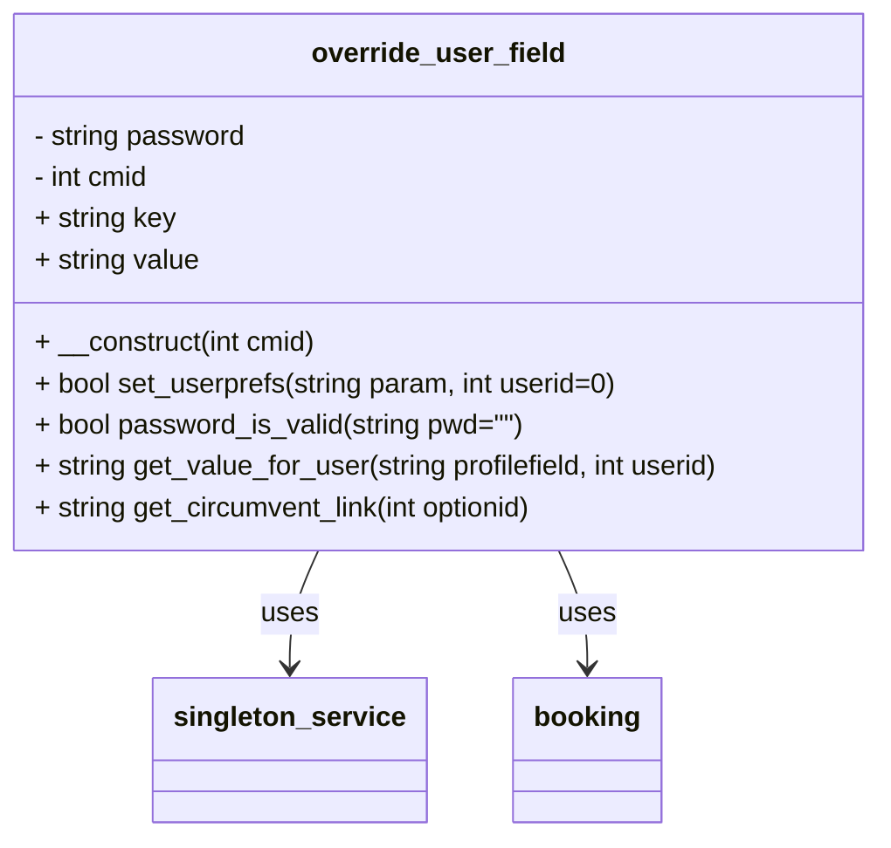

[Back to parent section](../README.md)

# Override User Field — Access Links for Externals

The **Override user field** feature lets you generate a special URL that temporarily bypasses a [user profile field availability condition](../booking_conditions/user_profile_field.md) for a specific booking instance. This is useful when you want to allow access to a restricted booking option for a specific external user without permanently changing their Moodle profile.

---

## Quick setup path

1. Open the booking option and identify required profile field checks.
2. Build an override URL as described on this page.
3. Test URL with one user that should bypass and one that should not.
4. Roll out URL only to trusted users.

---

## Table of Contents

1. [What it does](#1-what-it-does)
2. [How to enable it](#2-how-to-enable-it)
3. [URL parameters](#3-url-parameters)
4. [How to generate a circumvention link](#4-how-to-generate-a-circumvention-link)
5. [Enabling circumvention for another user](#5-enabling-circumvention-for-another-user)
6. [Security considerations](#6-security-considerations)
7. [Technical reference](#7-technical-reference)

---

## 1. What it does

Normally, a booking option with a **User profile field** availability condition blocks users whose profile field does not match the required value. The Override user field feature lets you:

1. Generate a special link containing a bypass token.
2. Share that link with the external user.
3. When the user clicks the link, their browser stores a temporary preference that unlocks the booking option for that specific booking instance (`cmid`).

The circumvention is:

- **Instance-specific:** It only bypasses the condition within the one booking activity where the link was generated. Clicking a link from a different booking activity overrides that instance's circumvention.
- **Field-value-specific:** The link encodes both the profile field shortname and the value to override (`cvfield=fieldshortname_value`).
- **Not permanent:** The user preference is stored in Moodle's user preferences table. It is not a profile field change.

---

## 2. How to enable it

1. Open a **Booking activity** and go to its settings.
2. In the booking instance settings, find the **Override user field** section.
3. Enable the feature.
4. Optionally set a **password** (`cvpwd`). If a password is set, the circumvention URL must include this password for it to work.
5. Save the settings.

---

## 3. URL parameters

When a user visits the booking option detail page (`optionview.php`) with these parameters, the circumvention is activated:

| Parameter | Description |
|-----------|-------------|
| `cvpwd=<password>` | The circumvention password (if set in the booking instance settings). If no password is configured, this parameter can be omitted. |
| `cvfield=<shortname>_<value>` | The profile field shortname and value to bypass, joined by an underscore. For example, `cvfield=department_external` bypasses a condition that requires `department = external`. |

**Example URL:**

```
https://moodle.example.com/mod/booking/optionview.php?id=42&optionid=123&cvpwd=mysecret&cvfield=department_external
```

After visiting this URL, the user can book the option as if their `department` profile field contained `external`, for this booking activity only.

---

## 4. How to generate a circumvention link

Circumvention links can be copied directly from the booking option UI:

1. Open the booking option in the booking activity.
2. Expand the **cog wheel** (actions) menu next to the option.
3. Click **Copy access link for externals**.

This button only appears when:

- The Override user field feature is enabled in the booking instance.
- The booking option has a **User profile field** availability condition with operator **equals** or **contains** (other operators are not supported for link generation).
- The current user has the capability to edit the booking option.

The generated link is copied to the clipboard and can be shared directly with the external user.

---

## 5. Enabling circumvention for another user

Users with the **`mod/booking:updatebooking`** capability can activate circumvention on behalf of another user by adding the `userid` parameter to the `optionview.php` URL:

```
https://moodle.example.com/mod/booking/optionview.php?id=42&optionid=123&cvpwd=mysecret&cvfield=department_external&userid=456
```

This sets the circumvention preference for user ID 456, allowing that specific user to bypass the condition in this booking instance.

---

## 6. Security considerations

- **Password protection:** Always set a password in the booking instance settings. Without a password, anyone who knows the URL format can circumvent conditions.
- **Instance scope:** The circumvention is limited to one booking instance. Accessing a circumvention link for a different instance replaces the stored preference — it does not accumulate.
- **Not a profile change:** The feature only bypasses the availability check. It does not change the user's actual profile data.
- **Sensitive use:** Only users with edit-booking capability can generate circumvention links. Treat generated links as sensitive — sharing them grants booking access to whoever receives them.
- **Field operator limitation:** Only conditions using the `equals` or `contains` operator on a user profile field support link generation.

---

## 7. Technical reference

The feature is implemented in `classes/local/override_user_field.php`.



Key methods:

| Method | Description |
|--------|-------------|
| `__construct(int $cmid)` | Loads the password and key/value configuration for the booking instance. |
| `set_userprefs(string $param, int $userid = 0)` | Parses the `cvfield` parameter and stores the circumvention preference for the user. |
| `password_is_valid(string $pwd = "")` | Validates the provided password against the instance's configured password. |
| `get_value_for_user(string $profilefield, int $userid)` | Returns the effective profile field value for a user (real value or overridden circumvention value). |
| `get_circumvent_link(int $optionid)` | Generates and returns the circumvention URL for a specific booking option. |

---

## See also

- [User profile field condition (standard)](../booking_conditions/user_profile_field.md)
- [User profile field condition (custom)](../booking_conditions/user_profile_field_custom.md)
- [Capabilities](../capabilities/README.md) — `updatebooking` capability
